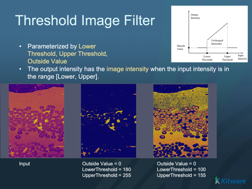

# ITK Threshold Image Filter

Set image values to a user-specified value if they are below, above, or between simple threshold values.

## Group (Subgroup)

ITKThresholding (Thresholding)

## Description

ThresholdImageFilter sets image values to a user-specified "outside" value (by default, "black") if the image values are below, above, or between simple threshold values.

The available methods are:

ThresholdAbove() : The values greater than the threshold value are set to OutsideValue

ThresholdBelow() : The values less than the threshold value are set to OutsideValue

ThresholdOutside() : The values outside the threshold range (less than lower or greater than upper) are set to OutsideValue

Note that these definitions indicate that pixels equal to the threshold value are not set to OutsideValue in any of these methods

The pixels must support the operators >= and <=.

% Auto generated parameter table will be inserted here

## Example Pipelines

## License & Copyright

Please see the description file distributed with this plugin.

## DREAM3D-NX Help

If you need help, need to file a bug report or want to request a new feature, please head over to the [DREAM3DNX-Issues](https://github.com/BlueQuartzSoftware/DREAM3DNX-Issues/discussions) GitHub site where the community of DREAM3D-NX users can help answer your questions.
