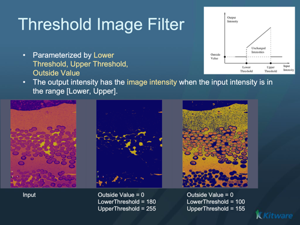

# ITK Threshold Image Filter

Replaces pixels that fall outside a chosen intensity range with a single "outside" value while leaving in-range pixels unchanged.

## Group (Subgroup)

ITKThresholding (Thresholding)

## Description

This filter clips an image by intensity. Every pixel whose value lies **within the range [Lower, Upper]** keeps its original value; every pixel **outside** that range is replaced with the *Outside Value*:

$$
\text{output}(x) = \begin{cases} x & \text{if } \text{Lower} \le x \le \text{Upper} \\ \text{OutsideValue} & \text{otherwise} \end{cases}
$$

Use this filter when you want to mask away intensities that are too low or too high while preserving the actual pixel values inside the band of interest. This is different from the [Binary Threshold](ITKBinaryThresholdImageFilter.md) filter, which replaces *every* pixel with one of two labels (it binarizes); here the in-range pixels retain their measured intensity.

### Parameter Guidance

- **Lower** / **Upper** — the bounds of the range to keep, in the **input image's intensity units**. Pixels below *Lower* or above *Upper* are set to the *Outside Value*. To keep everything above a value, set *Lower* and leave *Upper* at its maximum; to keep everything below a value, set *Upper* and leave *Lower* at its minimum.
- **Outside Value** — the intensity written for every out-of-range pixel (in the image's intensity units, default *0*).

### Required Input Sources

Operates on any scalar image — typically from [Read Image](../SimplnxCore/ReadImageFilter.md), [Read Images [3D Stack]](../SimplnxCore/ReadImageStackFilter.md), or the output of a prior ITK image filter.

% Auto generated parameter table will be inserted here

## Example Pipelines

## License & Copyright

Please see the description file distributed with this **Plugin**

## DREAM3D-NX Help

If you need help, need to file a bug report or want to request a new feature, please head over to the [DREAM3DNX-Issues](https://github.com/BlueQuartzSoftware/DREAM3DNX-Issues/discussions) GitHub site where the community of DREAM3D-NX users can help answer your questions.
