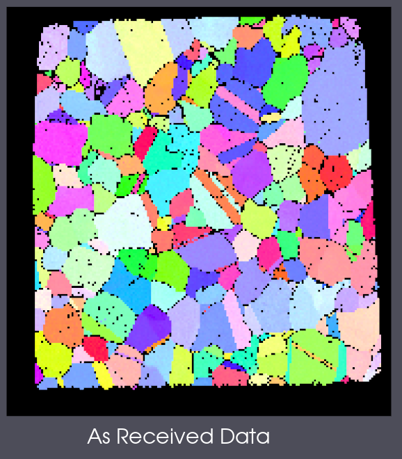

# Neighbor Orientation Comparison (Bad Data)

## Group (Subgroup)

Processing (Cleanup)

## Description

This **Filter** rescues *bad* cells (those with *Mask = false*) that are surrounded by good cells with consistent orientations. It does **not** modify any cell-level attributes other than the **Mask** array; it only flips the *Mask* value of qualifying cells from **false** to **true**, effectively re-classifying them as good.

This is a sister filter to [Neighbor Orientation Correlation](NeighborOrientationCorrelationFilter.md). The key difference: this filter only updates the mask, while *Neighbor Orientation Correlation* copies full cell attributes from a neighbor. Use this filter as the **first pass** to recover cells that were marked bad by an over-aggressive threshold but are genuinely surrounded by valid neighbors; use *Neighbor Orientation Correlation* afterward to clean up cells whose orientation is genuinely wrong.

### How This Filter Works

For each cell whose *Mask* is **false**:

1. Compute the misorientation between the cell and each of its 6 face-neighbors (cells in the +X, -X, +Y, -Y, +Z, -Z directions).
2. Count the number of neighbors whose misorientation falls below the user-specified *Misorientation Tolerance*.
3. If that count is at least *Required Number of Neighbors*, flip the cell's *Mask* from **false** to **true**.

The filter steps down through *Required Number of Neighbors* from 6 to the user-defined floor: setting it to 4 runs at levels 6, 5, and 4 in sequence.

While the algorithm runs, the *Mask* array is updated continuously. When a cell's mask flips, its neighbors are re-evaluated -- they may now have enough valid neighbors to qualify themselves. **This can cascade into a flood fill**, especially if the user sets *Required Number of Neighbors* very low. Always inspect the output to confirm the filter is not overshooting.

### Required Number of Neighbors

The *Required Number of Neighbors* parameter is the **count of agreeing face-neighbors needed to flip the mask** and ranges from **1 to 6**:

- **6** -- only rescue cells where all 6 face-neighbors agree. Very conservative.
- **4-5** -- rescues most over-thresholded cells while leaving genuinely uncertain cells alone.
- **2-3** -- aggressive; risks cascading.
- **1** -- one matching neighbor is enough; effectively a flood fill.

### 2D vs 3D

In 2D data (Z dimension = 1), no cell can have 6 face-neighbors because there are no neighbors in the +Z and -Z directions. The maximum count for 2D is therefore 4.

### Warning -- Data Modification

Only the *Mask* array is modified. Every other cell-level array (orientations, phases, etc.) is left unchanged. To replace orientation data on cells whose orientations are wrong, run [Neighbor Orientation Correlation](NeighborOrientationCorrelationFilter.md) afterward.

### Example Data

| Example Input Image                                                       | Example Output Image                                                                                                                          |
|---------------------------------------------------------------------------|-----------------------------------------------------------------------------------------------------------------------------------------------|
|                    |                                                                                        |
| The Small IN100 data just after initial alignment filters have completed. | The Small IN100 data after running this filter with *Misorientation Tolerance* = 5° and *Required Number of Neighbors* = 4. |

The cells that flipped from false (black) to true (IPF-colored) had Confidence Index just below the original mask threshold (CI > 0.1, IQ > 120) but had enough valid neighbors with consistent orientations to be rescued.

### Required Input Sources

- **Mask Array** -- a boolean cell-level array, typically produced by [Multi-Threshold Objects](../SimplnxCore/MultiThresholdObjectsFilter.md) applied to EBSD confidence/quality scalars.
- **Cell Quaternions** -- typically read from EBSD data via [Read H5EBSD](ReadH5EbsdFilter.md), [Read CTF Data](ReadCtfDataFilter.md), or [Read ANG Data](ReadAngDataFilter.md).
- **Cell Phases** -- typically read from EBSD data alongside the quaternions.
- **Crystal Structures** -- ensemble-level array read from EBSD data or created by [Create Ensemble Info](CreateEnsembleInfoFilter.md).

% Auto generated parameter table will be inserted here

## Example Pipelines

+ (02) Small IN100 Full Reconstruction

## Related Filters

- [Fill Bad Data](../SimplnxCore/FillBadDataFilter.md) — fills voxels still marked bad after this filter runs (or as a standalone alternative when no orientation data is available).
- [Multi-Threshold Objects](../SimplnxCore/MultiThresholdObjectsFilter.md) — typical upstream filter that generates the initial *Mask* array (e.g., from `Confidence Index` and `Image Quality`).
- [Replace Element Attributes with Neighbor Values](../SimplnxCore/ReplaceElementAttributesWithNeighborValuesFilter.md) — alternative cleanup approach that copies attribute values from neighboring cells rather than flipping a mask.

## License & Copyright

Please see the description file distributed with this **Plugin**

## DREAM3D-NX Help

If you need help, need to file a bug report or want to request a new feature, please head over to the [DREAM3DNX-Issues](https://github.com/BlueQuartzSoftware/DREAM3DNX-Issues/discussions) GitHub site where the community of DREAM3D-NX users can help answer your questions.
