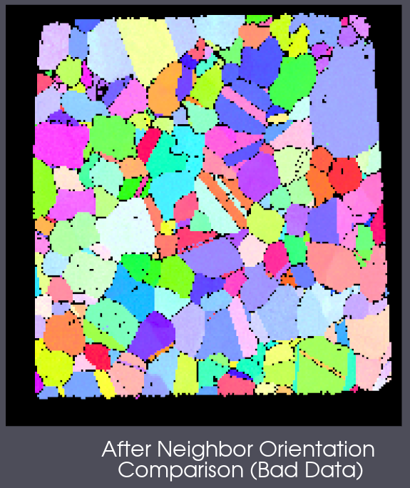

# Neighbor Orientation Comparison (Bad Data)

## Group (Subgroup)

Orientation Analysis (Cleanup)

## Description

This filter will calculate the misorientation between a cell and its 6 face neighbor cells if the *Mask* value is true of the target cell. If the misorientation falls below the user defined threshold for the user defined minimum number of neighbors, then the target cell will have its *Mask* value changed from false to true.

The filter will iteratively reduce the required number of neighbors from 6 until it reaches the user defined number. So, if the user selects a required number of neighbors of 4, then the filter will run with a required number of neighbors of 6, then 5, then 4 before finishing.

### Warning - Data Modification

Only the *Mask* value defining the cell as *good* or *bad* is changed. No other cell level array is modified.

## Example Data

|    Example Input/Output Images |
|--------------------------------|
|  |
| The Small IN100 data just after initial alignment filters have completed. |
|  |
| The Small IN100 data just after running this filter with a *Misorientation Tolerance* of 5 degrees and a *Required Number of Neighbors* of 4. |

From the above before and after images you can see that this filter can help modify a mask that was generated through a simple threshold filter. This filter essentially uses neighbors to determine if a cell point should have had a mask value of false. The majority of cells that were changed from *false* or the black voxels, into valid IPF colored voxels, had a confidence index that fell just below the initial threshold applied (Confidence Index > 0.1 and Image Quality > 120). This filter determines that enough of that cell's neighbors had a mask value of true, the misorientation was < 5 degrees and the cell had enough valid neighbors that the cell's *mask* value was changed from **false** to **true**.

% Auto generated parameter table will be inserted here

## Example Pipelines

+ (10) SmallIN100 Full Reconstruction
+ (04) SmallIN100 Presegmentation Processing
+ INL Export
+ 04_Steiner Compact

## License & Copyright

Please see the description file distributed with this **Plugin**

## DREAM3D-NX Help

If you need help, need to file a bug report or want to request a new feature, please head over to the [DREAM3DNX-Issues](https://github.com/BlueQuartzSoftware/DREAM3DNX-Issues/discussions) GitHub site where the community of DREAM3D-NX users can help answer your questions.
