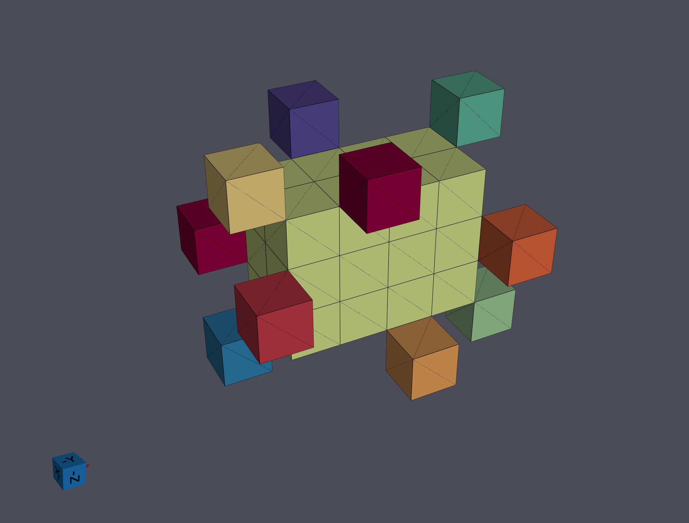
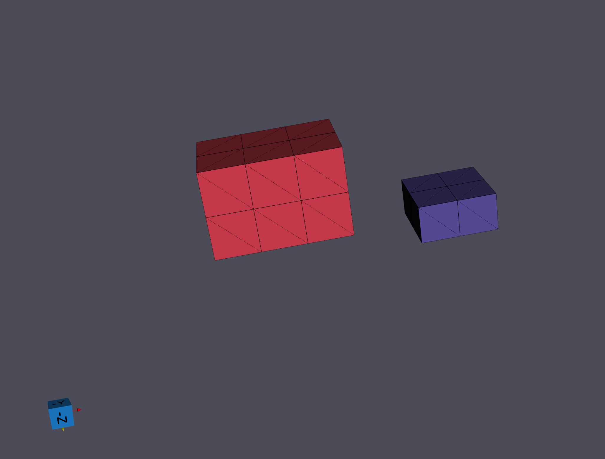
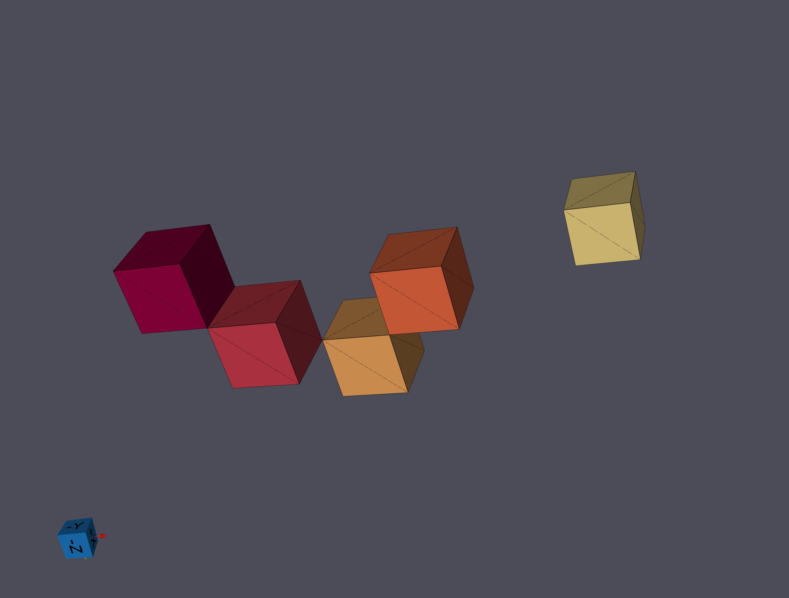

# Segment Features (C-Axis Misalignment)

## Group (Subgroup)

Reconstruction (Segmentation)

## Description

This **Filter** groups neighboring **Cells** (voxels) whose crystal C-axes are nearly aligned into **Features** (grains), producing a *FeatureIds* array that labels every cell in the input geometry with a grain number. The *c-axis misalignment* refers to the angle between the [0001] directions (the c-axis in the hexagonal system) that is present between neighboring **Cells**. Because the c-axis is a direction (not a vector), the misalignment is folded into [0°, 90°]: two nearly antiparallel c-axes are considered aligned.

This filter is **only valid for hexagonal phases**. For general EBSD grain segmentation (cubic, orthorhombic, or any other symmetry), use [Segment Features (Misorientation)](EBSDSegmentFeaturesFilter.md) instead; for scalar-based segmentation, use [Segment Features (Scalar)](../SimplnxCore/ScalarSegmentFeaturesFilter.md).

The input geometry may be either an **Image Geometry** or a **RectGrid Geometry**.

### When to Use This Filter

In hexagonal materials (titanium, magnesium, zinc, zirconium, etc.), the [C-axis](ComputeAvgCAxesFilter.md) is the unique, mechanically significant crystal direction. For many studies -- especially those focused on basal-plane slip, texture, or deformation -- it is more informative to group cells by how closely their C-axes point in the same direction than by their full orientation. Two cells may have very different full orientations (rotated differently about their own C-axis) but still belong to the same grain if their C-axes point the same way.

If you need full misorientation-based grain segmentation (accounting for rotations about the C-axis), use [Segment Features (Misorientation)](EBSDSegmentFeaturesFilter.md) instead.

### How This Filter Works

The process by which the **Features** are identified is a standard *burn algorithm* that grows each feature outward from a seed cell:

1. Select the next unassigned **Cell** in row-major order that is eligible to seed a **Feature** (not excluded by the mask and with a phase value greater than 0), add it to an empty list and set its *Feature Id* to the current **Feature**
2. Compare the **Cell** to each of its neighbors as selected by the *Neighbor Scheme* parameter (i.e., calculate the c-axis misalignment with each neighbor)
3. Add each neighbor **Cell** that has a C-axis misalignment below the user defined tolerance to the list created in 1. and set the *Feature Id* of the neighbor **Cell** to the current **Feature**
4. Remove the current **Cell** from the list and move to the next **Cell** and repeat 2. and 3.; continue until no **Cells** are left in the list
5. Increment the current **Feature** counter and repeat steps 1. through 4.; continue until no eligible **Cells** remain unassigned in the dataset

The C-axis direction for each cell is computed on-the-fly from the cell's orientation quaternion. See [Compute Average C-Axis Orientations](ComputeAvgCAxesFilter.md) for a full explanation of the C-axis concept and why it only makes physical sense for hexagonal symmetries.

After all the **Features** have been identified, a **Feature Attribute Matrix** is created for the **Features** and each **Feature** is flagged as *Active* in the matrix (index 0 is reserved and never active).

### Tolerance and Units

The *Misalignment Tolerance* is in **degrees**. Typical values:

- **1-3 degrees** -- very tight; splits grains with even slight C-axis variation (subgrains).
- **5 degrees** -- the common default for grain segmentation.
- **10+ degrees** -- loose; merges adjacent grains whose C-axes are within a cone.

### Hexagonal Crystal Structures Required

The c-axis is only a physically meaningful unique axis for hexagonal Laue classes. Every **Cell** that can participate in the segmentation (phase > 0 and not excluded by the mask) must belong to an **Ensemble** whose crystal structure is *Hexagonal-Low (6/m)* or *Hexagonal-High (6/mmm)*; otherwise the filter fails with error `-8363`. A phase value with no corresponding entry in the *Crystal Structures* array produces error `-8364`. Unindexed **Cells** (phase 0) and masked-out **Cells** are exempt from this requirement, so datasets with unindexed points — or with a non-hexagonal phase that has been masked out — process normally.

### Randomize Feature Ids

When *Randomize Feature Ids* is enabled the final *Feature Ids* are relabeled with a deterministic (fixed-seed) random permutation, which improves visual contrast between neighboring **Features** when coloring by *Feature Id*. The segmentation itself is unchanged, and repeated runs produce identical output. (Legacy DREAM.3D 6.x always randomized with a clock-derived seed, so its labeling differed on every run; see the migration deviation notes in `vv/deviations/CAxisSegmentFeaturesFilter.md` of the simplnx source tree.)

### Neighbor Scheme

The *Neighbor Scheme* parameter provides the following choices:

- **Face Neighbors [0]**: Only the 6 face-sharing neighbors of a voxel are considered during segmentation.
- **All Connected Neighbors [1]**: All 26 neighbors connected by a face, edge, or vertex are considered during segmentation.

DREAM.3D version 6.x only used face neighbors. The default here is still *Face Only* for backward compatibility.

| Neighbor Scheme = "Face Only" | Neighbor Scheme = "All Connected" |
|:--:|:--:|
|  |  |

| Neighbor Scheme = "Face Only" | Neighbor Scheme = "All Connected" |
|:--:|:--:|
|  |  |

| Neighbor Scheme = "Face Only" | Neighbor Scheme = "All Connected" |
|:--:|:--:|
|  |  |

| Neighbor Scheme = "Face Only" | Neighbor Scheme = "All Connected" |
|:--:|:--:|
|  |  |

### Mask Array

If *Use Mask Array* is enabled, cells flagged *false* in the mask (a boolean or `uint8` **Cell** array) are excluded from segmentation and left with a Feature Id of 0. Masks are commonly used to restrict segmentation to the sample region or to cells with reliable orientation data (for example, a threshold on an EBSD confidence index). Masked-out **Cells** and unindexed **Cells** (phase 0) never join a **Feature** and keep a *Feature Id* of 0.

### Required Input Sources

- **Cell Quaternions** -- typically read from EBSD data via [Read H5EBSD](ReadH5EbsdFilter.md), [Read CTF Data](ReadCtfDataFilter.md), or [Read ANG Data](ReadAngDataFilter.md); can also be produced from Euler angles by [Convert Orientations](ConvertOrientationsFilter.md).
- **Cell Phases** -- typically read from EBSD data alongside the quaternions.
- **Crystal Structures** -- ensemble-level array read from EBSD data or created by [Create Ensemble Info](CreateEnsembleInfoFilter.md). Phases that are not hexagonal will produce invalid segmentation for those cells.
- **Mask Array** (optional) -- a boolean array marking valid cells, typically produced by [Multi-Threshold Objects](../SimplnxCore/MultiThresholdObjectsFilter.md).

% Auto generated parameter table will be inserted here

## Example Pipelines

EBSD_Hexagonal_Data_Analysis

## License & Copyright

Please see the description file distributed with this **Plugin**

## DREAM3D-NX Help

If you need help, need to file a bug report or want to request a new feature, please head over to the [DREAM3DNX-Issues](https://github.com/BlueQuartzSoftware/DREAM3DNX-Issues/discussions) GitHub site where the community of DREAM3D-NX users can help answer your questions.
