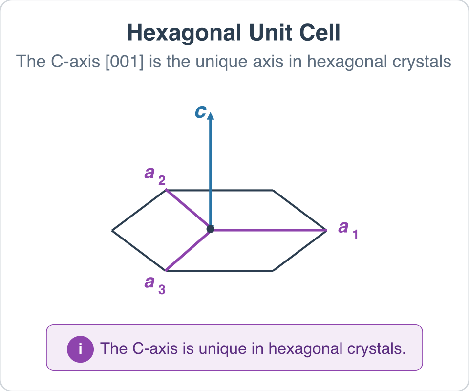

# Compute Average C-Axis Orientations

## Group (Subgroup)

Statistics (Crystallography)

## Description

This **Filter** computes the average C-axis direction for each **Feature** (grain) in hexagonal materials. The result is a unit vector per **Feature** that indicates where the grain's C-axis points in the sample reference frame.

### What is the C-Axis?

In hexagonal crystal structures (such as titanium, magnesium, and zinc), the *C-axis* is the unique crystallographic direction that runs along the long axis of the hexagonal unit cell (the [001] direction). This axis is important because many mechanical and physical properties of hexagonal materials vary depending on whether they are measured along or perpendicular to the C-axis.

### How This Filter Works

Each **Cell** (voxel) in a grain has its own measured orientation. This filter determines where each cell's C-axis points in the physical sample coordinate system, then averages those directions across all cells belonging to the same **Feature**:

1. For each **Cell**, the filter uses the cell's orientation (quaternion) to rotate the crystal [001] direction into the sample reference frame.
2. The rotated C-axis directions are accumulated for each **Feature**, ensuring all directions point into the same hemisphere for a consistent average.
3. The accumulated directions are normalized to produce a unit vector for each **Feature**.

### Hexagonal Materials Only

This filter only produces valid results for hexagonal phases (6/mmm or 6/m symmetry). In hexagonal materials, the C-axis is unique -- there is only one [001] direction, so crystal symmetry does not create ambiguity.

In cubic materials, the [001], [010], and [100] directions are all crystallographically equivalent. Applying symmetry operators would move the [001] direction to different positions in the sample frame, making a simple average meaningless. For this reason, **non-hexagonal phases will have their output values set to NaN**.

The filter will produce an error if no hexagonal phases are present in the data.

### Required Input Sources

This filter operates on previously segmented data and requires that several prior operations have already been run:

- **Cell Quaternions** -- typically read from EBSD data via [Read H5EBSD](ReadH5EbsdFilter.md), [Read CTF Data](ReadCtfDataFilter.md), or [Read ANG Data](ReadAngDataFilter.md); can also be produced from Euler angles by [Convert Orientations](ConvertOrientationsFilter.md).
- **Cell Feature Ids** -- produced by a segmentation filter such as [Segment Features (Misorientation)](EBSDSegmentFeaturesFilter.md) or [Segment Features (C-Axis Misalignment)](CAxisSegmentFeaturesFilter.md).
- **Cell Phases** -- typically read from EBSD data alongside the quaternions.
- **Crystal Structures** -- ensemble-level array read from EBSD data or created by [Create Ensemble Info](CreateEnsembleInfoFilter.md).

% Auto generated parameter table will be inserted here

## Example Pipelines

+ `EBSD_Hexagonal_Data_Analysis`

## License & Copyright

Please see the description file distributed with this **Plugin**

## DREAM3D-NX Help

If you need help, need to file a bug report or want to request a new feature, please head over to the [DREAM3DNX-Issues](https://github.com/BlueQuartzSoftware/DREAM3DNX-Issues/discussions) GitHub site where the community of DREAM3D-NX users can help answer your questions.
