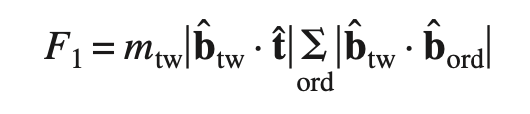
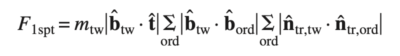
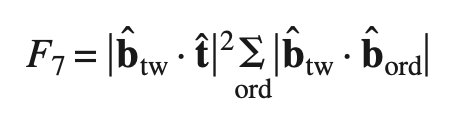

# Compute Feature Boundary Strength Metrics

## Group (Subgroup)

Statistics (Crystallography)

## Description

This **Filter** computes slip transmission metrics for each **Face** (triangle) on a grain boundary mesh. These metrics quantify how easily plastic deformation can transfer across a grain boundary, based on the geometric alignment of slip systems in the two grains on either side.

This filter computes the same metrics as the [Compute Neighbor Slip Transmission Metrics](ComputeSlipTransmissionMetricsFilter.md) filter, but stores results per boundary **Face** rather than per **Feature**. This makes it suitable for visualization and analysis on a **Triangle Geometry** surface mesh.

For a detailed explanation of the slip transmission concept and the individual metrics, see the [Compute Neighbor Slip Transmission Metrics](ComputeSlipTransmissionMetricsFilter.md) documentation.

### Cubic Materials Only

This filter only works on **cubic m-3m Laue classes**.

### How This Filter Works

1. For each **Face** in the **Triangle Geometry**, the filter identifies the two **Features** on either side
2. The average orientation of both **Features** is retrieved
3. Transmission metrics are calculated in both directions (Feature 1 → Feature 2 and Feature 2 → Feature 1), since the direction of slip approaching the boundary affects the result
4. Both directional values are stored on the **Face**

### Luster-Morris Parameter (M')

The Luster-Morris parameter measures geometric compatibility between slip systems across a boundary. Calculated as presented in [1].

### Fracture Initiation Parameters (F1, F1spt, F7)

Three fracture initiation parameter values are computed per **Face**, as defined in [2] (see page 021012-4):

## References

[1] [Luster, J., Morris, M.A., 1995. *Compatibility Of Deformation In Two-Phase Ti-Al Alloys: Dependence On Microstructure And Orientation Relationships*. **Metallurgical and Materials Transactions A 26, 1745**](https://link.springer.com/article/10.1007/BF02670762)

[2] [D. Kumar, T. R. Bieler, P. Eisenlohr, D. E. Mason, M. A. Crimp, F. Roters, and D. Raabe. On Predicting Nucleation of Microcracks Due to Slip Twin Interactions at Grain Boundaries in Duplex Near γ-TiAl. Journal of Engineering Materials and Technology, 130(2):021012–12, 2008. doi:10.1115/1.2841620.](https://doi.org/10.1115/1.2841620)

### Required Input Sources

This filter operates on a grain-boundary surface mesh and requires the following upstream steps:

- **Triangle Geometry** and **Face Labels** -- produced by a surface meshing filter such as [Quick Surface Mesh](../SimplnxCore/QuickSurfaceMeshFilter.md).
- **Average Quaternions** -- the per-feature average orientation produced by [Compute Average Orientations](ComputeAvgOrientationsFilter.md).
- **Feature Phases** -- produced by [Compute Feature Phases](../SimplnxCore/ComputeFeaturePhasesFilter.md).
- **Crystal Structures** -- ensemble-level array read from EBSD data or created by [Create Ensemble Info](CreateEnsembleInfoFilter.md).

% Auto generated parameter table will be inserted here

## Example Pipelines

## License & Copyright

Please see the description file distributed with this **Plugin**

## DREAM3D-NX Help

If you need help, need to file a bug report or want to request a new feature, please head over to the [DREAM3DNX-Issues](https://github.com/BlueQuartzSoftware/DREAM3DNX-Issues/discussions) GitHub site where the community of DREAM3D-NX users can help answer your questions.
