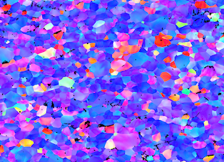
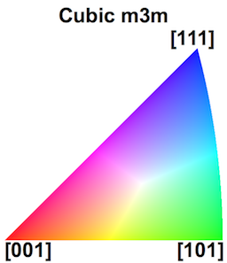
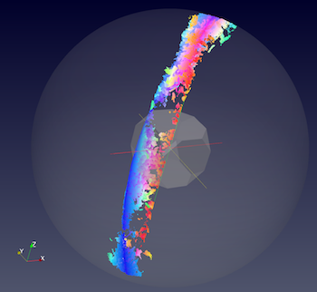
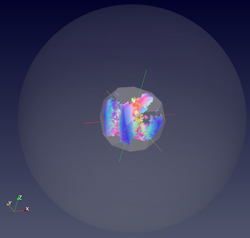

# Compute Reduction Orientations to Fundamental Zone

## Group (Subgroup)

OrientationAnalysis (OrientationAnalysis)

## Description

This **Filter** reduces input orientations (Quaternions) into the fundamental zone for the given Laue group.

The following figures represent a BCC Interstitial steel EBSD data set courtesy of [1].

|    |    |
|----|----|
|   |    |
| Original IPF Colored dataset  | IPF Color Legend for m-3m Laue group  |
|     |   |
| EBSD Dataset **before** the filter. IPF Colors are using a reference direction of < 001 >.  The data is visualized in the 3D stereographic unit spheres with a superimposed Rodrigues Fundamental Zone.   | EBSD Dataset **after** the filter. IPF Colors are using a reference direction of < 001 >. The data is visualized in the 3D stereographic unit spheres with a superimposed Rodrigues Fundamental Zone. |

### Crystal Structure Table

| String Name | Internal Value | Laue Name |
| ------------|----------------|----------|
| Hexagonal_High | 0 |  Hexagonal-High 6/mmm |
| Cubic_High | 1 |  Cubic Cubic-High m3m |
| Hexagonal_Low | 2 |  Hexagonal-Low 6/m |
| Cubic_Low | 3 |  Cubic Cubic-Low m3 (Tetrahedral) |
| Triclinic | 4 |  Triclinic -1 |
| Monoclinic | 5 |  Monoclinic 2/m |
| OrthoRhombic | 6 |  Orthorhombic mmm |
| Tetragonal_Low | 7 |  Tetragonal-Low 4/m |
| Tetragonal_High | 8 |  Tetragonal-High 4/mmm |
| Trigonal_Low | 9 |  Trigonal-Low -3 |
| Trigonal_High | 10 |  Trigonal-High -3m |
| UnknownCrystalStructure | 999 |  Undefined Crystal Structure |

% Auto generated parameter table will be inserted here

## References

[1]: N. Allain-Bonasso, F. Wagner, S. Berbenni, D.P. Field, A study of the heterogeneity of plastic deformation in IF steel by EBSD, Materials Science and Engineering: A, Volume 548, 30 June 2012, Pages 56-63, ISSN 0921-5093, <http://dx.doi.org/10.1016/j.msea.2012.03.068>.
(<http://www.sciencedirect.com/science/article/pii/S0921509312004388>)

## Example Pipelines

## License & Copyright

Please see the description file distributed with this plugin.

## DREAM3D-NX Help

If you need help, need to file a bug report or want to request a new feature, please head over to the [DREAM3DNX-Issues](https://github.com/BlueQuartzSoftware/DREAM3DNX-Issues/discussions) GItHub site where the community of DREAM3D-NX users can help answer your questions.
