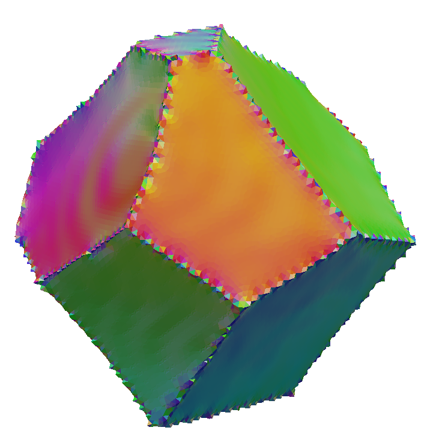

# Compute IPF Colors (Face)

## Group (Subgroup)

Processing (Crystallography)

## Description

This **Filter** generates a pair of colors for each **Triangle** in a **Triangle Geometry** based on the inverse pole figure (IPF) color scheme for the present crystal structure. Each **Triangle** has 2 colors since any **Face** sits at a boundary between 2 **Features** for a well-connected set of **Features** that represent _grains_. The reference direction used for the IPF color generation is the _normal_ of the **Triangle**.

------------

------------

% Auto generated parameter table will be inserted here

## Example Pipelines

+ (03) SmallIN100 Mesh Statistics

## License & Copyright

Please see the description file distributed with this **Plugin**

## DREAM3D-NX Help

If you need help, need to file a bug report or want to request a new feature, please head over to the [DREAM3DNX-Issues](https://github.com/BlueQuartzSoftware/DREAM3DNX-Issues/discussions) GItHub site where the community of DREAM3D-NX users can help answer your questions.
