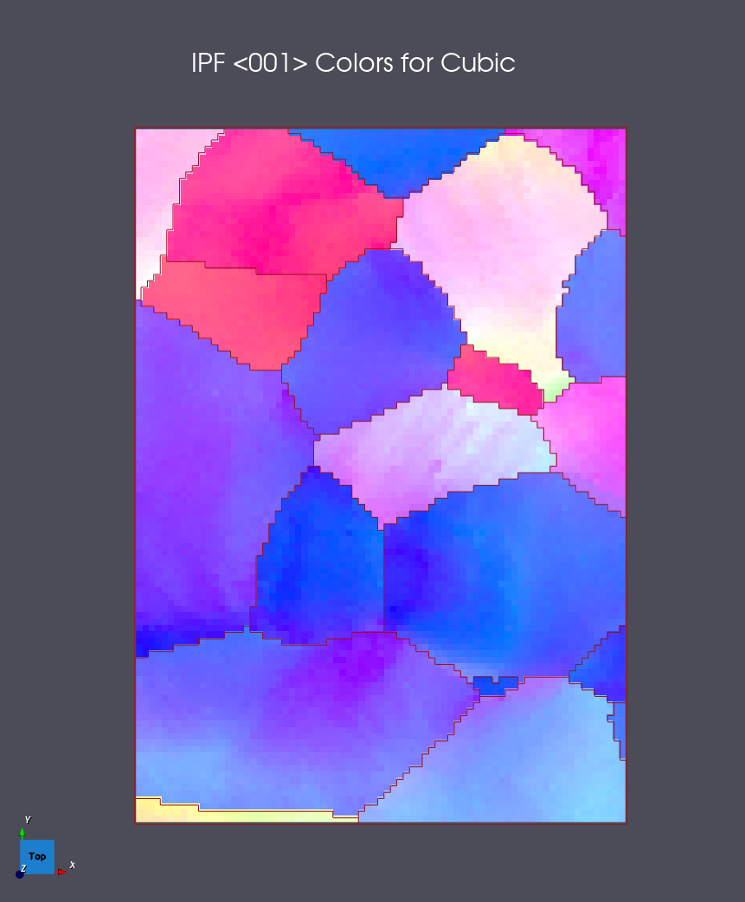
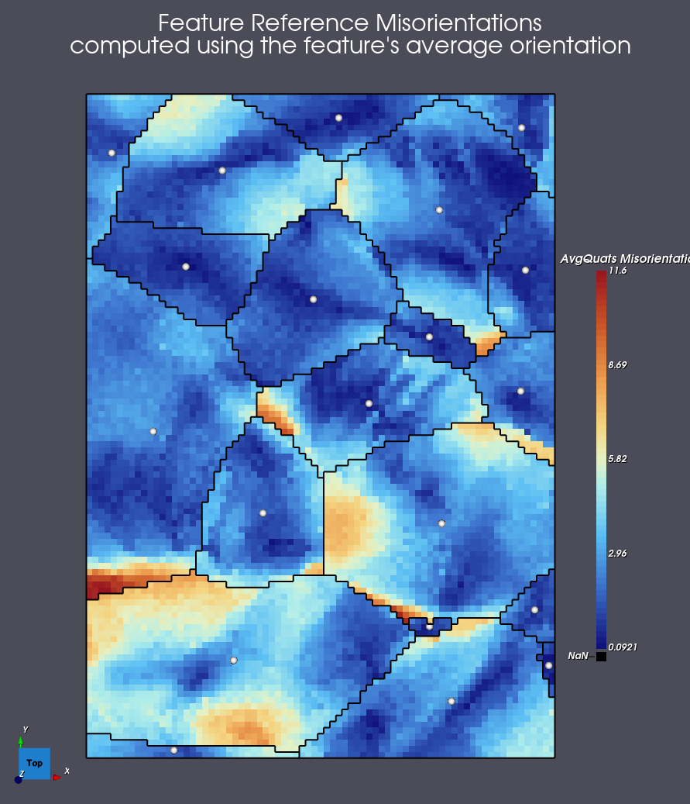
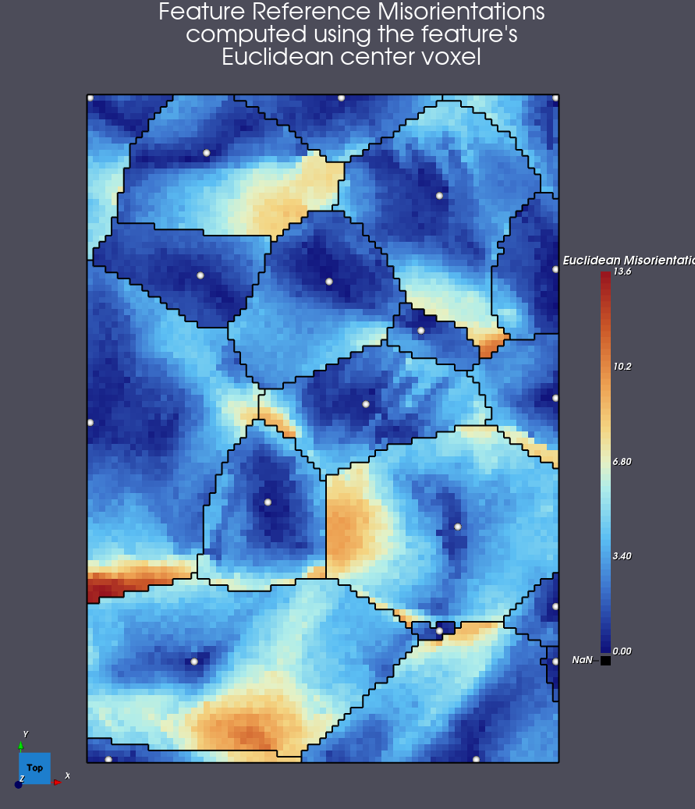

# Compute Feature Reference Misorientations

## Group (Subgroup)

Statistics (Crystallography)

## Description

This **Filter** calculates the misorientation angle between each **Cell** within a **Feature** and a 
*reference orientation* for that **Feature**.  The user can choose the *reference orientation* to 
be used for the **Features** from a drop-down menu.  The options for the *reference orientation* are 
the average orientation of the **Feature** or the orientation of the **Cell** that is furthest from 
the *boundary* of the **Feature**.

Note: the average orientation of the **Feature** is a typical choice, but if the **Feature** has 
undergone plastic deformation and the amount of lattice rotation developed is of interest, then 
it may be more reasonable to use the orientation *near the center* of the **Feature** as it may 
not have rotated and thus serve as a better *reference orientation*.

### Reference Orientation

The *Reference Orientation* parameter provides the following choices:

- **Average Feature Orientation [0]**: Uses the average orientation of the **Feature** as the reference orientation for misorientation calculations.
- **Orientation Farthest from Feature Boundary [1]**: Uses the orientation of the **Cell** that is furthest from the boundary of the **Feature** (nearest to its Euclidean center) as the reference orientation. Requires a `Boundary Euclidean Distances` array as input; that array is typically produced by the [Compute Euclidean Distance Map](../SimplnxCore/ComputeEuclideanDistMapFilter.md) filter upstream of this one.

### Output Units

The misorientation values in both output arrays (`Cell Reference Misorientations` and `Feature Average Misorientations`) are expressed in **degrees**, not radians.

### Mode 1 — Raster-order tie-break for the "farthest from boundary" voxel

When two or more voxels within a single feature share the same maximum `Boundary Euclidean Distances` value, the algorithm selects the voxel with the **latest linear (raster) index** as the feature's reference. This matches the legacy DREAM3D 6.5.171 behavior. In practice, ties are rare on real EBSD data and the choice between tied voxels has no qualitative impact on the resulting misorientation field; for synthetic inputs that deliberately tie distances, the reader should be aware that re-ordering the voxel layout would change which voxel is selected as the reference.

## IPF Colors <001> Direction

This is the data set's IPF colors by the <001> direction which shows the reader the relative
orientation gradients within each feature (grain).

## Example Using Feature's Average Orientation

Using the `T12-MAI-2010/fw-ar-IF1-aptr12-corr.ctf` data set we can generate the following
data using the **Feature Average Orientation** choice.

### Example Using Feature's Euclidean Center Voxel's Orientation

Using the same dataset, the algorithm will find the voxel that is the furthest from the
feature boundary, and use that voxel's orientation as the **reference orientation**.

% Auto generated parameter table will be inserted here

## Example Pipelines

+ (04) Small IN100 Crystallographic Statistics

## Related Filters

- [Compute Feature Reference C-Axis Misorientations](ComputeFeatureReferenceCAxisMisorientationsFilter.md) — the C-axis variant of this filter, used for hexagonal-phase reconstructions.
- [Compute Kernel Average Misorientations](ComputeKernelAvgMisorientationsFilter.md) — computes a per-voxel kernel average misorientation; complementary to this filter for grain-boundary characterization.
- [Compute Feature Neighbor Misorientations](ComputeFeatureNeighborMisorientationsFilter.md) — computes pairwise feature-to-neighbor misorientations.
- [Compute Euclidean Distance Map](../SimplnxCore/ComputeEuclideanDistMapFilter.md) — typical upstream filter that produces the `Boundary Euclidean Distances` array required by Mode 1.

## License & Copyright

Please see the description file distributed with this **Plugin**

## DREAM3D-NX Help

If you need help, need to file a bug report or want to request a new feature, please head over to the [DREAM3DNX-Issues](https://github.com/BlueQuartzSoftware/DREAM3DNX-Issues/discussions) GitHub site where the community of DREAM3D-NX users can help answer your questions.
