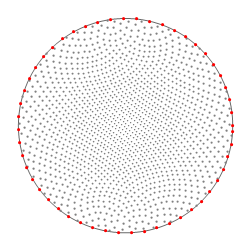
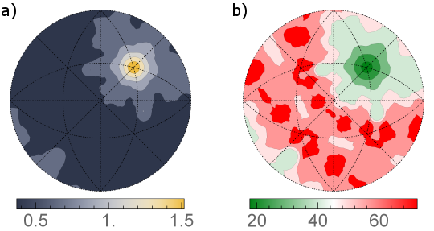

# Compute GBCD (Metric-Based Approach)

## Group (Subgroup)

Statistics (Crystallography)

## Description

This **Filter** computes a section through the five-dimensional grain boundary character distribution (GBCD) for a fixed misorientation, using a metric-based approach rather than binning. An example of such a section is shown in Fig. 1.

Unlike the [Compute GBCD](ComputeGBCDFilter.md) filter, which partitions the boundary space into discrete bins, this filter uses a continuous metric-based approach described by K. Glowinski and A. Morawiec in [Analysis of experimental grain boundary distributions based on boundary-space metrics, Metall. Mater. Trans. A 45, 3189-3194 (2014)](https://link.springer.com/article/10.1007/s11661-014-2325-y). The metric-based approach avoids discretization artifacts and can produce smoother distributions, especially with limited data.

![Fig. 1: Section for the 17.9 deg./[111] misorientation through the grain boundary distribution obtained using this Filter for the small IN100 data set. Units are multiples of random distribution (MRDs).](Images/ComputeGBCDMetricBased_dist.png)

The metric-based approach defines distance measures in the boundary space so that boundaries with similar geometry are considered "close" and boundaries with different geometry are considered "distant," taking crystal symmetry into account. The procedure has two stages:

1. **Misorientation selection:** Boundary segments whose misorientation is within a limiting angular distance &rho;m of the user-specified fixed misorientation are selected.
2. **Normal probing:** The distribution is sampled at evenly distributed normal directions (see Fig. 2). For each sampling direction, the areas of boundaries whose normals fall within &rho;p of that direction are summed.

The limiting distances &rho;m and &rho;p should be chosen based on the resolution, amount, and quality of the data. The result is normalized and expressed in multiples of a random distribution (MRD).

| Image |
|-------|
| |
|Fig. 2: End-points (drawn in stereographic projection) of sampling directions used for probing distribution values; the number of points here is about 1500. Additionally, distributions are probed at points lying at the equator (marked with red); this is helpful for some plotting software.|

This **Filter** also calculates statistical errors of the distributions using the formula

&epsilon; = ( *f* *n* *v* )1/2

where &epsilon; is the relative error of the distribution function at a given point, *f* is the value of the function at that point, *n* stands for the number of grain boundaries (**not** the number of mesh triangles) in the considered network, and *v* denotes the volume restricted by &rho;m and &rho;p. The errors can be calculated either as their absolute values, i.e., &epsilon; &times; *f* (Fig. 3a) or as relative errors, i.e., 100% &times; &epsilon; (Fig. 3b). The latter are computed in a way that if the relative error exceeds 100%, it is rounded down to 100%.

| Image |
|-------|
| |
||

## Format of Output Files

Output files are formatted to be readable by GMT plotting program. The first line contains the fixed misorientation axis and angle. Each of the remaining lines contains three numbers. The first two columns are angles (in degrees) describing a given sampling direction; let us denote them  *col*1 and *col*2, respectively. The third column is either the value of the GBCD (in MRD) for that direction or its error (in MRD or %, depending on user's selection). If you use other software, you can retrive spherical angles &theta; and &phi; of the sampling directions in the following way:

&theta; = 90&deg; - *col*1

&phi; = *col*2

Then, the directions are given as [ sin &theta; &times; cos &phi; , sin &theta; &times; sin &phi; , cos &theta; ].

## Feedback

In the case of any questions, suggestions, bugs, etc.,  please feel free to email the author of this **Filter** at kglowinski *at* ymail.com

### Limiting Distances

The *Limiting Distances* parameter selects the maximum angular deviations used when selecting boundary segments. The choices are pairs of (misorientation radius, plane-inclination radius):

- **3 deg. Misorientations; 7 deg. Plane Inclinations [0]**: Use a 3-degree misorientation radius and a 7-degree plane-inclination radius.
- **5 deg. Misorientations; 5 deg. Plane Inclinations [1]**: Use a 5-degree radius for both misorientations and plane inclinations.
- **5 deg. Misorientations; 7 deg. Plane Inclinations [2]**: Use a 5-degree misorientation radius and a 7-degree plane-inclination radius.
- **5 deg. Misorientations; 8 deg. Plane Inclinations [3]**: Use a 5-degree misorientation radius and an 8-degree plane-inclination radius.
- **6 deg. Misorientations; 7 deg. Plane Inclinations [4]**: Use a 6-degree misorientation radius and a 7-degree plane-inclination radius.
- **7 deg. Misorientations; 7 deg. Plane Inclinations [5]**: Use a 7-degree radius for both misorientations and plane inclinations.
- **8 deg. Misorientations; 8 deg. Plane Inclinations [6]**: Use an 8-degree radius for both misorientations and plane inclinations.

### Required Input Sources

This filter operates on a grain-boundary surface mesh and requires the following upstream steps:

- **Triangle Geometry** with **Face Labels**, **Face Normals**, **Face Areas**, and **Node Types** -- produced by a surface meshing filter such as [Quick Surface Mesh](../SimplnxCore/QuickSurfaceMeshFilter.md), followed by [Compute Triangle Normals](../SimplnxCore/TriangleNormalFilter.md) and [Compute Triangle Areas](../SimplnxCore/ComputeTriangleAreasFilter.md).
- **Feature Euler Angles / Feature Phases** -- feature-level averages produced by [Compute Average Orientations](ComputeAvgOrientationsFilter.md) and [Compute Feature Phases](../SimplnxCore/ComputeFeaturePhasesFilter.md).
- **Crystal Structures** -- ensemble-level array read from EBSD data or created by [Create Ensemble Info](CreateEnsembleInfoFilter.md).

% Auto generated parameter table will be inserted here

## References

[1] K. Glowinski and A. Morawiec, Analysis of experimental grain boundary distributions based on boundary-space metrics, Metall. Mater. Trans. A 45, 3189-3194 (2014)

## Example Pipelines

`(05) SmallIN100 GBCD Metric.d3dpipeline`

This pipeline depends on previous pipelines in the Small IN100 reconstruction pipeline series.

## License & Copyright

Please see the description file distributed with this **Plugin**.

## DREAM3D-NX Help

If you need help, need to file a bug report or want to request a new feature, please head over to the [DREAM3DNX-Issues](https://github.com/BlueQuartzSoftware/DREAM3DNX-Issues/discussions) GitHub site where the community of DREAM3D-NX users can help answer your questions.
