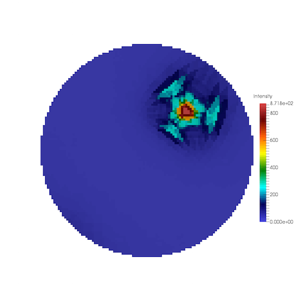
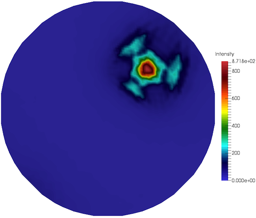

# Compute GBCD Pole Figure

## Group (Subgroup)

IO (Output)

## Description

This **Filter** creates a pole figure from the Grain Boundary Character Distribution (GBCD) data. The user must select the relevant phase for which to generate the pole figure by entering the *phase index*.

The GBCD is a 5-dimensional histogram that captures the statistical distribution of grain boundary planes as a function of the misorientation between the two grains meeting at each boundary. This filter extracts a 2D stereographic projection (pole figure) from that 5D distribution for a specific misorientation and crystal phase.

## Algorithm

For each pixel (x, y) in the output square image, the filter:

1. Performs inverse stereographic projection to obtain a unit-sphere direction representing the boundary-plane normal.
2. Iterates over all pairs of crystal symmetry operators (nSym x nSym) for the selected Laue class.
3. For each symmetry pair, computes the symmetrically-equivalent misorientation in both crystal reference frames.
4. If the equivalent misorientation falls within the fundamental zone (all three Euler angles < pi/2), the corresponding 5D GBCD bin is looked up and the intensity is accumulated.
5. The pixel intensity is the average GBCD value across all valid symmetry-pair lookups.

Pixels outside the unit circle of the stereographic projection are left at zero intensity.

### In-Core Path (ComputeGBCDPoleFigureDirect)

When the GBCD array resides in contiguous in-memory storage, the algorithm caches the entire GBCD array (all phases) into a local heap buffer, then uses `ParallelData2DAlgorithm` to compute pixel intensities in parallel across the output image grid. The parallel workers access only the cached raw pointer, so no `DataStore` access occurs in the hot loop.

### Out-of-Core Path (ComputeGBCDPoleFigureScanline)

When the GBCD array is backed by chunked (OOC) disk storage, the algorithm caches only the single-phase slice of the GBCD needed for the selected phase of interest. This is the critical optimization: for a typical GBCD, one phase slice is on the order of 100K-500K float64 elements, compared to millions for the full multi-phase array. Once the phase slice is cached, pixel computation proceeds in parallel identically to the in-core path.

### Performance

Both paths use multi-threaded parallel pixel computation. The difference is only in how much GBCD data is loaded into memory: the in-core path loads everything; the OOC path loads only the phase of interest. For single-phase analyses, the performance is nearly identical. For multi-phase datasets stored out-of-core, the OOC path avoids loading irrelevant phase data and reduces memory consumption proportionally to the number of phases.

% Auto generated parameter table will be inserted here

## Example Pipelines

+ (08) Small IN100 GBCD

## License & Copyright

Please see the description file distributed with this **Plugin**

## DREAM3D-NX Help

If you need help, need to file a bug report or want to request a new feature, please head over to the [DREAM3DNX-Issues](https://github.com/BlueQuartzSoftware/DREAM3DNX-Issues/discussions) GitHub site where the community of DREAM3D-NX users can help answer your questions.
