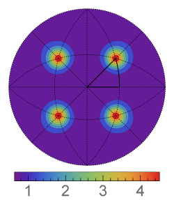

# Compute GBPD (Metric-Based Approach)

## Group (Subgroup)

Statistics (Crystallographic)

## Description

This **Filter** computes the grain boundary plane distribution (GBPD) like that shown in Fig. 1. It should be noted that most GBPDs presented so far in literature were obtained using a method based on partition of the grain boundary space into bins, similar to that implemented in the *Compute GBCD* **Filter**. This **Filter** calculates the GBPD using an alternative approach adapted from the one included in the *Compute GBCD (Metric-based Approach)* **Filter** and described by K. Glowinski and A. Morawiec in [Analysis of experimental grain boundary distributions based on boundary-space metrics, Metall. Mater. Trans. A 45, 3189-3194 (2014)](http://link.springer.com/article/10.1007%2Fs11661-014-2325-y). Briefly, the GBPD is probed at evenly distributed sampling directions (similarly to *Compute GBCD (Metric-based Approach)* **Filter**) and areas of mesh segments with their normal vectors deviated by less than a limiting angle &rho;p  from a given direction are summed. If *n*S is the number of crystal symmetry transformations, each boundary plane segment is represented by up to 4 &times; *n*S equivalent vectors, and all of them are processed. It is enough to sample the distribution at directions corresponding to the standard stereographic triangle (or, in general, to a fundamental region corresponding to a considered crystallographic point group); values at remaining points are obtained based on crystal symmetries. After summing the boundary areas, the distribution is normalized. First, the values at sampling vectors are divided by the total area of all segments. Then, in order to express the distribution in the conventional units, i.e., multiples of random distribution (MRDs), the obtained fractional values are divided by the volume *v* = (*A* nS) / (4&pi;), where *A* is the area of a spherical cap determined by &rho;p.

This **Filter** also calculates statistical errors of the distributions using the formula

&epsilon; = ( *f* *n* *v* )1/2, where &epsilon;

is the relative error of the distribution function at a given point, *f* is the value of the function at that point, and *n* stands for the number of grain boundaries (**not** the number of mesh triangles) in the considered network. The errors can be calculated either as their absolute values, i.e., &epsilon; &times; *f* or as relative errors, i.e., 100% &times; &epsilon;. The latter are computed in a way that if the relative error exceeds 100%, it is rounded down to 100%.

See also the documentation for {ref}`Compute GBCD (Metric-based Approach) Filter <OrientationAnalysis/ComputeGBCDMetricBasedFilter:Description>` for additional information.

## Format of Output Files

Output files are formatted to be readable by GMT plotting program. The first line is always "0.0 0.0 0.0 0.0". Each of the remaining lines contains three numbers. The first two columns are angles (in degrees) describing a given sampling direction; let us denote them  *col*1 and *col*2, respectively. The third column is either the value of the GBCD (in MRD) for that direction or its error (in MRD or %, depending on user's selection). If you use other software, you can retrive spherical angles &theta; and &phi; of the sampling directions in the following way:

&theta; = 90&deg; - *col*1

&phi; = *col*2

Then, the directions are given as [ sin &theta; &times; cos &phi; , sin &theta; &times; sin &phi; , cos &theta; ].

## Feedback

In the case of any questions, suggestions, bugs, etc., please feel free to email the author of this **Filter** at kglowinski *at* ymail.com
% Auto generated parameter table will be inserted here

## References

[1] K. Glowinski and A. Morawiec, Analysis of experimental grain boundary distributions based on boundary-space metrics, Metall. Mater. Trans. A 45, 3189-3194 (2014)

## Example Pipelines

## License & Copyright

Please see the description file distributed with this **Plugin**.

## DREAM3D-NX Help

If you need help, need to file a bug report or want to request a new feature, please head over to the [DREAM3DNX-Issues](https://github.com/BlueQuartzSoftware/DREAM3DNX-Issues/discussions) GitHub site where the community of DREAM3D-NX users can help answer your questions.
