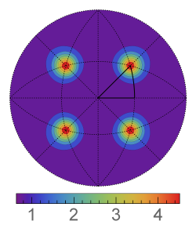

# Compute GBPD (Metric-Based Approach)

## Group (Subgroup)

Statistics (Crystallography)

## Description

This **Filter** computes the Grain Boundary Plane Distribution (GBPD), which describes the relative frequency of grain boundary plane orientations in a polycrystalline material, regardless of the misorientation across the boundary. While the GBCD (see [Compute GBCD](ComputeGBCDFilter.md)) describes boundaries in the full 5D space of misorientation + plane normal, the GBPD considers only the 2D distribution of boundary plane normals.

An example GBPD is shown in Fig. 1.

### Metric-Based Approach

This filter uses a metric-based approach adapted from the [Compute GBCD (Metric-Based Approach)](ComputeGBCDMetricBasedFilter.md) filter, as described by K. Glowinski and A. Morawiec in [Analysis of experimental grain boundary distributions based on boundary-space metrics, Metall. Mater. Trans. A 45, 3189-3194 (2014)](http://link.springer.com/article/10.1007%2Fs11661-014-2325-y).

The distribution is sampled at evenly distributed directions. For each sampling direction, the areas of mesh segments whose normals fall within a limiting angle &rho;p of that direction are summed. Crystal symmetry is applied so that each boundary segment is represented by up to 4 &times; *n*S equivalent vectors (where *n*S is the number of symmetry transformations). Only directions within the standard stereographic triangle need to be sampled; values at other points are obtained from symmetry.

After summing boundary areas, the distribution is normalized to multiples of a random distribution (MRD). A value of 1.0 means that plane orientation is as frequent as in a random polycrystal; values above 1.0 indicate preferred boundary plane orientations.

This **Filter** also calculates statistical errors of the distributions using the formula

&epsilon; = ( *f* *n* *v* )1/2, where &epsilon;

is the relative error of the distribution function at a given point, *f* is the value of the function at that point, and *n* stands for the number of grain boundaries (**not** the number of mesh triangles) in the considered network. The errors can be calculated either as their absolute values, i.e., &epsilon; &times; *f* or as relative errors, i.e., 100% &times; &epsilon;. The latter are computed in a way that if the relative error exceeds 100%, it is rounded down to 100%.

See also the documentation for [Compute GBCD (Metric-Based Approach)](ComputeGBCDMetricBasedFilter.md) for additional information.

## Format of Output Files

Output files are formatted to be readable by GMT plotting program. The first line is always "0.0 0.0 0.0 0.0". Each of the remaining lines contains three numbers. The first two columns are angles (in degrees) describing a given sampling direction; let us denote them  *col*1 and *col*2, respectively. The third column is either the value of the GBCD (in MRD) for that direction or its error (in MRD or %, depending on user's selection). If you use other software, you can retrive spherical angles &theta; and &phi; of the sampling directions in the following way:

&theta; = 90&deg; - *col*1

&phi; = *col*2

Then, the directions are given as [ sin &theta; &times; cos &phi; , sin &theta; &times; sin &phi; , cos &theta; ].

## Feedback

In the case of any questions, suggestions, bugs, etc., please feel free to email the author of this **Filter** at kglowinski *at* ymail.com

### Required Input Sources

This filter operates on a grain-boundary surface mesh and requires the following upstream steps:

- **Triangle Geometry** with **Face Labels**, **Face Normals**, **Face Areas**, and **Node Types** -- produced by a surface meshing filter such as [Quick Surface Mesh](../SimplnxCore/QuickSurfaceMeshFilter.md), followed by [Compute Triangle Normals](../SimplnxCore/TriangleNormalFilter.md) and [Compute Triangle Areas](../SimplnxCore/ComputeTriangleAreasFilter.md).
- **Feature Phases** -- produced by [Compute Feature Phases](../SimplnxCore/ComputeFeaturePhasesFilter.md).
- **Crystal Structures** -- ensemble-level array read from EBSD data or created by [Create Ensemble Info](CreateEnsembleInfoFilter.md).

% Auto generated parameter table will be inserted here

## References

[1] K. Glowinski and A. Morawiec, Analysis of experimental grain boundary distributions based on boundary-space metrics, Metall. Mater. Trans. A 45, 3189-3194 (2014)

## Example Pipelines

## License & Copyright

Please see the description file distributed with this **Plugin**.

## DREAM3D-NX Help

If you need help, need to file a bug report or want to request a new feature, please head over to the [DREAM3DNX-Issues](https://github.com/BlueQuartzSoftware/DREAM3DNX-Issues/discussions) GitHub site where the community of DREAM3D-NX users can help answer your questions.
