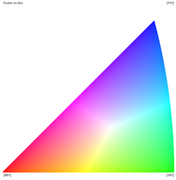
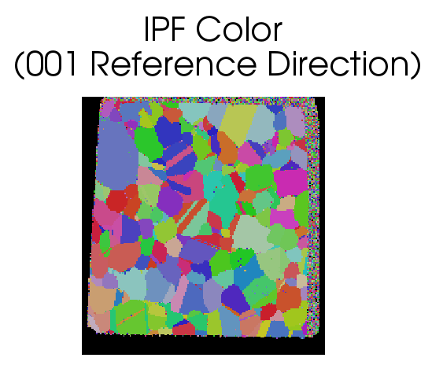

# Compute IPF Colors

## Group (Subgroup)

Processing (Crystallography)

## Description

This **Filter** will generate *inverse pole figure* (IPF) colors. The user can enter the *Reference Direction*, which defaults to [001]. The **Filter** also has the option to apply a black color to all "bad" **Elements**, as defined by a boolean *mask* array, which can be generated using the Threshold Objects **Filter** or any other filter that generates a "mask" of the data and outputs either a bool or uint8 array.

### Originating Data Notes

+ TSL (.ang file)
  + If the data originates from a TSL .ang file, then **Elements** that the TSL software could not reliably identify the Euler angles for will have a "Fit of Solution" = 180 and/or an "Image Quality" = 0.0.
  + This means that when the user runs some sort of threshold **Filter** the *mask* will be those **Elements** that have an Image Quality > 0 and/or Fit < 180.0
+ HKL (.ctf file)
  + If the data originates from an HKL (or Bruker) system (.ctf file) then unindexed voxels can typically be found by setting "Error" > 0
  + This means that when the user runs some sort of threshold **Filter** the *mask* will be those **Elements** that have an Error = 0

### IPF Legends

IPF Legends for most all of the Laue classes can be found in the Data/OrientationAnalysis folder that comes with DREAM3D-NX distributions. They are very high resolution images and you are free to use them in any published work.

### Crystallographic Convention (Hexagonal & Trigonal)

For hexagonal and trigonal phases the **IPF color itself is convention-independent**: the X‖a (TSL/EDAX) and X‖a\* (MTEX/Oxford) bases differ only by a 30° rotation about the c-axis, which does not change the computed RGB. What depends on the convention is only how the inverse-pole-figure triangle's corners are *labeled*. The IPF legends shipped with DREAM3D-NX are drawn in the **X‖a (TSL/EDAX)** convention, where the Cartesian +X axis is the a-axis [2-1-10]:

| Triangle corner | Crystal direction (X‖a) | Color |
|---|---|---|
| apex | [0001] (c-axis) | red |
| η = 0° edge | [2-1-10] (a-axis) | green |
| η = 30° edge | [10-10] (m-axis) | blue |

The 6/m, -3m, and -3 Laue classes use wider/shifted triangle wedges (so their green/blue corners are different crystal directions), but the apex is always [0001] = red. Each legend image prints the convention it was generated with as a footnote along its bottom edge.

% Auto generated parameter table will be inserted here

## Example Pipelines

+ (02) Small IN100 Full Reconstruction
+ (02) Single Hexagonal Phase Equiaxed
+ (03) Single Cubic Phase Rolled
+ INL Export
+ TxCopper_Exposed
+ TxCopper_Unexposed
+ MassifPipeline
+ InsertTransformationPhase
+ Edax IPF Colors
+ (01) Single Cubic Phase Equiaxed
+ (04) Two Phase Cubic Hexagonal Particles Equiaxed
+ (06) SmallIN100 Synthetic

## License & Copyright

Please see the description file distributed with this **Plugin**

## DREAM3D-NX Help

If you need help, need to file a bug report or want to request a new feature, please head over to the [DREAM3DNX-Issues](https://github.com/BlueQuartzSoftware/DREAM3DNX-Issues/discussions) GitHub site where the community of DREAM3D-NX users can help answer your questions.
