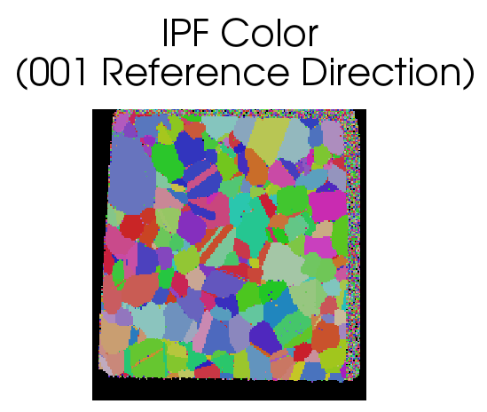

# Compute IPF Colors

## Group (Subgroup)

Processing (Crystallography)

## Description

This **Filter** will generate *inverse pole figure* (IPF) colors for cubic, hexagonal or trigonal crystal structures. The user can enter the *Reference Direction*, which defaults to [001]. The **Filter** also has the option to apply a black color to all "bad" **Elements**, as defined by a boolean *mask* array, which can be generated using the Threshold Objects **Filter**.

### Originating Data Notes

+ TSL (.ang file)
  + If the data originates from a TSL .ang file, then **Elements** that the TSL software could not reliably identify the Euler angles for will have a "Fit of Solution" = 180 and/or an "Image Quality" = 0.0.
  + This means that when the user runs some sort of threshold **Filter** the *mask* will be those **Elements** that have an Image Quality > 0 and/or Fit < 180.0
+ HKL (.ctf file)
  + If the data originates from an HKL (or Bruker) system (.ctf file) then bad voxels can typically be found by setting "Error" > 0
  + This means that when the user runs some sort of threshold **Filter** the *mask* will be those **Elements** that have an Error = 0

% Auto generated parameter table will be inserted here

## Example Pipelines

+ (10) SmallIN100 Full Reconstruction
+ (04) SmallIN100 Presegmentation Processing
+ (02) Single Hexagonal Phase Equiaxed
+ (03) Single Cubic Phase Rolled
+ INL Export
+ TxCopper_Exposed
+ TxCopper_Unexposed
+ MassifPipeline
+ InsertTransformationPhase
+ Edax IPF Colors
+ (01) Single Cubic Phase Equiaxed
+ (04) Two Phase Cubic Hexagonal Particles Equiaxed
+ (03) SmallIN100 Alignment
+ (06) SmallIN100 Synthetic

## License & Copyright

Please see the description file distributed with this **Plugin**

## DREAM3D-NX Help

If you need help, need to file a bug report or want to request a new feature, please head over to the [DREAM3DNX-Issues](https://github.com/BlueQuartzSoftware/DREAM3DNX-Issues/discussions) GItHub site where the community of DREAM3D-NX users can help answer your questions.
