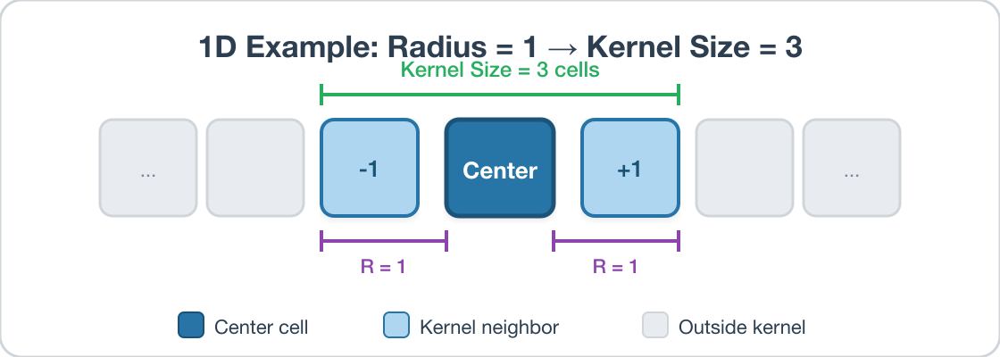
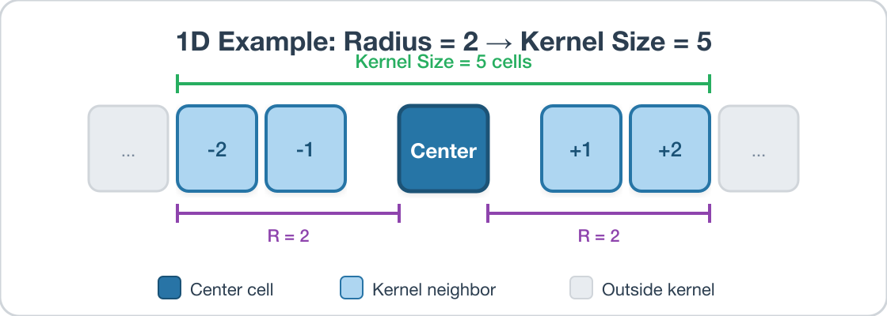
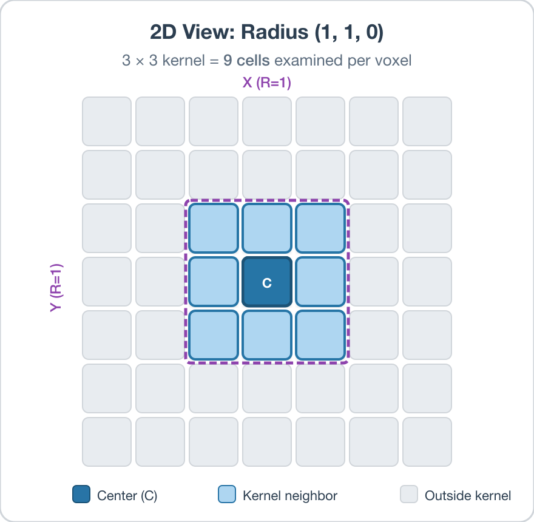
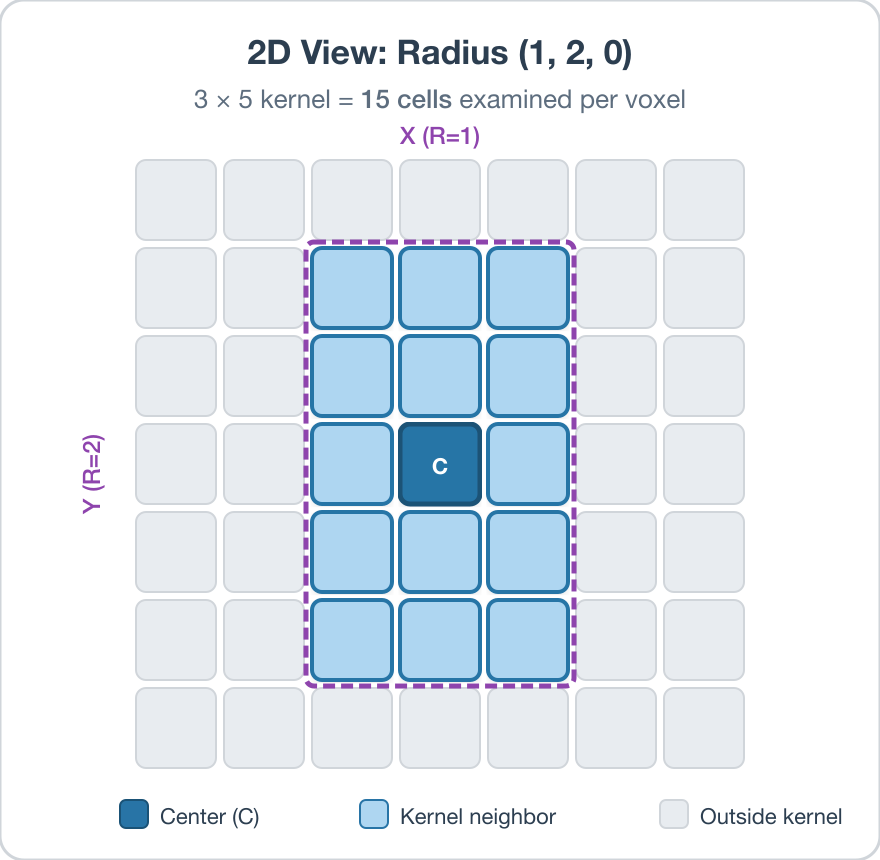
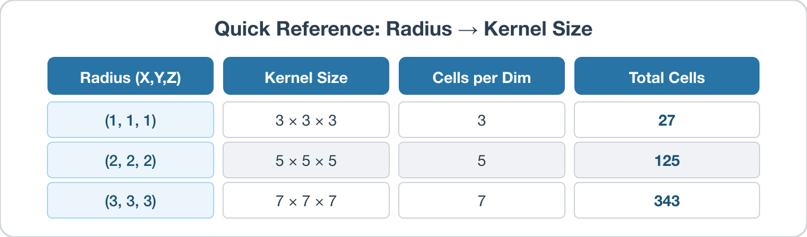

# Compute Kernel Average Misorientations

## Group (Subgroup)

Statistics (Crystallography)

## Description

This **Filter** determines the Kernel Average Misorientation (KAM) for each **Cell**. This **Filter** requires an **Image Geometry**, and the output KAM values are stored in degrees.  The user can select the size of the kernel (in voxels) to be used in the calculation.  The kernel size entered by the user is the *radius* of the kernel (i.e., entering values of *1*, *2*, *3* will result in a kernel that is *3*, *5*, and *7* **Cells** in size in the X, Y and Z directions, respectively; see *Understanding the Kernel Radius* below).  The algorithm for the determination of KAM is as follows:

1. Calculate the misorientation angle between each **Cell** in a kernel and the central **Cell** of the kernel **only** if the kernel cell belongs to the same `FeatureId`.
2. Average all of the misorientations for the kernel and store at the central **Cell**

The **Use Feature Ids** option controls which **Cells** within the kernel are included in the average:

+ **Checked (default):** only **Cells** that belong to the same *Feature* (same *Feature Id*) as the central **Cell** are considered — the calculation will **not** cross grain boundaries. This is the traditional per-grain KAM.
+ **Unchecked:** the *Feature Id* grouping is ignored and the average may cross grain boundaries, producing a per-voxel KAM. A kernel **Cell** is still excluded if its *Feature Id* is 0 (invalid/background data) or if its *Phase* differs from the central **Cell**'s *Phase* (averaging is restricted to Cells of the same Phase).

In both modes, **Cells** with a *Feature Id* of 0 or a *Phase* of 0 are considered invalid and receive a KAM value of 0.

### Note

All **Cells** in the kernel are weighted equally during the averaging, though they are not equidistant from the central **Cell**.

### Understanding the Kernel Radius

The *Kernel Radius* parameter has three components (X, Y, Z), and each value specifies how many **Cells** to extend outward from the center **Cell** along that axis.  The resulting kernel size along each axis is:

The kernel extends the specified radius in *both* directions (e.g., left and right) along each axis, plus includes the center **Cell** itself -- hence the formula.  The radius can be set independently for each axis.  For example, a Kernel Radius of *(1, 2, 3)* produces a kernel that is 3 &times; 5 &times; 7 **Cells** in the X, Y, and Z directions, respectively.

#### 1D Examples

Consider a single row of **Cells**.  With a radius of 1, the kernel extends 1 **Cell** in each direction from the center, giving a kernel of size 3:

Increasing the radius to 2 extends 2 **Cells** in each direction, giving a kernel of size 5:

#### 2D Examples

In 2D, the kernel forms a rectangular region around the center **Cell**.  With a symmetric radius of (1, 1), the kernel is a 3 &times; 3 square:

When different radii are used per axis, the kernel becomes non-square.  With X Radius = 1 and Y Radius = 2, the kernel is 3 **Cells** wide and 5 **Cells** tall:

In 3D, the Z Radius works the same way, extending into adjacent slices above and below the center **Cell**.

#### Quick Reference

### Required Input Sources

- **Cell Feature Ids** -- produced by a segmentation filter such as [Segment Features (Misorientation)](EBSDSegmentFeaturesFilter.md).
- **Cell Quaternions** -- typically read from EBSD data via [Read H5EBSD](ReadH5EbsdFilter.md), [Read CTF Data](ReadCtfDataFilter.md), or [Read ANG Data](ReadAngDataFilter.md).
- **Cell Phases** -- typically read from EBSD data alongside the quaternions.
- **Crystal Structures** -- ensemble-level array read from EBSD data or created by [Create Ensemble Info](CreateEnsembleInfoFilter.md).

For related per-feature misorientation metrics, see the **Compute Feature Reference Misorientations** and **Compute Misorientation** filters.

% Auto generated parameter table will be inserted here

## Example Pipelines

+ `MassifPipeline`
+ `(05) SmallIN100 Crystallographic Statistics`

## License & Copyright

Please see the description file distributed with this **Plugin**

## DREAM3D-NX Help

If you need help, need to file a bug report or want to request a new feature, please head over to the [DREAM3DNX-Issues](https://github.com/BlueQuartzSoftware/DREAM3DNX-Issues/discussions) GitHub site where the community of DREAM3D-NX users can help answer your questions.
