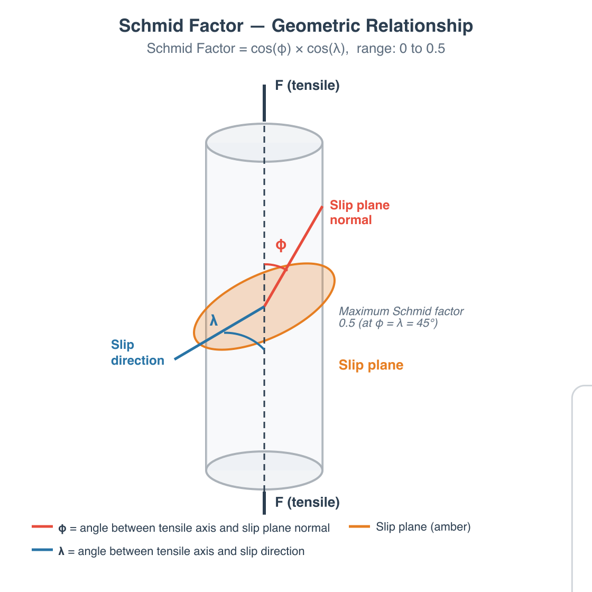

# Compute Schmid Factors

## Group (Subgroup)

Statistics (Crystallography)

## Description

This **Filter** calculates the Schmid factor for each **Feature** (grain), which measures how favorably oriented that grain is for plastic deformation under a given loading direction. A higher Schmid factor means the grain is more likely to deform (slip) under the applied load.

### What is the Schmid Factor?

When a force is applied to a polycrystalline material, each grain responds differently depending on how its internal crystal planes are oriented relative to the loading direction. Deformation occurs by *slip* -- atoms sliding along specific crystal planes in specific directions. Each combination of a slip plane and a slip direction is called a *slip system*.

The Schmid factor quantifies how much of the applied force is resolved onto a given slip system:

**Schmid Factor = cos(&phi;) &times; cos(&lambda;)**

where:

- **&phi;** is the angle between the loading axis and the *slip plane normal* (the direction perpendicular to the slip plane)
- **&lambda;** is the angle between the loading axis and the *slip direction* (the direction atoms slide along within the slip plane)

The Schmid factor ranges from 0 to 0.5. A value of 0.5 means the slip system is optimally aligned with the applied load. A value near 0 means the slip system is poorly oriented for deformation.

### How This Filter Works

1. The user specifies a **Loading Direction** as a unit vector in the sample reference frame (e.g., [0, 0, 1] for loading along the Z-axis). This is a dimensionless direction, not a magnitude.
2. For each **Feature**, the filter rotates the loading direction from the sample frame into the grain's crystal frame using the grain's average orientation.
3. The filter evaluates the Schmid factor for every slip system available for that grain's crystal structure.
4. By default, the slip system with the **largest** Schmid factor is reported.  Alternatively, the user can specify a particular slip plane and slip direction to evaluate.

### Note

Only the geometric Schmid factor is considered. The critical resolved shear stress (CRSS), which varies between slip systems in real materials, is not taken into account. This means the reported "most favorable" slip system is based purely on geometric alignment, not on the actual stress required to activate slip.

### Required Input Sources

- **Average Quaternions** -- the per-feature average orientation produced by [Compute Average Orientations](ComputeAvgOrientationsFilter.md).
- **Feature Phases** -- produced by [Compute Feature Phases](../SimplnxCore/ComputeFeaturePhasesFilter.md).
- **Crystal Structures** -- ensemble-level array read from EBSD data or created by [Create Ensemble Info](CreateEnsembleInfoFilter.md).

% Auto generated parameter table will be inserted here

## Example Pipelines

+ `(05) SmallIN100 Crystallographic Statistics`

## License & Copyright

Please see the description file distributed with this **Plugin**

## DREAM3D-NX Help

If you need help, need to file a bug report or want to request a new feature, please head over to the [DREAM3DNX-Issues](https://github.com/BlueQuartzSoftware/DREAM3DNX-Issues/discussions) GitHub site where the community of DREAM3D-NX users can help answer your questions.
