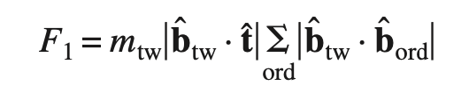
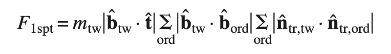
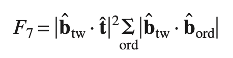

# Compute Neighbor Slip Transmission Metrics

## Group (Subgroup)

Statistics (Crystallographic)

## Description

**THIS FILTER ONLY WORKS ON Cubic m-3m LAUE CLASSES**

This **Filter** calculates a suite of *slip transmission metrics* that are related to the alignment of slip directions and planes across **Feature** boundaries. The algorithm for calculation of these metrics is as follows:

1. Get the average orientation of the **Feature**
2. Get the **Feature**'s list of neighboring **Features**
3. Get the average orientation of each neighboring **Feature**
4. Calculate metrics given by equations in *slip transmission metrics*
5. Store metrics in lists for the **Feature**
6. Repeat for all **Features**

*Note:* The transmission metrics are calculated using the average orientations for neighboring **Features** and not the local orientation near the boundary. Also, the metrics are calculated twice (i.e., when **Feature** 1 has neighbor **Feature** 2 and when **Feature** 2 has neighbor **Feature** 1) because the direction across the boundary between the **Features** affects the value of the metric.

## Luster-Morris Parameter (M' Values)

The values are calculated as presented in [1].

## Fracture Initiation Parameter (fip)

Three (3) *fip* values are computed as outputs to this filter. These are best explained in [2], see page 021012-4

## Citations

[1] [Luster, J., Morris, M.A., 1995. *Compatibility Of Deformation In Two-Phase Ti-Al Alloys: Dependence On Microstructure And Orientation Relationships*. **Metallurgical and Materials Transactions A 26, 1745**](https://link.springer.com/article/10.1007/BF02670762)

[2] [D. Kumar, T. R. Bieler, P. Eisenlohr, D. E. Mason, M. A. Crimp, F. Roters, and D. Raabe. On Predicting Nucleation of Microcracks Due to Slip Twin Interactions at Grain Boundaries in Duplex Near γ-TiAl. Journal of Engineering Materials and Technology, 130(2):021012–12, 2008. doi:10.1115/1.2841620.](https://doi.org/10.1115/1.2841620)

% Auto generated parameter table will be inserted here

## Example Pipelines

## License & Copyright

Please see the description file distributed with this **Plugin**

## DREAM3D-NX Help

If you need help, need to file a bug report or want to request a new feature, please head over to the [DREAM3DNX-Issues](https://github.com/BlueQuartzSoftware/DREAM3DNX-Issues/discussions) GitHub site where the community of DREAM3D-NX users can help answer your questions.
