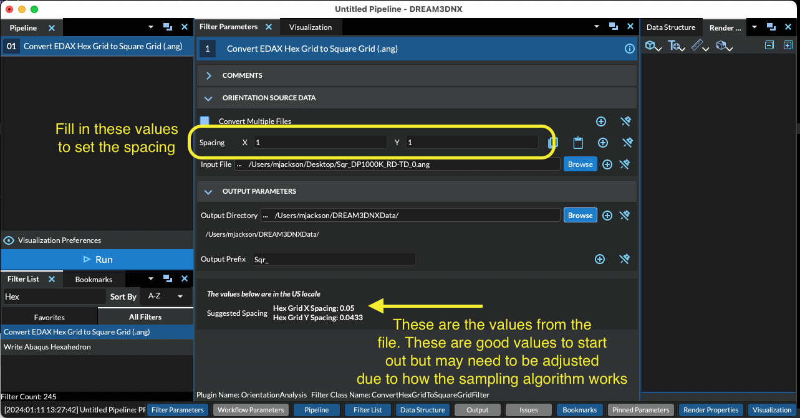

# Convert Hexagonal Grid Data to Square Grid Data (TSL - .ang)

## Group (Subgroup)

Conversion, ANG File, EDAX, Hex Grid

## Description

This **Filter** will convert TSL .ang files on hexagonal grids to TSL .ang files on square grids by means of interpolation between points. Note that the resulting square grid .ang files may have more or less rows of data and that some data may be interpolated based on its neighbor data.  By default, the spacing of the square grid will be the spacing between columns in the hexagonal grid.

This **Filter** is useful since most DREAM3D-NX routines for analyzing Ebsd data require a square grid.  After using this **Filter** to bulk convert the EDAX/TSL .ang files to square grids, it is suggested to use the {ref}`Import Orientation File(s) to H5Ebsd <OrientationAnalysis/EbsdToH5EbsdFilter:Description>` **Filter** to convert the square grid .ang files to the H5Ebsd format. The user can then use the {ref}`Read H5Ebsd File <OrientationAnalysis/ReadH5EbsdFilter:Description>` **Filter** to import the H5Ebsd file into DREAM.3D for analysis.

The use of this **Filter** is similar to the use of the {ref}`Import Orientation File(s) to H5Ebsd <OrientationAnalysis/EbsdToH5EbsdFilter:Description>`  **Filter**.  Please consult that **Filter's** documentation for a detailed description of the various user interface elements.  Note that unlike the {ref}`Import Orientation File(s) to H5Ebsd <OrientationAnalysis/EbsdToH5EbsdFilter:Description>` **Filter**, this **Filter** does not require either the *Stacking Order* or the *Reference Frame* to be modified.

% Auto generated parameter table will be inserted here

## Example Pipelines

## License & Copyright

Please see the description file distributed with this **Plugin**

## DREAM3D-NX Help

If you need help, need to file a bug report or want to request a new feature, please head over to the [DREAM3DNX-Issues](https://github.com/BlueQuartzSoftware/DREAM3DNX-Issues/discussions) GItHub site where the community of DREAM3D-NX users can help answer your questions.
