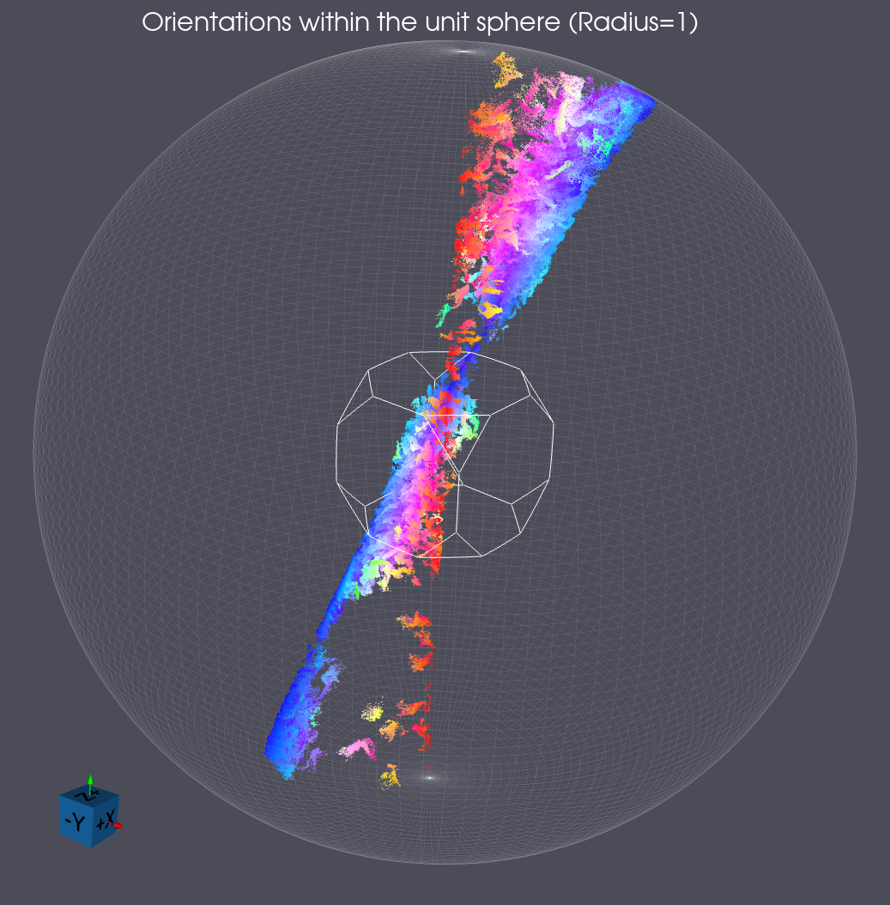
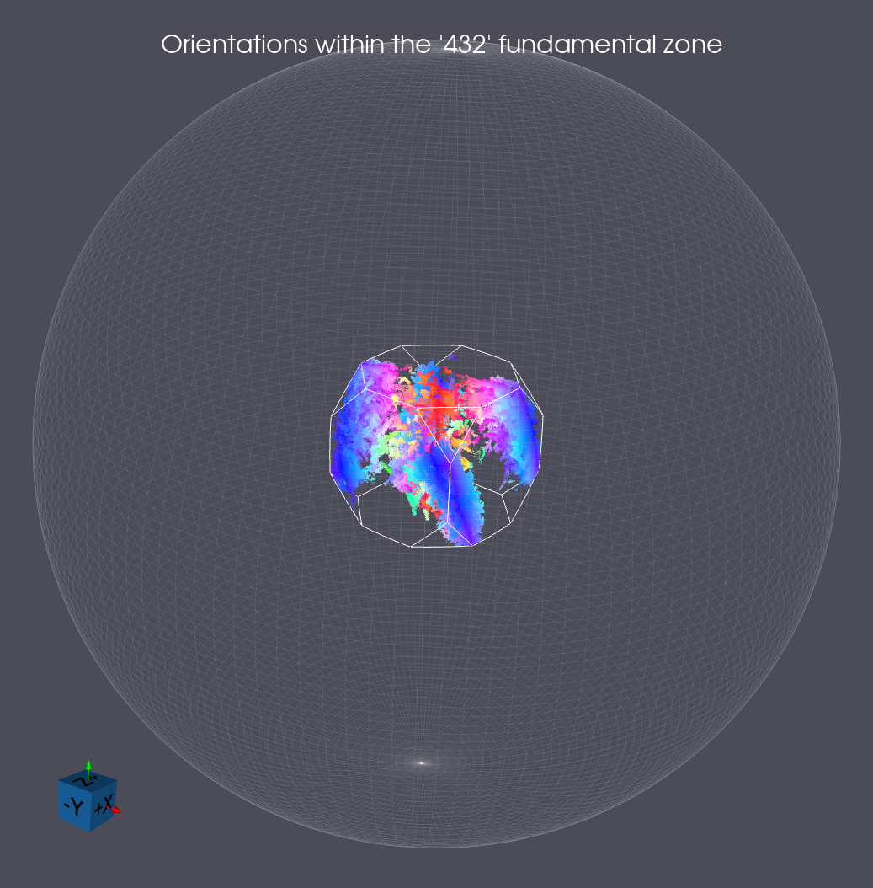

# Convert Orientations To Rodrigues Geometry

## Group (Subgroup)

Visualization (Crystallographic)

## Description

For each orientation a point inside the stereographic sphere of radius=1 is generated. There is an option to also ensure the point is within the fundamental zone (FZ) for a given Laue class.

This is an image of the conversion of a data set of rotation point group 432 into Rodrigues space.

This is the same data, but with the option to convert the data to the Fundamental Zone (FZ) set to ON.

Note the coloring used in the previous images is via an IPF-Z <001> Coloring.

### Input Orientation Type

The *Input Orientation Type* parameter specifies the orientation representation of the input array:

- **Euler Angles**: Three-component (phi1, Phi, phi2) Bunge Euler angle representation.
- **Orientation Matrix**: Nine-component (3x3) rotation matrix in row-major format.
- **Quaternions**: Four-component quaternion in vector-scalar ordering ([x, y, z], w).
- **Axis Angle**: Four-component axis-angle representation ([x, y, z], Angle).
- **Rodrigues Vectors**: Four-component Rodrigues vector ([x, y, z], w) where the vector is normalized and the length is stored as the last component.
- **Homochoric**: Three-component homochoric vector [x, y, z].
- **Cubochoric**: Three-component cubochoric vector [x, y, z].
- **Stereographic**: Three-component stereographic projection vector [x, y, z].

% Auto generated parameter table will be inserted here

## Example Pipelines

## License & Copyright

Please see the description file distributed with this **Plugin**

## DREAM3D-NX Help

If you need help, need to file a bug report or want to request a new feature, please head over to the [DREAM3DNX-Issues](https://github.com/BlueQuartzSoftware/DREAM3DNX-Issues/discussions) GitHub site where the community of DREAM3D-NX users can help answer your questions.
