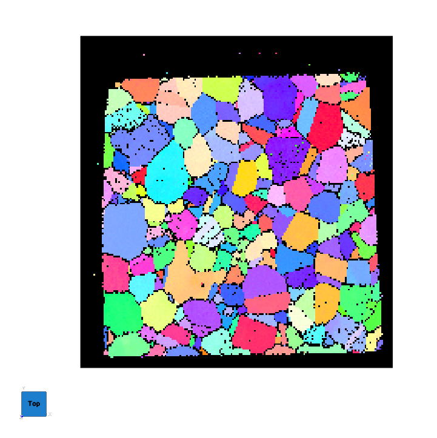
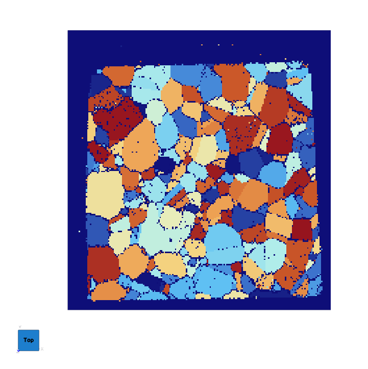

# Segment Features (Misorientation)

## Group (Subgroup)

Reconstruction (Segmentation)

## Description

This **Filter** groups neighboring **Cells** (voxels) that have similar crystal orientations into **Features** (grains), producing a *FeatureIds* array that labels every cell in the input **Image Geometry** with a grain number. This is the primary grain-segmentation filter for EBSD data and is usually the first feature-generating step in a reconstruction pipeline.

For segmentation based only on C-axis alignment in hexagonal materials, see [Segment Features (C-Axis Misalignment)](CAxisSegmentFeaturesFilter.md). For segmentation based on a scalar value rather than orientation, see [Segment Features (Scalar)](../SimplnxCore/ScalarSegmentFeaturesFilter.md).

### What is Misorientation-Based Segmentation?

A **grain** in a polycrystalline material is a region of crystal with a nearly-uniform lattice orientation. At grain boundaries the lattice rotates abruptly -- typically by many degrees -- from one grain to the next. Within a grain, orientation changes are small (sub-degree to a few degrees), due to noise, elastic strain, or mild plastic deformation.

*Misorientation* is the angular rotation that maps one crystal orientation onto another. By walking cell-to-cell and merging neighbors whose misorientation is below a threshold, this filter carves the cell-level orientation map into discrete grains.

### How This Filter Works

The filter uses a standard *burn algorithm* to grow each grain outward from a seed cell:

1. Randomly pick an unassigned **Cell** and give it a new *Feature Id*.
2. Compute the misorientation angle between the seed cell and each neighbor (see **Neighbor Scheme** below). Crystal symmetry is applied so that the smallest symmetry-equivalent angle is used.
3. Any neighbor whose misorientation angle is less than the user-specified *Misorientation Tolerance* (in **degrees**) is added to the current feature and gets the same *Feature Id*.
4. Repeat step 2-3 from each newly added cell, growing the feature outward until no more neighbors qualify.
5. Increment the feature counter and pick a new unassigned seed cell. Continue until every eligible cell has been assigned.

### Example: Before and After

The single EBSD slice below is shown first as an IPF (inverse pole figure) color map of the
raw cell orientations, then after misorientation-based segmentation, where each grain has been
assigned a distinct *Feature Id* and colored categorically.

| IPF Color Map (input orientations) | Segmented Grains (Feature Ids) |
|:--:|:--:|
|  |  |

### Typical Tolerance Values

The *Misorientation Tolerance* is in **degrees**. The right value depends on what you are trying to resolve:

- **5 degrees** -- the industry-standard default for general grain segmentation. Works well across most materials.
- **2-3 degrees** -- tighter; useful when the data is very clean and you want to resolve subgrains or low-angle boundaries.
- **10-15 degrees** -- the classical "high-angle grain boundary" threshold. Useful if you want to ignore subgrain structure entirely and segment only the high-angle grains.

Smaller tolerances produce more, smaller features and will pick up noise and subgrain boundaries as feature splits. Larger tolerances produce fewer, larger features at the cost of possibly merging neighboring grains that have a low-angle boundary between them.

### Phase Handling

Only cells belonging to the same phase are ever merged. Cells of different phases are always considered different features regardless of their orientation, because misorientation between different crystal systems is not physically meaningful. Cells with *phase = 0* (the "Unknown" phase) are treated as unsegmentable and receive Feature Id 0.

### Neighbor Scheme

The *Neighbor Scheme* parameter provides the following choices:

- **Face Neighbors [0]**: Only the 6 face-sharing neighbors of a voxel are considered during segmentation.
- **All Connected Neighbors [1]**: All 26 neighbors connected by a face, edge, or vertex are considered during segmentation.

DREAM.3D version 6.x only used face neighbors. The default here is still *Face Only* for backward compatibility; switch to *All Connected* when diagonal connectivity should merge a grain that would otherwise be split into two features.

| Neighbor Scheme = "Face Only" | Neighbor Scheme = "All Connected" |
|:--:|:--:|
|  |  |

| Neighbor Scheme = "Face Only" | Neighbor Scheme = "All Connected" |
|:--:|:--:|
|  |  |

| Neighbor Scheme = "Face Only" | Neighbor Scheme = "All Connected" |
|:--:|:--:|
|  |  |

| Neighbor Scheme = "Face Only" | Neighbor Scheme = "All Connected" |
|:--:|:--:|
|  |  |

### Mask Array

If *Use Mask Array* is enabled, cells flagged *false* in the mask are excluded from segmentation and left with a Feature Id of 0. This is essential for EBSD data where low-confidence cells should not be merged into grains -- typically use a threshold on the confidence index or image quality to build the mask via [Multi-Threshold Objects](../SimplnxCore/MultiThresholdObjectsFilter.md).

### Periodic Option

If the input data represents a **periodic** volume (e.g., a synthetic microstructure that tiles across opposite faces), enable *Is Periodic*. The filter will detect features that wrap across the geometry bounds and emit a warning that centroid and other spatial statistics may be incorrect for those features.

### Required Input Sources

- **Cell Quaternions** -- typically read from EBSD data via [Read H5EBSD](ReadH5EbsdFilter.md), [Read CTF Data](ReadCtfDataFilter.md), or [Read ANG Data](ReadAngDataFilter.md); can also be produced from Euler angles by [Convert Orientations](ConvertOrientationsFilter.md).
- **Cell Phases** -- typically read from EBSD data alongside the quaternions.
- **Crystal Structures** -- ensemble-level array read from EBSD data or created by [Create Ensemble Info](CreateEnsembleInfoFilter.md).
- **Mask Array** (optional) -- a boolean array marking valid cells, typically produced by [Multi-Threshold Objects](../SimplnxCore/MultiThresholdObjectsFilter.md).

% Auto generated parameter table will be inserted here

## Example Pipelines

+ (02) Small IN100 Full Reconstruction
+ INL Export
+ 04_Steiner Compact

## License & Copyright

Please see the description file distributed with this **Plugin**

## DREAM3D-NX Help

If you need help, need to file a bug report or want to request a new feature, please head over to the [DREAM3DNX-Issues](https://github.com/BlueQuartzSoftware/DREAM3DNX-Issues/discussions) GitHub site where the community of DREAM3D-NX users can help answer your questions.
