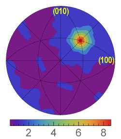
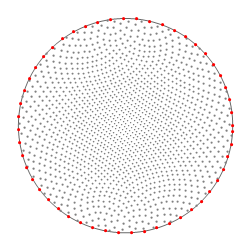
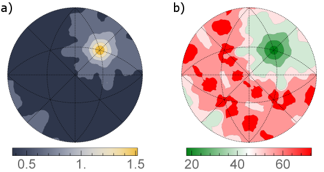

=================================
Find GBCD (Metric-Based Approach)
=================================

Group (Subgroup)
================

Statistics (Crystallographic)

Description
===========

This **Filter** computes a section through the five-dimensional grain boundary distirbution for a fixed misorientation.
An example of such a section is shown in Fig. 1. Differently than **Find GBCD Filter**, which uses a method based on
partition of the boundary space into bins, this **Filter** implements an alternative metric-based approach described by
K. Glowinski and A. Morawiec in `Analysis of experimental grain boundary distributions based on boundary-space metrics,
Metall. Mater. Trans. A 45, 3189-3194 (2014) <https://link.springer.com/article/10.1007/s11661-014-2325-y>`__

   this Filter for the small IN100 data set. Units are multiples of random distribution (MRDs).

   Fig. 1: Section for the 17.9 deg./[111] misorientation through the grain boundary distribution obtained using this
   Filter for the small IN100 data set. Units are multiples of random distribution (MRDs).

Metrics in the boundary space can be defined in a number of ways, but it is essential that two boundaries are close
(distant) if they have similar (different) geometric features, and that symmetrically equivalent representations of
boundaries are taken into consideration. Formally, the boundary space is a Cartesian product of the misorientation and
boundary-normal subspaces. For computational reasons and because of considerably different resolutions in
determinination of grain misorientation and boundary-plane parameters, it is convenient to use a separate metric in each
subspace. With separate metrics, the procedure for computing distribution values for a selected misorientation has two
stages. First, boundary segments with misorientations located not farther from the fixed misorientation than a limiting
distance ρm are selected. In the second stage, the distribution is probed at evenly distributed normal directions (see
Fig. 2), and areas of boundaries whose normals deviate from a given direction by less than ρp are summed. (The radii ρm
and ρp should be tailored to resolution, amount, and quality of data and set.) Eventually, the obtained distribution is
normalized in order to express it in the conventional units, i.e., multiples of the random distribution.

+-----------------------------------------------------------------------------------------------------------------------+
| Image                                                                                                                 |
+=======================================================================================================================+
| |image1|                                                                                                              |
+-----------------------------------------------------------------------------------------------------------------------+
| Fig. 2: End-points (drawn in stereographic projection) of sampling directions used for probing distribution values;   |
| the number of points here is about 1500. Additionally, distributions are probed at points lying at the equator        |
| (marked with red); this is helpful for some plotting software.                                                        |
+-----------------------------------------------------------------------------------------------------------------------+

This **Filter** also calculates statistical errors of the distributions using the formula

ε = ( *f* *n* *v* )1/2

where ε is the relative error of the distribution function at a given point, *f* is the value of the function at that
point, *n* stands for the number of grain boundaries (**not** the number of mesh triangles) in the considered network,
and *v* denotes the volume restricted by ρm and ρp. The errors can be calculated either as their absolute values, i.e.,
ε × *f* (Fig. 3a) or as relative errors, i.e., 100% × ε (Fig. 3b). The latter are computed in a way that if the relative
error exceeds 100%, it is rounded down to 100%.

+-----------------------------------------------------------------------------------------------------------------------+
| Image                                                                                                                 |
+=======================================================================================================================+
| |image2|                                                                                                              |
+-----------------------------------------------------------------------------------------------------------------------+
| |Fig. 3: (a) Errors (absolute values of one standard deviation) corresponding to the distribution shown in Fig. 1.    |
| Levels are given in MRDs. (b) Relative errors (given in %) of the distribution from Fig. 1.|                          |
+-----------------------------------------------------------------------------------------------------------------------+

Format of Output Files
======================

Output files are formatted to be readable by GMT plotting program. The first line contains the fixed misorientation axis
and angle. Each of the remaining lines contains three numbers. The first two columns are angles (in degrees) describing
a given sampling direction; let us denote them *col*\ 1 and *col*\ 2, respectively. The third column is either the value
of the GBCD (in MRD) for that direction or its error (in MRD or %, depending on user’s selection). If you use other
software, you can retrive spherical angles θ and φ of the sampling directions in the following way:

θ = 90° - *col*\ 1

φ = *col*\ 2

Then, the directions are given as [ sin θ × cos φ , sin θ × sin φ , cos θ ].

Parameters
==========

+---------------------------+---------------------------+-------------------------------------------------------------+
| Name                      | Type                      | Description                                                 |
+===========================+===========================+=============================================================+
| Phase of Interest         | int32_t                   | Index of the **Ensemble** for which to compute GBCD;        |
|                           |                           | boundaries having grains of this phase on both its sides    |
|                           |                           | will only be taken into account                             |
+---------------------------+---------------------------+-------------------------------------------------------------+
| Fixed Misorientation      | float (4x)                | Axis-angle representation of the misorientation of          |
|                           |                           | interest. Angle value should be in degrees.                 |
+---------------------------+---------------------------+-------------------------------------------------------------+
| Limiting Distances        | float                     | ρm and ρp as defined above                                  |
+---------------------------+---------------------------+-------------------------------------------------------------+
| Number of Sampling Points | int32_t                   | The **approximate** number of sampling directions           |
+---------------------------+---------------------------+-------------------------------------------------------------+
| Exclude Triangles         | bool                      | If checked, only interiors of **Faces** are included in     |
| Directly Neighboring      |                           | GBCD                                                        |
| Triple Lines              |                           |                                                             |
+---------------------------+---------------------------+-------------------------------------------------------------+
| Output Distribution File  | File Path                 | The output file path (extension .dat, GMT format)           |
+---------------------------+---------------------------+-------------------------------------------------------------+
| Output Distribution       | File Path                 | The output file path (extension .dat, GMT format)           |
| Errors File               |                           |                                                             |
+---------------------------+---------------------------+-------------------------------------------------------------+
| Save Relative Errors      | bool                      | What type of errors to save (see above description for more |
| Instead of Their Absolute |                           | detail)                                                     |
| Values                    |                           |                                                             |
+---------------------------+---------------------------+-------------------------------------------------------------+

Required Geometry
=================

Image + Triangle

Required Objects
================

+----------------+----------------------------------+-------------------------------+---------------------+-----------+
| Kind           | Default Name                     | Type                          | Comp Dims           | De        |
|                |                                  |                               |                     | scription |
+================+==================================+===============================+=====================+===========+
| Vertex         | NodeTypes                        | int8_t                        | (1)                 | Specifies |
| Attribute      |                                  |                               |                     | the type  |
| Array*\*       |                                  |                               |                     | of node   |
|                |                                  |                               |                     | in the    |
|                |                                  |                               |                     | Geometry  |
+----------------+----------------------------------+-------------------------------+---------------------+-----------+
| Face Attribute | FaceLabels                       | int32_t                       | (2)                 | Specifies |
| Array          |                                  |                               |                     | which     |
|                |                                  |                               |                     | **F       |
|                |                                  |                               |                     | eatures** |
|                |                                  |                               |                     | are on    |
|                |                                  |                               |                     | either    |
|                |                                  |                               |                     | side of   |
|                |                                  |                               |                     | each      |
|                |                                  |                               |                     | \**Face   |
+----------------+----------------------------------+-------------------------------+---------------------+-----------+
| Face Attribute | FaceNormals                      | double                        | (3)                 | Specifies |
| Array          |                                  |                               |                     | the       |
|                |                                  |                               |                     | normal of |
|                |                                  |                               |                     | each      |
|                |                                  |                               |                     | \**Face   |
+----------------+----------------------------------+-------------------------------+---------------------+-----------+
| Face Attribute | FaceAreas                        | double                        | (1)                 | Specifies |
| Array          |                                  |                               |                     | the area  |
|                |                                  |                               |                     | of each   |
|                |                                  |                               |                     | \**Face   |
+----------------+----------------------------------+-------------------------------+---------------------+-----------+
| Feature        | FaceLabels                       | int32_t                       | (2)                 | Specifies |
| Attribute      |                                  |                               |                     | which     |
| Array          |                                  |                               |                     | *         |
|                |                                  |                               |                     | original* |
|                |                                  |                               |                     | **F       |
|                |                                  |                               |                     | eatures** |
|                |                                  |                               |                     | are on    |
|                |                                  |                               |                     | either    |
|                |                                  |                               |                     | side of   |
|                |                                  |                               |                     | each      |
|                |                                  |                               |                     | boundary  |
|                |                                  |                               |                     | \         |
|                |                                  |                               |                     | **Feature |
+----------------+----------------------------------+-------------------------------+---------------------+-----------+
| Feature        | AvgEulerAngles                   | float                         | (3)                 | Three     |
| Attribute      |                                  |                               |                     | angles    |
| Array          |                                  |                               |                     | defining  |
|                |                                  |                               |                     | the       |
|                |                                  |                               |                     | or        |
|                |                                  |                               |                     | ientation |
|                |                                  |                               |                     | of the    |
|                |                                  |                               |                     | **        |
|                |                                  |                               |                     | Feature** |
|                |                                  |                               |                     | in Bunge  |
|                |                                  |                               |                     | c         |
|                |                                  |                               |                     | onvention |
|                |                                  |                               |                     | (Z-X-Z)   |
+----------------+----------------------------------+-------------------------------+---------------------+-----------+
| Feature        | Phases                           | int32_t                       | (1)                 | Specifies |
| Attribute      |                                  |                               |                     | to which  |
| Array          |                                  |                               |                     | phase     |
|                |                                  |                               |                     | each      |
|                |                                  |                               |                     | **        |
|                |                                  |                               |                     | Feature** |
|                |                                  |                               |                     | belongs   |
+----------------+----------------------------------+-------------------------------+---------------------+-----------+
| Ensemble       | CrystalStructures                | uint32_t                      | (1)                 | En        |
| Attribute      |                                  |                               |                     | umeration |
| Array          |                                  |                               |                     | rep       |
|                |                                  |                               |                     | resenting |
|                |                                  |                               |                     | the       |
|                |                                  |                               |                     | crystal   |
|                |                                  |                               |                     | structure |
|                |                                  |                               |                     | for each  |
|                |                                  |                               |                     | \*        |
|                |                                  |                               |                     | *Ensemble |
+----------------+----------------------------------+-------------------------------+---------------------+-----------+

Feedback
========

In the case of any questions, suggestions, bugs, etc., please feel free to email the author of this **Filter** at
kglowinski *at* ymail.com

References
==========

[1] K. Glowinski and A. Morawiec, Analysis of experimental grain boundary distributions based on boundary-space metrics,
Metall. Mater. Trans. A 45, 3189-3194 (2014)

Example Pipelines
=================

``(05) SmallIN100 GBCD Metric.d3dpipeline``

This pipeline depends on previous pipelines in the Small IN100 reconstruction pipeline series.

License & Copyright
===================

Please see the description file distributed with this **Plugin**.

DREAM3DNX Help
==============

Check out our GitHub community page at `DREAM3DNX-Issues <https://github.com/BlueQuartzSoftware/DREAM3DNX-Issues>`__ to
report bugs, ask the community for help, discuss features, or get help from the developers.

.. |Fig. 3: (a) Errors (absolute values of one standard deviation) corresponding to the distribution shown in Fig. 1. Levels are given in MRDs. (b) Relative errors (given in %) of the distribution from Fig. 1.| image:: Images/FindGBCDMetricBased_err2.png
