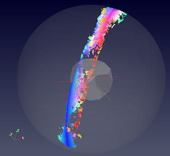
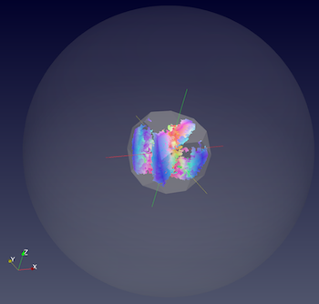

# GenerateFZQuaternions 

## Group (Subgroup) ##

OrientationAnalysis (OrientationAnalysis)

## Description ##

This **Filter** reduces input orientations (Quaternions) into the fundamental zone for the given Laue group.

The following figures represent a BCC Interstitial steel EBSD data set courtesy of [1].

|    |    |
|----|----|
|   |    |
| Original IPF Colored dataset  | IPF Color Legend for m-3m Laue group  |
|     |   |
| EBSD Dataset **before** the filter. IPF Colors are using a reference direction of < 001 >.  The data is visualized in the 3D stereographic unit spheres with a superimposed Rodrigues Fundamental Zone.   | EBSD Dataset **after** the filter. IPF Colors are using a reference direction of < 001 >. The data is visualized in the 3D stereographic unit spheres with a superimposed Rodrigues Fundamental Zone. |

## Parameters ##

| Name | Type | Description |
|------|------|------|
| Apply to Good Elements Only (Bad Elements Will Be Black) | bool | Whether to assign a black color to "bad" **Elements** |

## Required Geometry ##

Not Applicable

## Required Objects ##

| Kind | Default Name | Type | Component Dimensions | Description |
|------|--------------|-------------|---------|-----|
| **Element Attribute Array** | Quaternions | float | (4)  | Quaternions ordered as (< x, y, z >, w) |
| **Element Attribute Array** | Phases | int32_t | (1) | Phase Id specifying the phase of the **Element** |
| **Element Attribute Array** | Mask | bool | (1) | Used to define **Elements** as *good* or *bad*. Only required if _Apply to Good Elements Only (Bad Elements Will Be Black)_ is checked |
| **Ensemble Attribute Array** | CrystalStructures | uint32_t | (1) | Enumeration representing the crystal structure for each **Ensemble**.  |

**Crystal Structure Table**

| String Name | Internal Value | Laue Name |
| ------------|----------------|----------|
| Hexagonal_High | 0 |  Hexagonal-High 6/mmm |
| Cubic_High | 1 |  Cubic Cubic-High m3m |
| Hexagonal_Low | 2 |  Hexagonal-Low 6/m |
| Cubic_Low | 3 |  Cubic Cubic-Low m3 (Tetrahedral) |
| Triclinic | 4 |  Triclinic -1 |
| Monoclinic | 5 |  Monoclinic 2/m |
| OrthoRhombic | 6 |  Orthorhombic mmm |
| Tetragonal_Low | 7 |  Tetragonal-Low 4/m |
| Tetragonal_High | 8 |  Tetragonal-High 4/mmm |
| Trigonal_Low | 9 |  Trigonal-Low -3 |
| Trigonal_High | 10 |  Trigonal-High -3m |
| UnknownCrystalStructure | 999 |  Undefined Crystal Structure |

## Created Objects ##

| Kind | Default Name | Type | Component Dimensions | Description |
|------|--------------|-------------|---------|-----|
| **Element Attribute Array** | FZ Quaternions |  float | (4) | The Quaternion that represents an orientation within the fundamental zone for each **Element** |

## References ##

[1]: N. Allain-Bonasso, F. Wagner, S. Berbenni, D.P. Field, A study of the heterogeneity of plastic deformation in IF steel by EBSD, Materials Science and Engineering: A, Volume 548, 30 June 2012, Pages 56-63, ISSN 0921-5093, http://dx.doi.org/10.1016/j.msea.2012.03.068.
(http://www.sciencedirect.com/science/article/pii/S0921509312004388)

[2]: http://reference.iucr.org/dictionary/Laue_classes

## Example Pipelines ##

## License & Copyright ##

Please see the description file distributed with this plugin.

## DREAM3DNX Help

Check out our GitHub community page at [DREAM3DNX-Issues](https://github.com/BlueQuartzSoftware/DREAM3DNX-Issues) to report bugs, ask the community for help, discuss features, or get help from the developers.

## Python Filter Arguments

+ module: OrientationAnalysis
+ Class Name: GenerateFZQuaternions
+ Displayed Name: Reduce Orientations to Fundamental Zone

| argument key | Human Name | Description | Parameter Type |
|--------------|------------|-------------|----------------|
| cell_phases_array_path | Input Phases | The phases of the data. The data should be the indices into the Crystal Structures Data Array. | complex.ArraySelectionParameter |
| crystal_structures_array_path | Crystal Structures | Enumeration representing the crystal structure for each Ensemble | complex.ArraySelectionParameter |
| f_zquats_array_path | Created FZ Quaternions | The name of the array containing the Quaternion that represents an orientation within the fundamental zone for each Element | complex.DataObjectNameParameter |
| good_voxels_array_path | Input Mask [Optional] | Optional Mask array where valid data is TRUE or 1. | complex.ArraySelectionParameter |
| quats_array_path | Input Quaternions | The input quaternions to convert. | complex.ArraySelectionParameter |
| use_good_voxels | Apply to Good Elements Only (Bad Elements Will Be Black) | Whether to assign a black color to 'bad' Elements | complex.BoolParameter |

