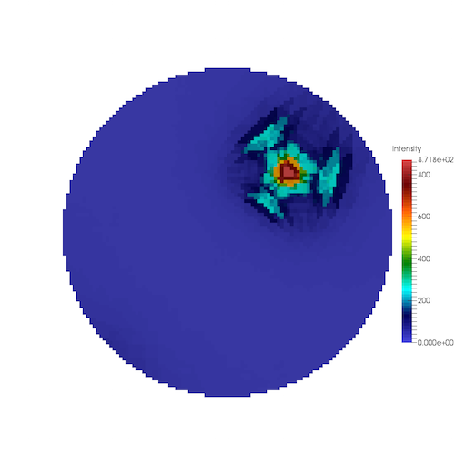

=========================
Generate GBCD Pole Figure
=========================

Group (Subgroup)
================

IO (Output)

Description
===========

This **Filter** creates a pole figure from the Grain Boundary Character Distribution (GBCD) data. The user must select
the relevant phase for which to generate the pole figure by entering the *phase index*.

--------------

   Regular Grid Visualization of the Small IN100 GBCD results

.. figure:: Images/Small_IN100_GBCD_Delaunay2D.png
   :alt: Using ParaView’s Threshold filter + Cells to Points + Delaunay2D Filters

   Using ParaView’s Threshold filter + Cells to Points + Delaunay2D Filters

--------------

Parameters
==========

+---------------------------+---------------------------+-------------------------------------------------------------+
| Name                      | Type                      | Description                                                 |
+===========================+===========================+=============================================================+
| Phase of Interest         | int32                     | Index of the **Ensemble** for which to plot the pole figure |
+---------------------------+---------------------------+-------------------------------------------------------------+
| Misorientation Axis-Angle | float (4x)                | Axis-Angle pair values for drawing GBCD in the order of     |
|                           |                           | Axis (Degrees) then Axis (Normalized)                       |
+---------------------------+---------------------------+-------------------------------------------------------------+
| Output Image Dimension    | int32                     | The value to use for the x and y dimensions of the created  |
|                           |                           | Image Geometry                                              |
+---------------------------+---------------------------+-------------------------------------------------------------+

Required Geometry
=================

Triangle

Required Objects
================

+-----------------------------+--------------+----------+------------+-------------------------------------------------+
| Kind                        | Default Name | Type     | Comp. Dims | Description                                     |
+=============================+==============+==========+============+=================================================+
| Ensemble Attribute Array    | GBDC         | double   | (n,        | 5 parameter GBCD data. The 6th component is     |
|                             |              |          | m,l,o,q,r) | used internally to track the northern           |
|                             |              |          |            | vs. southern hemisphere of the Lambert sphere   |
+-----------------------------+--------------+----------+------------+-------------------------------------------------+
| Crystal Structure           | Cryst        | Enu      | 1          | Crystal structure for GBCD. Currently supports  |
|                             | alStructures | meration |            | from Hexagonal-High 6/mmm or Cubic-High m-3m    |
|                             |              |          |            | symmetries                                      |
+-----------------------------+--------------+----------+------------+-------------------------------------------------+

Created Objects
===============

+--------------------+-------------------------------------------------+----------------------------------------------+
| Kind               | Default Name                                    | Description                                  |
+====================+=================================================+==============================================+
| Image Geometry     | [ImageGeometry]                                 | The Image Geometry to be created             |
+--------------------+-------------------------------------------------+----------------------------------------------+
| Cell Attribute     | Cell Data                                       | The name of the cell attribute matrix        |
| Matrix             |                                                 | created for the Image Geometry               |
+--------------------+-------------------------------------------------+----------------------------------------------+
| Cell Intensity     | Intensity                                       | The data array to be created from the pole   |
| Array              |                                                 | figures and stored in the Image Geometry     |
|                    |                                                 | cell attribute matrix                        |
+--------------------+-------------------------------------------------+----------------------------------------------+

Example Pipelines
=================

-  

   (4) SmallIN100 GBCD

License & Copyright
===================

Please see the description file distributed with this **Plugin**

DREAM3DNX Help
==============

Check out our GitHub community page at `DREAM3DNX-Issues <https://github.com/BlueQuartzSoftware/DREAM3DNX-Issues>`__ to
report bugs, ask the community for help, discuss features, or get help from the developers.
