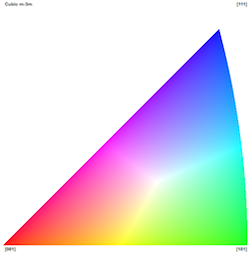
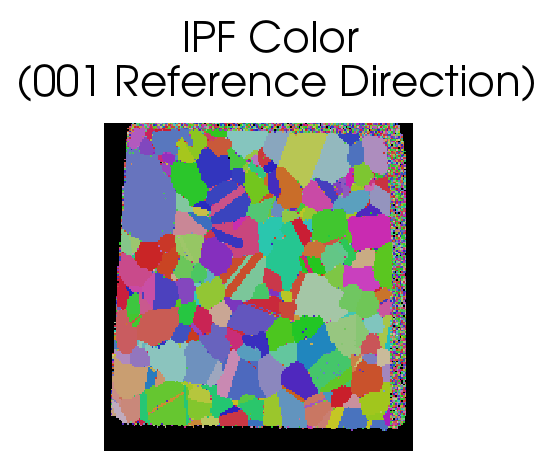

===================
Generate IPF Colors
===================

Group (Subgroup)
================

Processing (Crystallography)

Description
===========

This **Filter** will generate *inverse pole figure* (IPF) colors for cubic, hexagonal or trigonal crystal structures.
The user can enter the *Reference Direction*, which defaults to [001]. The **Filter** also has the option to apply a
black color to all “bad” **Elements**, as defined by a boolean *mask* array, which can be generated using the Threshold
Objects **Filter**.

Originating Data Notes
----------------------

-  TSL (.ang file)

   -  If the data originates from a TSL .ang file, then **Elements** that the TSL software could not reliably identify
      the Euler angles for will have a “Fit of Solution” = 180 and/or an “Image Quality” = 0.0.
   -  This means that when the user runs some sort of threshold **Filter** the *mask* will be those **Elements** that
      have an Image Quality > 0 and/or Fit < 180.0

-  HKL (.ctf file)

   -  If the data originates from an HKL (or Bruker) system (.ctf file) then bad voxels can typically be found by
      setting “Error” > 0
   -  This means that when the user runs some sort of threshold **Filter** the *mask* will be those **Elements** that
      have an Error = 0

--------------

   IPF Color Triangle

--------------

   Example Data Set

--------------

Parameters
==========

+------------------------------+------------------------------+--------------------------------------------------------+
| Name                         | Type                         | Description                                            |
+==============================+==============================+========================================================+
| Reference Direction          | float (3x)                   | The reference axis with respect to compute the IPF     |
|                              |                              | colors                                                 |
+------------------------------+------------------------------+--------------------------------------------------------+
| Apply to Good Elements Only  | bool                         | Whether to assign a black color to “bad” \**Elements   |
| (Bad Elements Will Be Black) |                              |                                                        |
+------------------------------+------------------------------+--------------------------------------------------------+

Required Geometry
=================

Not Applicable

Required Objects
================

+-----------------------------+--------------+----------+------------+-------------------------------------------------+
| Kind                        | Default Name | Type     | Comp. Dims | Description                                     |
+=============================+==============+==========+============+=================================================+
| Element Data Array          | Euler Angles | float    | (3)        | Three angles defining the orientation of the    |
|                             |              |          |            | **Element** in Bunge convention (Z-X-Z)         |
+-----------------------------+--------------+----------+------------+-------------------------------------------------+
| Element Data Array          | Phases       | int32    | (1)        | Phase Id specifying the phase of the \**Element |
+-----------------------------+--------------+----------+------------+-------------------------------------------------+
| Element Data Array          | Mask         | bool     | (1)        | Used to define **Elements** as *good* or *bad*. |
|                             |              |          |            | Only required if *Apply to Good Elements Only   |
|                             |              |          |            | (Bad Elements Will Be Black)* is checked        |
+-----------------------------+--------------+----------+------------+-------------------------------------------------+
| Ensemble Data Array         | Crystal      | uint32   | (1)        | Enumeration representing the crystal structure  |
|                             | Structures   |          |            | for each \**Ensemble                            |
+-----------------------------+--------------+----------+------------+-------------------------------------------------+

Created Objects
===============

================== ============ ===== ========== ============================================================
Kind               Default Name Type  Comp. Dims Description
================== ============ ===== ========== ============================================================
Element Data Array IPFColor     uint8 (3)        The RGB colors encoded as unsigned chars for each \**Element
================== ============ ===== ========== ============================================================

Example Pipelines
=================

-  

   (10) SmallIN100 Full Reconstruction

-  

   (4) SmallIN100 Presegmentation Processing

-  

   (2) Single Hexagonal Phase Equiaxed

-  

   (3) Single Cubic Phase Rolled

-  INL Export

-  TxCopper_Exposed

-  TxCopper_Unexposed

-  MassifPipeline

-  InsertTransformationPhase

-  Edax IPF Colors

-  

   (1) Single Cubic Phase Equiaxed

-  

   (4) Two Phase Cubic Hexagonal Particles Equiaxed

-  

   (3) SmallIN100 Alignment

-  

   (6) SmallIN100 Synthetic

License & Copyright
===================

Please see the description file distributed with this **Plugin**

DREAM3DNX Help
==============

Check out our GitHub community page at `DREAM3DNX-Issues <https://github.com/BlueQuartzSoftware/DREAM3DNX-Issues>`__ to
report bugs, ask the community for help, discuss features, or get help from the developers.
