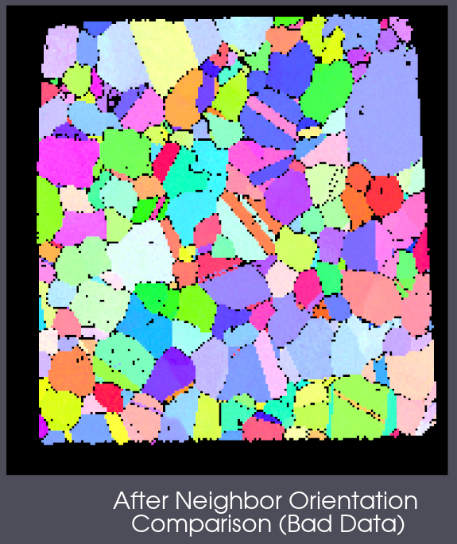
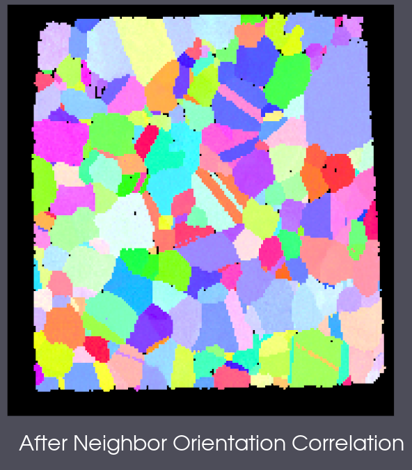

# Neighbor Orientation Correlation

## Group (Subgroup)

Processing (Cleanup)

## Description

This filter first identifies all cells that have a *Confidence Index* below the minimum set by the user.  Then, for each of those cells, their neighboring cells are checked to determine the number of neighbor cells with orientations different than the reference cell by more than the user defined *Misorientation Tolerance*.  In addition the neighboring cells are compared with each other to determine the number of neighboring cells that have the same orientation (again within the user defined tolerance). The *Cleanup Level* set by the user is then used to determine which cells are replaced.  If a level of 5 is set, at least 5 of the neighboring cells must be within the same misorientation tolerance (and so on for other *Cleanup Level*). If a cell meets the replacement criteria, then all of its attributes are replaced with the attributes of one of the neighboring cells that are the same as each other.

*Note:* The filter will iteratively reduce the *Cleanup Level* from 6 until it reaches the user defined number. So, if the user selects a level of 4, then the filter will run with a level of 6, then 5, then 4 before finishing.

Neighbors are defined as a the "nearest neighbors" which share a "face". For 3D structures it is 6 neighbors that share a common face with the current cell.

### Schematic Example

|   | 0 | 1 | 2 |
|---|---|---|---|
| 0 |   | (14.0, 0.0, 0.0) CI=0.2 |  |
| 1 | (13.0, 0.0, 0.0) CI=0.2   | (0.0, 0.0, 0.0) CI=0.05 | (12.0, 0.0, 0.0) CI=0.2 |
| 2 |   | (15.0, 0.0, 0.0) CI=0.2 |   |

Schematic layout of the neighboring cells. Only the In-Plane neighbors are shown.

In this example, cell (1,1) has a confidence index < 0.1 and the surrounding cells all have a misorientation tolerance not greater than 5 degrees. Comparing cell (1,1) with its neighbor cells we can see that the misorientation is greater than 5 Degrees. In this case the central cell (1,1) would have all of its attributes replaced with the "best" neighbor based on the phase of a neighbor cell matching the central cell.

## Example Data

|    Example Input/Output Images |
|--------------------------------|
|  |
| The Small IN100 data just after some intial cleanup filters have been used. |
|  |
| The Small IN100 data just after running this filter with a *Misorientation Tolerance* of 5 degrees,  and a *Cleanup Level* of 2 and a minimum *Confidence Index* of 0.2 |

These before and after images show how this filter can be used to "fill in" data that was deemed non-indexed (in EBSD terms). The user should be careful with this filter as it is meant to clean up small sets of voxels and not flood fill an entire volume of voxels.

### Warning - Cell Level Data Modification

This filter will copy all attribute data from neighboring cells into the target cell if the criteria is met.

% Auto generated parameter table will be inserted here

## Example Pipelines

+ (04) SmallIN100 Presegmentation Processing
+ (08) SmallIN100 Full Reconstruction
+ INL Export

## License & Copyright

Please see the description file distributed with this **Plugin**

## DREAM3D-NX Help

If you need help, need to file a bug report or want to request a new feature, please head over to the [DREAM3DNX-Issues](https://github.com/BlueQuartzSoftware/DREAM3DNX-Issues/discussions) GitHub site where the community of DREAM3D-NX users can help answer your questions.
