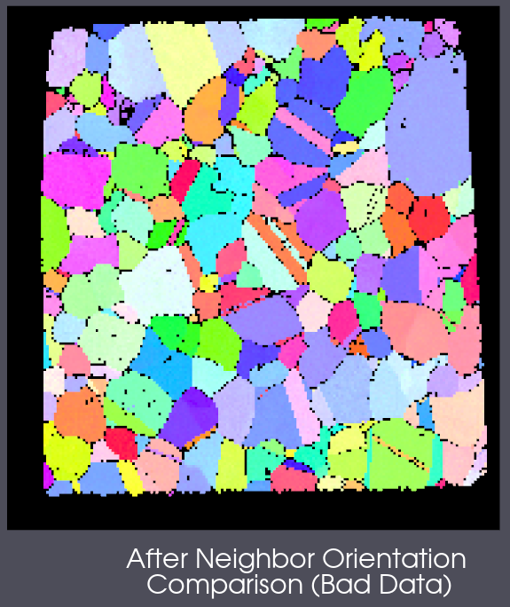
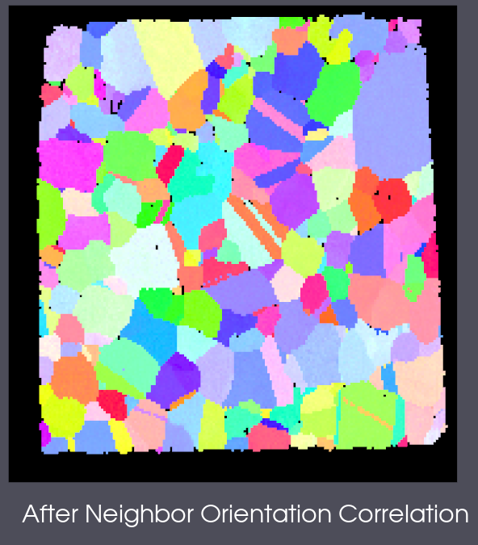

# Neighbor Orientation Correlation

## Group (Subgroup)

Processing (Cleanup)

## Description

This filter first identifies all cells that have a *Confidence Index* below the minimum set by the user. Then, for each of those cells, every pair of its face-neighbor cells is compared: a pair whose two cells belong to the same (non-zero) phase and whose orientations differ by less than the user defined *Misorientation Tolerance* is counted as *similar*, and each similar pair credits both of its cells. The neighbor with the highest similar-pair count is the "best" neighbor, and **all** of the bad cell's attributes are replaced with that neighbor's attributes (ties resolve to the last neighbor in the fixed −Z, −Y, −X, +X, +Y, +Z scan order, which matches the neighbor DREAM.3D 6.5.171 picked whenever all counts tie). A low-confidence cell whose neighbors contain no similar pair is left unchanged.

The whole scan-and-replace process runs `6 − Cleanup Level` times (a *Cleanup Level* of 4 runs 2 passes). Because the replaced cell also inherits its neighbor's *Confidence Index*, each pass can enable further replacements in the next pass, growing repairs inward from the edges of bad regions.

*Note:* Despite its name, *Cleanup Level* is **not** a neighbor-count threshold — it only controls the number of passes. Lower values clean more aggressively. At the default value of 6 the filter performs **zero passes and makes no changes**; set the level below 6 for the filter to do anything.

Neighbors are defined as the "nearest neighbors" which share a "face". For 3D structures it is 6 neighbors that share a common face with the current cell; for 2D data the 4 in-plane neighbors are used.

### Schematic Example

|   | 0 | 1 | 2 |
|---|---|---|---|
| 0 |   | (14.0, 0.0, 0.0) CI=0.2 |  |
| 1 | (13.0, 0.0, 0.0) CI=0.2   | (0.0, 0.0, 0.0) CI=0.05 | (12.0, 0.0, 0.0) CI=0.2 |
| 2 |   | (15.0, 0.0, 0.0) CI=0.2 |   |

Cell (1,1) has CI = 0.05, which is below a 0.1 minimum, so it is flagged. Its 4 in-plane neighbors all have orientations within 5 degrees of each other (Euler angles around (12-15, 0, 0)) but more than 5 degrees from (1,1)'s orientation (0, 0, 0). At *Cleanup Level* = 4, the four neighbors agree, so (1,1)'s attributes are replaced with one of them.

In this example, cell (1,1) has a confidence index < 0.1. Its four neighbors are compared pairwise with each other: (13.0), (14.0), (12.0) and (15.0) are all within a few degrees of each other, so every neighbor participates in several similar pairs. The central cell (1,1) has all of its attributes replaced with those of the neighbor holding the highest similar-pair count. Note that the central cell's own orientation and phase play no role in choosing the replacement — only the mutual similarity of its neighbors matters.

## Example Data

|    Example Input/Output Images |
|--------------------------------|
|  |
| The Small IN100 data just after some initial cleanup filters have been used. |
|  |
| The Small IN100 data after running this filter with *Misorientation Tolerance* = 5°, *Cleanup Level* = 2, and *Minimum Confidence Index* = 0.2. |

These before-and-after images show how this filter can fill in non-indexed EBSD cells. Use it for small isolated bad regions, not for flood-filling entire low-confidence areas.

### Warning - Cell-Level Data Modification

This filter will copy all attribute data from neighboring cells into the target cell if the criteria is met. Arrays listed in *Attribute Arrays to Ignore* are excluded from the copy.

### Differences from legacy DREAM.3D 6.5.171

DREAM3D-NX's implementation fixes three defects present in DREAM.3D 6.5.171, so results will differ on most datasets:

1. 6.5.171 could count a mixed-phase (or unindexed, phase-0) neighbor pair as "similar" by reusing the previous pair's misorientation, occasionally replacing a cell with data from a **different phase**.
2. 6.5.171 ran only half the cleanup passes of the original design (`ceil((6 − Level)/2)` instead of `6 − Level`), leaving deep bad regions partially unfilled.
3. 6.5.171 copied from the *last* neighbor having any similar pair rather than the neighbor with the *highest* similarity count. (When all counts tie — the common case in grain interiors — both versions pick the same neighbor.)

See `NeighborOrientationCorrelationFilter-D1` through `-D4` in `src/Plugins/OrientationAnalysis/vv/deviations/NeighborOrientationCorrelationFilter.md` for the full analysis and migration guidance.

## Algorithm

### In-Core Path

For each voxel, the algorithm computes the misorientation with its 6 face-sharing neighbors. If too many neighbors disagree (exceed the misorientation tolerance), the voxel is flagged for cleanup and its attributes are replaced with those of a suitable neighbor. All data access uses direct array indexing with `operator[]`.

### Out-of-Core Path

Uses a 3-slice Z rolling window (previous, current, next) to provide all neighbor access from memory. For each Z-slice processed, the algorithm loads the three relevant slices into local buffers using `copyIntoBuffer()`. After processing a slice, modified data is written back using `copyFromBuffer()`, and the window advances by shifting buffers and reading the next slice. This ensures that all 6-neighbor lookups are serviced from in-memory buffers rather than individual OOC element reads.

### Performance

The OOC optimization matters most for large datasets that exceed available RAM. Because each voxel requires access to neighbors in adjacent Z-slices, naive OOC access would decompress the same chunks repeatedly. The rolling window approach reads each slice at most three times total (as previous, current, and next), converting random access into predictable sequential I/O. For in-memory datasets, the two paths produce identical results with negligible overhead difference.

% Auto generated parameter table will be inserted here

## Example Pipelines

+ (02) SmallIN100 Full Reconstruction
+ INL Export

## License & Copyright

Please see the description file distributed with this **Plugin**

## DREAM3D-NX Help

If you need help, need to file a bug report or want to request a new feature, please head over to the [DREAM3DNX-Issues](https://github.com/BlueQuartzSoftware/DREAM3DNX-Issues/discussions) GitHub site where the community of DREAM3D-NX users can help answer your questions.
