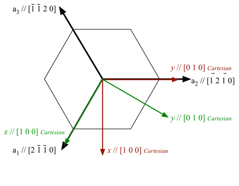

# Import Oxford Instr. Ebsd Data

## Group (Subgroup)

IO (Input)

## Description

This **Filter** will read a single .ctf file into a new **Image Geometry**, allowing the immediate use of **Filters** on the data instead of having to generate the intermediate .h5ebsd file. A **Cell Attribute Matrix** and Ensemble Attribute Matrix** will also be created to hold the imported EBSD information. Currently, the user has no control over the names of the created **Attribute Arrays**. The user should be aware that simply reading the file then performing operations that are dependent on the proper crystallographic and sample reference frame will be **undefined, inaccurate and/or wrong**. In order to bring the crystal reference frame and sample reference frame into coincidence, rotations will need to be applied to the data. An excellant reference for this is the following PDF file:
[http://pajarito.materials.cmu.edu/rollett/27750/L17-EBSD-analysis-31Mar16.pdf](http://pajarito.materials.cmu.edu/rollett/27750/L17-EBSD-analysis-31Mar16.pdf)

### Default HKL Transformations

If the data has come from a HKL acquisition system and the settings of the acquisition software were in the default modes, then the following reference frame transformations need to be performed:

+ Sample Reference Frame: 180o about the <010> Axis
+ Crystal Reference Frame: None

The user also may want to assign un-indexed pixels to be ignored by flagging them as "bad". The Threshold Objects **Filter** can be used to define this *mask* by thresholding on values such as *Error* = 0.

### Radians and Degrees

Most 2D .ctf files have their angles in **degrees** where as DREAM.3D expects radians. The filter provides an option to convert the Euler Angles to Radians and is turned on by default. The user is encouraged to create an IPF Image of their EBSD data to ensure that they do in-fact need to have this option enabled.

### The Axis Alignment Issue for Hexagonal Symmetry [1]

+ The issue with hexagonal materials is the alignment of the Cartesian coordinate system used for calculations with the crystal coordinate system (the Bravais lattice).
+ In one convention (e.g. EDAX.TSL), the x-axis, i.e. [1,0,0], is aligned with the crystal a1 axis, i.e. the [2,-1,-1,0] direction. In this case, the y-axis is aligned with the [0,1,-1,0] direction. (Green Axis in Figure 1)
+ In the other convention, (e.g. Oxford Instr, Univ. Metz software), the x-axis, i.e. [1,0,0], is aligned with the crystal [1,0,-1,0] direction. In this case, the y-axis is aligned with the [-1,2,-1,0] direction. (Red Axis in Figure 1)
+ This is important because texture analysis can lead to an ambiguity as to the alignment of [2,-1,-1,0] versus [1,0,-1,0], with apparent **30 Degree** shifts in the data.
+ Caution: it appears that the axis alignment is a choice that must be made when installing TSL software so determination of which convention is in use must be made on a case-by-case basis. It is fixed to the y-convention in the HKL software.
+ The main clue that something is wrong in a conversion is that either the 2110 & 1010 pole figures are transposed, or that a peak in the inverse pole figure that should be present at 2110 has shifted over to 1010.
+ DREAM.3D uses the TSL/EDAX convention.
+ **The result of this is that the filter will by default add 30 degrees to the second Euler Angle (phi2) when reading Oxford Instr (.ctf) files. This can be disabled by the user if necessary.**

| Figure 1 |
|--------|
|  |
| Figure 1:**showing TSL and Oxford Instr. conventions. EDAX/TSL is in **Green**. Oxford Inst. is in**Red |

% Auto generated parameter table will be inserted here

## Example Pipelines

+ TxCopper_Exposed
+ TxCopper_Unexposed

## License & Copyright

Please see the description file distributed with this **Plugin**

## References

[1] Rollett, A.D. Lecture Slides located at [http://pajarito.materials.cmu.edu/rollett/27750/L17-EBSD-analysis-31Mar16.pdf](http://pajarito.materials.cmu.edu/rollett/27750/L17-EBSD-analysis-31Mar16.pdf)

## DREAM3D-NX Help

If you need help, need to file a bug report or want to request a new feature, please head over to the [DREAM3DNX-Issues](https://github.com/BlueQuartzSoftware/DREAM3DNX-Issues) GItHub site where the community of DREAM3D-NX users can help answer your questions.
