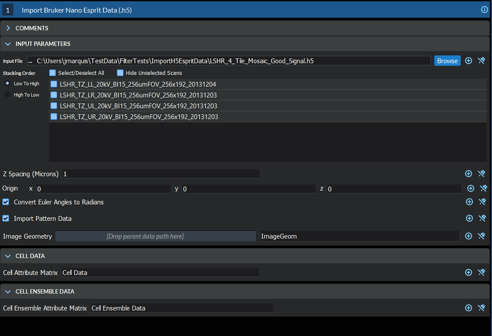
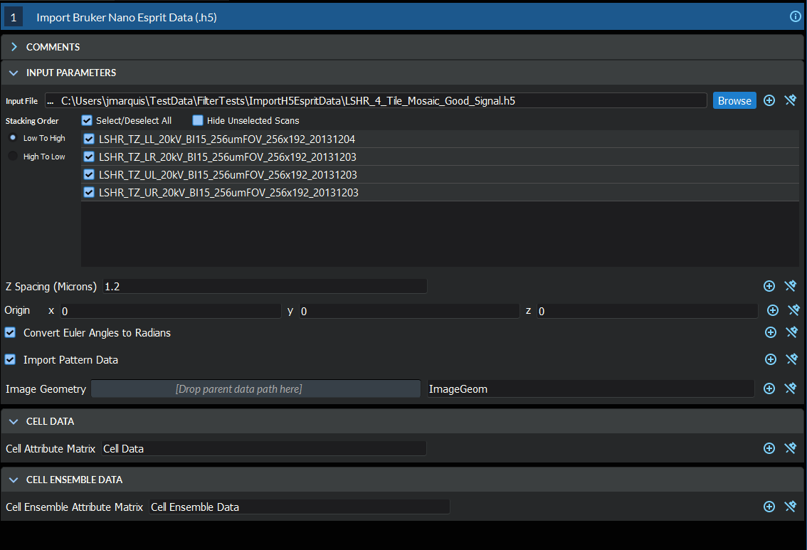

# Import Bruker Nano Esprit EBSD Data (.h5)

## Group (Subgroup)

Import/Export (Import)

## Description

This **Filter** will read a single .h5 file into a new **Image Geometry**, allowing the immediate use of **Filters** on the data instead of having to generate the intermediate .h5ebsd file. A **Cell Attribute Matrix** and Ensemble Attribute Matrix** will also be created to hold the imported EBSD information. Currently, the user has no control over the names of the created **Attribute Arrays**.

| User interface before entering a proper "Z Spacing" value and selecting which scans to include. |
|-------|
||

| User interface AFTER setting the "Z Spacing" and selecting files.  |
|-------|
||

## Notes About Reference Frames

The user should be aware that simply reading the file then performing operations that are dependent on the proper crystallographic and sample reference frame will be undefined or simply **wrong**. In order to bring the crystal reference frame and sample reference frame into coincidence, rotations will need to be applied to the data. The recommended filters are:

+ {ref}`Rotate Euler Reference Frame <OrientationAnalysis/RotateEulerRefFrameFilter:Description>`
+ {ref}`Rotate Sample Reference Frame <SimplnxCore/RotateSampleRefFrameFilter:Description>`

If the data has come from a TSL acquisition system and the settings of the acquisition software were in the default modes, the following reference frame transformations may need to be performed based on the version of the OIM Analysis software being used to collect the data:

+ Sample Reference Frame: 180o about the <010> Axis
+ Crystal Reference Frame: 90o about the <001> Axis

The user also may want to assign un-indexed pixels to be ignored by flagging them as "bad". The {ref}`Threshold Objects <SimplnxCore/MultiThresholdObjects:Description>` Filter can be used to define this *mask* by thresholding on values such as *MAD* > xx.

+ Note: If the X Step or Y Step within the HDF5 file for a scan is ZERO, those values will be set to 1.0 when the filter runs. This is needed
as the user has no effective way to fix the HDF5 file. If the user needs a different
spacing value, the user can utilize the {ref}`Set Origin and Spacing<SimplnxCore/SetImageGeomOriginScalingFilter:Description>` filter.

% Auto generated parameter table will be inserted here

## Example Pipelines

## License & Copyright

Please see the description file distributed with this **Plugin**

## DREAM3D-NX Help

If you need help, need to file a bug report or want to request a new feature, please head over to the [DREAM3DNX-Issues](https://github.com/BlueQuartzSoftware/DREAM3DNX-Issues/discussions) GItHub site where the community of DREAM3D-NX users can help answer your questions.
