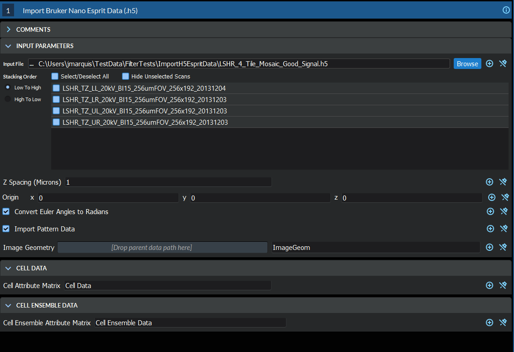
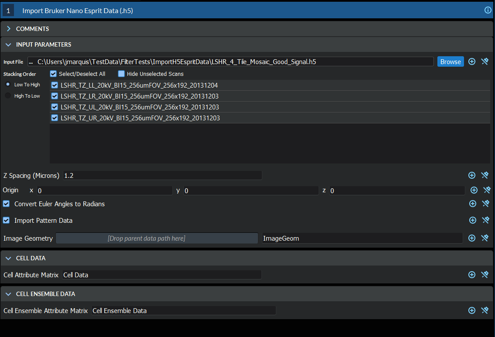

# Read Bruker Nano Esprit Data (.h5)

## Group (Subgroup)

IO (Input)

## Description

This filter reads a single `.h5` file (the HDF5-based EBSD export from Bruker Nano's Esprit software) into a new **Image Geometry**. Reading the file directly lets the data be used immediately by other filters, instead of having to first build an intermediate `.h5ebsd` file. A **Cell Attribute Matrix** (per-pixel data) and an **Ensemble Attribute Matrix** (per-phase data) are created to hold the imported EBSD information. The user currently has no control over the names of the created **Attribute Arrays**.

The scan stores an **orientation** at every pixel as three **Euler angles** (three angles, in the Bunge Z-X-Z convention, describing how the measured crystal at that pixel is rotated relative to the sample).

| User interface before entering a proper "Z Spacing" value and selecting which scans to include. |
|-------|
||

| User interface AFTER setting the "Z Spacing" and selecting files.  |
|-------|
||

## Notes About Reference Frames

The user should be aware that simply reading the file then performing operations that are dependent on the proper crystal reference frame (the axes fixed to the crystal lattice) and sample reference frame (the axes fixed to the physical specimen) will be undefined or simply **wrong**. To bring the crystal and sample reference frames into coincidence, rotations may need to be applied to the data. The recommended filters are:

+ [Rotate Euler Reference Frame](RotateEulerRefFrameFilter.md)
+ [Rotate Sample Reference Frame](../SimplnxCore/RotateSampleRefFrameFilter.md)

If the data has come from a TSL acquisition system and the settings of the acquisition software were in the default modes, the following reference frame transformations may need to be performed based on the version of the OIM Analysis software being used to collect the data:

+ Sample Reference Frame: 180o about the <010> Axis
+ Crystal Reference Frame: 90o about the <001> Axis

The user also may want to assign un-indexed pixels to be ignored by flagging them as "bad". The [Multi-Threshold Objects](../SimplnxCore/MultiThresholdObjectsFilter.md) filter can be used to define this *mask* by thresholding on values such as *Mean Angular Deviation (MAD)* > xx. The **Mean Angular Deviation (MAD)** is a per-pixel metric describing how well the indexed solution fit the measured pattern (lower is better).

+ Note: If the X Step or Y Step within the HDF5 file for a scan is ZERO, those values will be set to 1.0 micron when the filter runs. This is needed
as the user has no effective way to fix the HDF5 file. If the user needs a different
spacing value, the user can utilize the [Set Origin & Spacing (Image Geom)](../SimplnxCore/SetImageGeomOriginScalingFilter.md) filter.

### Downstream Processing

Once the reference frames are correct, the imported Euler angles are typically converted to other orientation representations (quaternions, and so on) with [Convert Orientation Representation](ConvertOrientationsFilter.md) before computing misorientations, segmenting grains, or generating pole figures.

### Required Input Sources

None — this filter reads directly from a `.h5` file on disk.

% Auto generated parameter table will be inserted here

## License & Copyright

Please see the description file distributed with this **Plugin**

## DREAM3D-NX Help

If you need help, need to file a bug report or want to request a new feature, please head over to the [DREAM3DNX-Issues](https://github.com/BlueQuartzSoftware/DREAM3DNX-Issues/discussions) GitHub site where the community of DREAM3D-NX users can help answer your questions.
