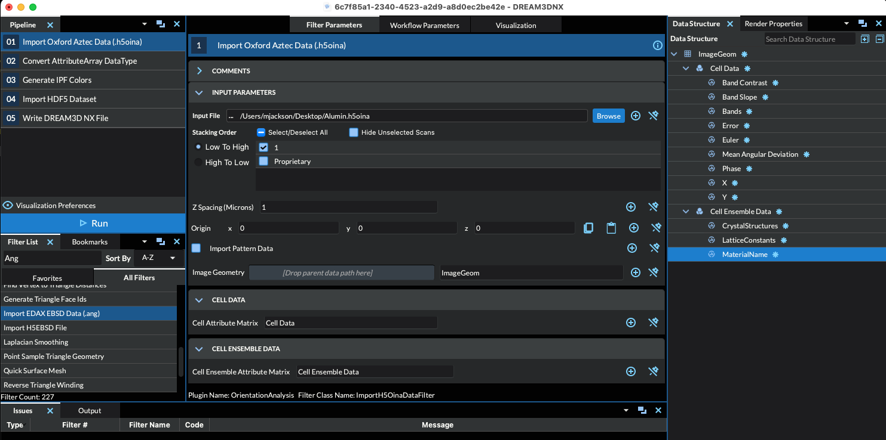

# Read Oxford Aztec Data (.h5oina)

## Group (Subgroup)

Import/Export (Import)

## Description

This filter will read data from a single .h5oina file into a new **Image Geometry**, allowing the immediate use of
**Filters** on the data instead of having to generate the intermediate .h5ebsd file. A **Cell Attribute Matrix** and
**Ensemble Attribute Matrix** will also be created to hold the imported EBSD information. Currently, the user has no control
over the names of the created **Attribute Arrays**.

### Limitations of the Filter

The current implementation only understands the FORMAT VERSION 2.0 of the H5OINA file. This means that a user
can use a newer H5OINA file but the filter will only extract out the VERSION 2.0 headers and data. If the user
needs additional data from the file, the "Import HDF5 Dataset" filter can be used to agment this filter.

## Notes About Reference Frames

In order to bring the crystal reference frame and sample reference frame into coincidence, rotations **MAY** need to be applied to the data. There are 2 filters that can perform the necessary rotations.

- {ref}`Rotate Euler Reference Frame <OrientationAnalysis/RotateEulerRefFrameFilter:Description>`
- {ref}`Rotate Sample Reference Frame <SimplnxCore/RotateSampleRefFrameFilter:Description>`

Historical reference frame operations for a .ctf file are the following:

+ Sample Reference Frame: 180o about the <010> Axis
+ Crystal Reference Frame: None

The user also may want to assign un-indexed pixels to be ignored by flagging them as "bad". The Threshold Objects **Filter** can be used to define this *mask* by thresholding on values such as *Error* = 0.

### Radians and Degrees

All orientation data in the H5OINA file are in radians.

### The Axis Alignment Issue for Hexagonal Symmetry [1]

+ The issue with hexagonal materials is the alignment of the Cartesian coordinate system used for calculations with the crystal coordinate system (the Bravais lattice).
+ In one convention (e.g. EDAX.TSL), the x-axis, i.e. [1,0,0], is aligned with the crystal a1 axis, i.e. the [2,-1,-1,0] direction. In this case, the y-axis is aligned with the [0,1,-1,0] direction. (Green Axis in Figure 1)
+ In the other convention, (e.g. Oxford Instr, Univ. Metz software), the x-axis, i.e. [1,0,0], is aligned with the crystal [1,0,-1,0] direction. In this case, the y-axis is aligned with the [-1,2,-1,0] direction. (Red Axis in Figure 1)
+ This is important because texture analysis can lead to an ambiguity as to the alignment of [2,-1,-1,0] versus [1,0,-1,0], with apparent **30 Degree** shifts in the data.
+ Caution: it appears that the axis alignment is a choice that must be made when installing TSL software so determination of which convention is in use must be made on a case-by-case basis. It is fixed to the y-convention in the HKL software.
+ The main clue that something is wrong in a conversion is that either the 2110 & 1010 pole figures are transposed, or that a peak in the inverse pole figure that should be present at 2110 has shifted over to 1010.
+ DREAM.3D uses the TSL/EDAX convention.
+ __The result of this is that the filter will by default add 30 degrees to the second Euler Angle (phi2) when reading Oxford Instr (.ctf) files. This can be disabled by the user if necessary.__

| Figure 1 |
|--------|
|  |
| **Figure 1:** showing TSL and Oxford Instr. conventions. EDAX/TSL is in **Green**. Oxford Inst. is in **Red** |

## Parameters

| Name | Type | Description |
|------|------| ----------- |
| Input File | File Path | The input .h5 file path |
| Scan Name | String | The name of the scan in the .h5oina file. |
| Z Spacing | float | The spacing in microns between each layer. |
| Origin | float (3x1) | The origin of the volume |
| Import Pattern Data | bool | Default=OFF |
| Hexagonal Axis Alignment | bool | Should the filter convert a Hexagonal phase to the EDAX standard for x-axis alignment |
| Convert Phase data to Int32 | bool | Should the phase data be converted to Int32 or keep the original uint8 |

## Created Objects

| Kind        | Default Name | Type | Comp Dims | Description                            |
|-------------|--------------|------|-----------|----------------------------------------|
| Data Container  | ImageDataContainer | N/A | N/A    | Created Data Container name with an **Image Geometry** |
| Attribute Matrix  | CellData | Cell | N/A    | Created **Cell Attribute Matrix** name  |
| Attribute Matrix  | CellEnsembleData | Cell Ensemble | N/A    | Created **Cell Ensemble Attribute Matrix** name  |
| Cell Attribute Array | Band Contrast  | uint8 | (1) |  |
| Cell Attribute Array | Band Slope  | uint8 | (1) |  |
| Cell Attribute Array | Bands  | uint8 | (1) |  |
| Cell Attribute Array | Error  | uint8 | (1) | The error descriptions are saved as attributes in the .h5oina file  |
| Cell Attribute Array | Euler  | float | (3) | Three angles defining the orientation of the **Cell** in Bunge convention (Z-X-Z)  |
| Cell Attribute Array | MeanAngularDeviation  | float | (1) |  |
| Cell Attribute Array | Phase  | uint8 | (1) |  |
| Cell Attribute Array | X  | float | (1) | The X Position of the scan point |
| Cell Attribute Array | Y  | float | (1) | The Y Position of the scan point |
| Ensemble Attribute Array | CrystalStructures | uint32_t | (1) | Enumeration representing the crystal structure for each **Ensemble** |
| Ensemble Attribute Array | LatticeConstants | float | (6) | The 6 values that define the lattice constants for each **Ensemble**|
| Ensemble Attribute Array | MaterialName | String | (1) | Name of each **Ensemble** |

## Example Pipelines

## References

[1] Rollett, A.D. Lecture Slides located at [http://pajarito.materials.cmu.edu/rollett/27750/L17-EBSD-analysis-31Mar16.pdf](http://pajarito.materials.cmu.edu/rollett/27750/L17-EBSD-analysis-31Mar16.pdf)

## DREAM3DNX Help

Check out our GitHub community page at [DREAM3DNX-Issues](https://github.com/BlueQuartzSoftware/DREAM3DNX-Issues/discussions) to report bugs, ask the community for help, discuss features, or get help from the developers.
