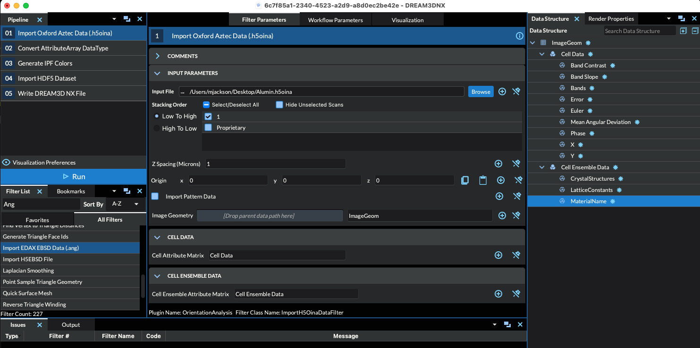
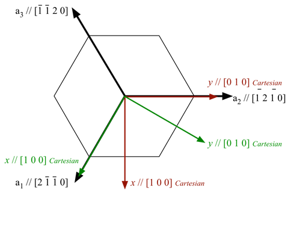

# Read Oxford Aztec Data (.h5oina)

## Group (Subgroup)

IO (Input)

## Description

This filter reads data from a single `.h5oina` file (the HDF5-based export from Oxford Instruments' AZtec software) into a new **Image Geometry**. Reading the file directly lets the data be used immediately by other filters, instead of having to first build an intermediate `.h5ebsd` file. A **Cell Attribute Matrix** (per-pixel data) and an **Ensemble Attribute Matrix** (per-phase data) are created to hold the imported EBSD information. The user currently has no control over the names of the created **Attribute Arrays**.

### What This Filter Produces

The file is EBSD (Electron Backscatter Diffraction) scan data. The most important imported arrays are:

- **Orientation** — stored as three **Euler angles** per pixel (the three angles, in Bunge Z-X-Z convention, that describe how each measured crystal is rotated relative to the sample). Orientation is the basis for almost all downstream crystallographic analysis.
- **Phase** — a per-pixel index identifying which material (phase) was measured at that point.
- **Pattern-quality metrics** — values such as Band Contrast, Band Slope, Bands, and Mean Angular Deviation describe how clear and reliable each measurement is. These are commonly used to flag unreliable pixels (see *Reference Frames* below).
- **Per-phase (Ensemble) data** — the crystal structure, lattice constants, and material name for each phase. An **Ensemble** here means one distinct material/crystal type.

### Reading More Than One Scan

An H5OINA file can hold several scans. Selecting more than one stacks them into a single
3D **Image Geometry**: the X and Y extents and step sizes come from the first selected
scan, the Z extent is the number of selected scans, and the Z spacing is the **Z Spacing**
parameter. Every selected scan must describe the same grid as the first one and declare
the same phase groups, and each must be present in the file; the filter reports an error
naming the offending scan otherwise. Scans whose phase lists differ have to be imported
separately, because all of the stacked scans share one **Ensemble Attribute Matrix**.

The **Stacking Order** setting carried by the scan selection chooses which end of the
list lands at Z = 0. *Low To High* stacks the scans in the order they are listed, so the
first selected scan is at Z = 0. *High To Low* stacks them in the reverse of that order,
so the last selected scan is at Z = 0.

### Limitations of the Filter

The filter reads the header keys and the nine data columns defined by **FORMAT VERSION 2.0**
of the H5OINA specification, which later versions retain. The file's `Format Version` value
is not used to select what is read, and a file without that value is read the same way. Any
column outside that set — for example `Pattern Quality`, `Beam Position X`/`Y` or the
`Electron Image` tree — is ignored, and can be brought in with the
[Read HDF5 Dataset](../SimplnxCore/ReadHDF5DatasetFilter.md) filter.

**Importing diffraction patterns is not yet supported for H5OINA files.** Turning on
*Import Pattern Data* stops the filter with an error rather than producing a partial result.
A file's `Processed Patterns` or `Unprocessed Patterns` dataset can be read with the
[Read HDF5 Dataset](../SimplnxCore/ReadHDF5DatasetFilter.md) filter.

## Notes About Reference Frames

In order to bring the crystal reference frame and the sample reference frame into coincidence, rotations **MAY** need to be applied to the data. Two filters can perform the necessary rotations:

- [Rotate Euler Reference Frame](RotateEulerRefFrameFilter.md)
- [Rotate Sample Reference Frame](../SimplnxCore/RotateSampleRefFrameFilter.md)

Historical reference frame operations for Oxford data are the following:

+ Sample Reference Frame: 180o about the <010> Axis
+ Crystal Reference Frame: None

The user also may want to assign un-indexed pixels to be ignored by flagging them as "bad". The [Multi-Threshold Objects](../SimplnxCore/MultiThresholdObjectsFilter.md) filter can be used to define this *mask*. For H5OINA data, threshold on `Phase` > 0: an un-indexed point carries phase 0, which is the reserved invalid-phase slot.

Do not assume `Error` = 0 marks a good point in an H5OINA file. AZtec writes an enumerated status code there whose values are not the same as the `.ctf` convention: in the AZtec export bundled with this filter's tests, every one of the 587 indexed points carries `Error` = 1 and every one of the 38 un-indexed points carries `Error` = 2, and no point carries 0. A mask built from `Error` = 0 would select nothing on that file.

### Radians and Degrees

All orientation data in the H5OINA file are in radians, and the imported `Euler` array is in
radians as well — no conversion is applied.

The per-phase `LatticeConstants` array is the one place where a unit does change on import.
An H5OINA file stores its three lattice angles in radians; they are imported as **degrees**,
so that the array means the same thing no matter which EBSD format the phase came from. A
cubic phase therefore reports `90, 90, 90` rather than `1.5707964, 1.5707964, 1.5707964`.
The three lattice dimensions are imported unchanged.

### The Axis Alignment Issue for Hexagonal Symmetry [1]

+ The issue with hexagonal materials is the alignment of the Cartesian coordinate system used for calculations with the crystal coordinate system (the Bravais lattice).
+ In one convention (e.g. EDAX.TSL), the x-axis, i.e. [1,0,0], is aligned with the crystal a1 axis, i.e. the [2,-1,-1,0] direction. In this case, the y-axis is aligned with the [0,1,-1,0] direction. (Green Axis in Figure 1)
+ In the other convention, (e.g. Oxford Instr, Univ. Metz software), the x-axis, i.e. [1,0,0], is aligned with the crystal [1,0,-1,0] direction. In this case, the y-axis is aligned with the [-1,2,-1,0] direction. (Red Axis in Figure 1)
+ This is important because texture analysis can lead to an ambiguity as to the alignment of [2,-1,-1,0] versus [1,0,-1,0], with apparent **30 Degree** shifts in the data.
+ Caution: it appears that the axis alignment is a choice that must be made when installing TSL software so determination of which convention is in use must be made on a case-by-case basis. It is fixed to the y-convention in the HKL software.
+ The main clue that something is wrong in a conversion is that either the 2110 & 1010 pole figures are transposed, or that a peak in the inverse pole figure that should be present at 2110 has shifted over to 1010.
+ DREAM3D-NX uses the TSL/EDAX convention.
+ __The result of this is that the filter will by default add 30 degrees to the third Euler angle (phi2) of every point whose phase is Hexagonal-High when reading Oxford `.h5oina` files. Because the file's Euler angles are in radians, the value actually added is 30 degrees expressed in radians (pi/6, about 0.5235988). Points of any other symmetry, and un-indexed points, are never adjusted. This can be disabled by the user if necessary.__

| Figure 1 |
|--------|
|  |
| **Figure 1:** showing TSL and Oxford Instr. conventions. EDAX/TSL is in **Green**. Oxford Inst. is in **Red** |

### Downstream Processing

Once the reference frames are correct, the imported Euler angles are typically converted to other orientation representations (quaternions, etc.) with [Convert Orientation Representation](ConvertOrientationsFilter.md) before computing misorientations, segmenting grains, or generating pole figures.

## Required Input Sources

None — this filter reads directly from a `.h5oina` file on disk.

## Created Outputs

The array names are the H5OINA dataset names, so several contain spaces.

### Cell Attribute Matrix

| Name | Type | Components | Notes |
|------|------|------------|-------|
| `Band Contrast` | uint8 | 1 | |
| `Band Slope` | uint8 | 1 | |
| `Bands` | uint8 | 1 | |
| `Error` | uint8 | 1 | AZtec status code; see the note on masking below — do not assume 0 means "indexed" |
| `Euler` | float32 | 3 | Radians; phi2 optionally shifted for Hexagonal-High points |
| `Mean Angular Deviation` | float32 | 1 | |
| `Phase` | int32 or uint8 | 1 | int32 by default; uint8 when *Convert Phase Data to Int32* is off. 0 marks an un-indexed point |
| `X` | float32 | 1 | |
| `Y` | float32 | 1 | |

### Ensemble Attribute Matrix

One tuple per phase in the file, plus tuple 0, which is reserved for the invalid phase that
un-indexed points refer to.

| Name | Type | Components | Notes |
|------|------|------------|-------|
| `CrystalStructures` | uint32 | 1 | Mapped from the file's Laue group; 999 in tuple 0 |
| `LatticeConstants` | float32 | 6 | a, b, c then alpha, beta, gamma in **degrees**; all zero in tuple 0 |
| `MaterialName` | string | 1 | `"Invalid Phase"` in tuple 0 |

% Auto generated parameter table will be inserted here

## Example Pipelines

## References

[1] Rollett, A.D. Lecture Slides located at [http://pajarito.materials.cmu.edu/rollett/27750/L17-EBSD-analysis-31Mar16.pdf](http://pajarito.materials.cmu.edu/rollett/27750/L17-EBSD-analysis-31Mar16.pdf)

## DREAM3D-NX Help

If you need help, need to file a bug report or want to request a new feature, please head over to the [DREAM3DNX-Issues](https://github.com/BlueQuartzSoftware/DREAM3DNX-Issues/discussions) GitHub site where the community of DREAM3D-NX users can help answer your questions.
