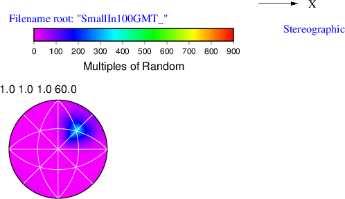

# Write GBCD Pole Figure (GMT 5)

## Group (Subgroup)

IO (Output)

## Description

This **Filter** creates a .dat file that can be used in conjunction with [GMT](http://gmt.soest.hawaii.edu/) to generate a grain boundary character distribution (GBCD) pole figure. The user must select the relevant phase for which to write the pole figure by entering the *phase index*.

% Auto generated parameter table will be inserted here

## Example Pipelines

+ (04) SmallIN100 GBCD

## License & Copyright

Please see the description file distributed with this **Plugin**

## DREAM3D-NX Help

If you need help, need to file a bug report or want to request a new feature, please head over to the [DREAM3DNX-Issues](https://github.com/BlueQuartzSoftware/DREAM3DNX-Issues/discussions) GitHub site where the community of DREAM3D-NX users can help answer your questions.
