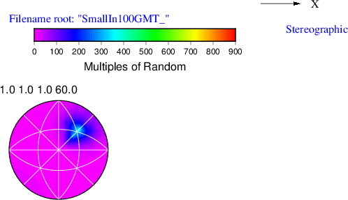

# Write GBCD Pole Figure (GMT 5)

## Group (Subgroup)

IO (Output)

## Description

This filter exports a **grain boundary character distribution (GBCD)** as a plain-text `.dat` file that the external [Generic Mapping Tools (GMT)](https://www.generic-mapping-tools.org/) package can render into a pole figure image. The filter does not draw the pole figure itself — it writes the data file that GMT then turns into a picture.

### What is a GBCD Pole Figure?

A **grain boundary** is the internal interface where two grains (individual crystals) meet inside a material. The **grain boundary character distribution (GBCD)** measures how often boundaries of a particular crystallographic character occur, compared to what a completely random arrangement would produce.

For a chosen **misorientation** (the rotation that relates the crystal orientations of the two grains on either side of a boundary), the GBCD describes how the boundary-plane normals are distributed in space. That distribution is displayed on a **pole figure**: a 2D circular plot that maps 3D directions onto a disk. The plotted values are in **multiples of a random distribution (MRD)**, where *1.0* means "as common as a random arrangement" and values above *1.0* mark boundary planes that occur more often than random.

### What This Filter Does

This filter is one step in an external toolchain:

[Compute GBCD](ComputeGBCDFilter.md) → **Write GBCD Pole Figure (GMT 5)** → GMT → rendered pole figure

It samples the GBCD for the selected phase and misorientation and writes the result to a `.dat` text file. GMT (a separate, freely available command-line mapping toolkit) reads that file to produce the final image.

### Parameter Guidance

- **Phase of Interest** — the 1-based index of the **Ensemble** (phase) whose boundaries are plotted. A value of *1* selects the first real phase; index *0* is reserved for the unindexed/background ensemble. This value is a dimensionless index.
- **Misorientation Axis-Angle** — selects which boundary misorientation to plot. The first value is the misorientation **angle in degrees**; the remaining three are the crystallographic axis **(h, k, l)**, a dimensionless crystal direction. For example, *60° about (1, 1, 1)* selects the Σ3 twin misorientation common in cubic materials.
- **Output GMT File** — the path of the `.dat` file to write. GMT reads this file to draw the pole figure.

### Required Input Sources

- **GBCD** -- produced by [Compute GBCD](ComputeGBCDFilter.md).
- **Crystal Structures** -- typically read from EBSD data via [Read H5EBSD File](ReadH5EbsdFilter.md), [Read EDAX EBSD Data (.ang)](ReadAngDataFilter.md), or [Read Oxford Instr. EBSD Data (.ctf)](ReadCtfDataFilter.md).

% Auto generated parameter table will be inserted here

## Example Pipelines

+ (08) Small IN100 GBCD

## License & Copyright

Please see the description file distributed with this **Plugin**

## DREAM3D-NX Help

If you need help, need to file a bug report or want to request a new feature, please head over to the [DREAM3DNX-Issues](https://github.com/BlueQuartzSoftware/DREAM3DNX-Issues/discussions) GitHub site where the community of DREAM3D-NX users can help answer your questions.
