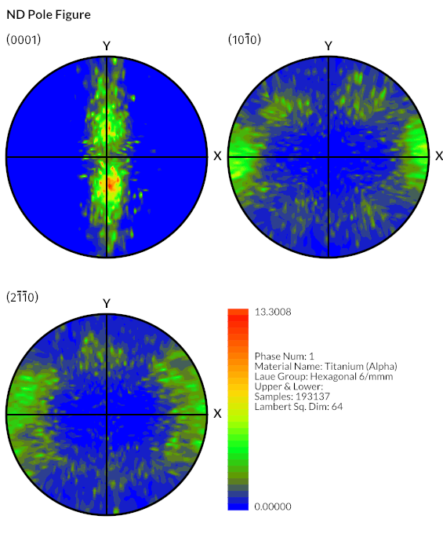
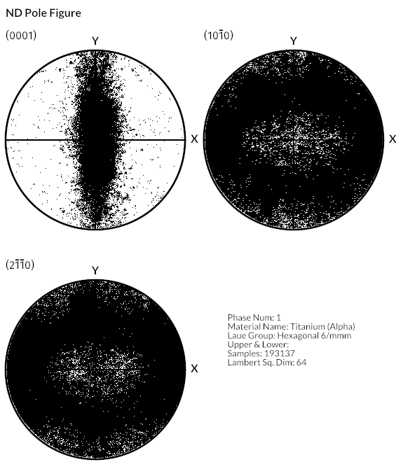

# Export Pole Figure Images

## Group (Subgroup)

IO (Output)

## Description

This **Filter** creates a standard pole figure image for each **Ensemble** in a selected **Data Container** with an **Image Geometry**. The **Filter** uses Euler angles in radians and requires the crystal structures for each **Ensemble** array and the corresponding **Ensemble** Ids on the **Cells**. The **Filter** also optionally can use a _mask_ array to determine which **Cells** are valid for the pole figure computation.

### Algorithm Choice

1: The pole figure algorithm uses a _modified Lambert square_ to perform the interpolations onto the unit circle. This is an alternate type of interpolation that the EBSD OEMs do not perform which may make the output from DREAM.3D look slightly different than output obtained from the OEM programs.

**Only an advanced user with intimate knowledge of the modified Lambert projection should attempt to change the value for the "Lambert Image Size (Pixels)" input parameter.**

2: Discrete Pole figure. The algorithm will simply mark each pixel that had at least 1 count as a black pixel.

### Layout

The 3 pole figures can be laid out in a Square, Horizontal row or vertical column. Supporting informatio (including the color bar legend for color pole figures) will also be printed on the image.

-----

| Lambert Projection | Discrete |
|--------------------|----------|
|  |  |

-----

## Parameters

| Name | Type | Description |
|------|------| ----------- |
| Figure Title | String | The title of the figure. |
| Pole Figure Type | Enumeration: 0=Lambert, 1=Discrete | Controls the type of pole figure |
| Lambert Image Size (Pixels) | int32_t | Size of the Lambert square in pixels |
| Number of Colors | int32_t | Number of colors to use to make the pole figure |
| Image Layout | Enumeration | Layout for the resulting pole figure images, either square, horizontal, or vertical |
| Image Prefix | String | Prefix the prepend each pole figure file with |
| Output Path | File Path | Output directory path for images |
| Image Size (Square Pixels) | int32_t | Size of the output image in square pixels |
| Use Mask Array | bool | Specifies whether to use a boolean array to exclude some **Cells**. Only those cells that have a _Mask Array_ value of 1 will be used. |
| Save as Image Geometry | Bool | Save the created Pole Figure as an Image Geometry |
| Output Image Geometry Path | DataPath | The DataPath to the created image geometry |

## Required Geometry

NONE

## Required Objects

| Kind | Default Name | Type | Component Dimensions | Description |
|------|--------------|------|----------------------|-------------|
| **Cell Attribute Array** | EulerAngles | float | (3)  | Three angles defining the orientation of the **Cell** in Bunge convention (Z-X-Z) |
| **Cell Attribute Array** | Phases | int32_t | (1) | Specifies to which **Ensemble** each **Cell** belongs |
| **Cell Attribute Array** | Mask | bool | (1) | Used to define **Cells** as *good* or *bad* |
| **Ensemble Attribute Array** | CrystalStructures | uint32_t | (1) | Enumeration representing the crystal structure for each **Ensemble** |

## Created Objects

| Kind | Default Name | Type | Component Dimensions | Description |
|------|--------------|------|----------------------|-------------|
| **Geometry** | ImageGeometry | Image | N/A | Created **Image Geometry** |
| **Attribute Matrix** | CellData | Cell | N/A | Created **Cell Attribute Matrix** name |
| **DataArray** | Image | Data Array (uint8) | 4 | Created **DataArray** name |

## Example Pipelines

+ TxCopper_Exposed
+ TxCopper_Unexposed

## License & Copyright

Please see the description file distributed with this **Plugin**

## DREAM3DNX Help

Check out our GitHub community page at [DREAM3DNX-Issues](https://github.com/BlueQuartzSoftware/DREAM3DNX-Issues) to report bugs, ask the community for help, discuss features, or get help from the developers.

## Python Filter Arguments

+ module: OrientationAnalysis
+ Class Name: WritePoleFigureFilter
+ Displayed Name: Generate Pole Figure Images

| argument key | Human Name | Description | Parameter Type |
|--------------|------------|-------------|----------------|
| cell_euler_angles_array_path | Euler Angles | Three angles defining the orientation of the Element in Bunge convention (Z-X-Z) | complex.ArraySelectionParameter |
| cell_phases_array_path | Phases | Specifies to which Ensemble each cell belongs | complex.ArraySelectionParameter |
| crystal_structures_array_path | Crystal Structures | Enumeration representing the crystal structure for each Ensemble | complex.ArraySelectionParameter |
| generation_algorithm | Pole Figure Type | The type of pole figure generated. 0=Color, 1=Discrete | complex.ChoicesParameter |
| good_voxels_array_path | Mask | DataPath to the input Mask DataArray | complex.ArraySelectionParameter |
| image_geometry_path | Created Image Geometry | The path to the created Image Geometry | complex.DataGroupCreationParameter |
| image_layout | Image Layout | How to layout the 3 pole figures. 0=Horizontal, 1=Vertical, 2=Square | complex.ChoicesParameter |
| image_prefix | Pole Figure File Prefix | The prefix to apply to each generated pole figure. Each Phase will have its own pole figure. | complex.StringParameter |
| image_size | Image Size (Square Pixels) | The number of pixels that define the height and width of **each** output pole figure | complex.Int32Parameter |
| lambert_size | Lambert Image Size (Pixels) | The height/width of the internal Lambert Square that is used for interpolation | complex.Int32Parameter |
| material_name_array_path | Material Name | DataPath to the input DataArray that holds the material names | complex.DataPathSelectionParameter |
| num_colors | Number of Colors | The number of colors to use for the Color Intensity pole figures | complex.Int32Parameter |
| output_path | Output Directory Path | This is the path to the directory where the pole figures will be created. One file for each phase. | complex.FileSystemPathParameter |
| save_as_image_geometry | Save Output as Image Geometry | Save the generated pole figure as an ImageGeometry | complex.BoolParameter |
| title | Figure Title | The title to place at the top of the Pole Figure | complex.StringParameter |
| use_good_voxels | Use Mask Array | Should the algorithm use a mask array to remove non-indexed points | complex.BoolParameter |
| write_image_to_disk | Write Pole Figure as Image | Should the filter write the pole figure plots to a file. | complex.BoolParameter |

