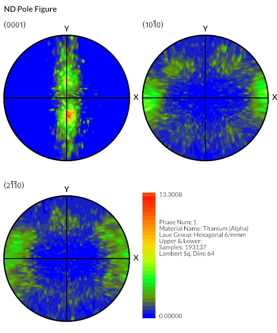
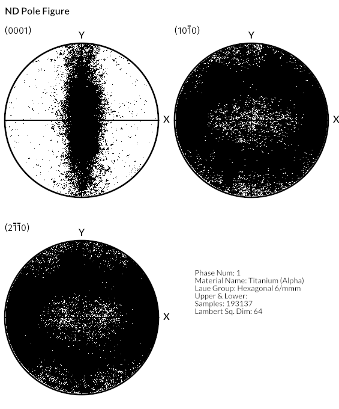

# Generate and Write Pole Figure Images

## Group (Subgroup)

IO (Output)

## Description

This filter creates standard crystallographic **pole figure** images, one set per **Ensemble** (phase) present in the data. A pole figure is a 2D circular plot that maps selected 3D crystal-orientation directions onto a flat disk, making it easy to see whether a material has a preferred orientation (texture) or is randomly oriented. This filter produces pole figures for the **<001>**, **<011>**, and **<111>** crystal directions.

The filter reads **Euler angles** (in *radians*, Bunge Z-X-Z convention) describing the orientation of each cell, the phase each cell belongs to, and per-phase crystal-structure information. An optional **Mask** array can exclude non-indexed or invalid points from the plot.

### How the Pole Figure Is Drawn

Two rendering methods are available through the *Pole Figure Type* parameter:

- **Color Intensity [0]**: Produces a continuous color intensity map. To do this the filter accumulates orientation counts onto a **modified Lambert square** -- an equal-area grid laid over a square that can be folded onto a hemisphere -- and interpolates that grid onto the unit circle. This is a **Lambert (equal-area) projection**. EBSD OEM software does not use this exact interpolation, so the output may look slightly different from an OEM-generated pole figure.
- **Discrete [1]**: Produces a point-based plot, marking each pixel that received at least one orientation count as a single colored point. This uses a **stereographic** projection, the classic pole-figure projection that maps directions from a sphere onto a plane while preserving angles.

The crystal symmetry used when folding orientations into the pole figure is determined by each phase's **Laue Class** -- the point-group symmetry class of the crystal (for example, cubic m-3m or hexagonal 6/mmm). The Laue Class is looked up from the per-**Ensemble** Crystal Structures array.

**Only an advanced user with intimate knowledge of the modified Lambert projection should change the *Lambert Image Size (Pixels)* parameter.** This value is the height/width, in *pixels*, of the internal Lambert square used for interpolation.

### Reference Frame Conventions (Matching EDAX OIM and MTEX)

This filter plots orientations exactly as they are stored in the **Euler Angles** array; it applies **no reference-frame correction** of its own. A pole figure depends only on the orientations, never on the physical location of the **Cell** each orientation came from.

This matters when comparing the output to other tools. TSL/EDAX `.ang` files record the **Euler angles** and the spatial scan coordinates in two *different* reference frames that are offset by a fixed rotation. EDAX OIM Analysis and the MTEX toolbox display pole figures in the *corrected* (spatial) frame, so their pole figures appear rotated relative to the uncorrected orientations this filter receives. With no correction applied, this filter's output is consistent with MTEX loaded *without* `convertEuler2SpatialReferenceFrame` (the renderer itself is verified to match MTEX point-for-point).

To make a pole figure match EDAX OIM or MTEX, apply the [Rotate Euler Reference Frame](RotateEulerRefFrameFilter.md) filter to the **Euler Angles** *before* this filter. The [Rotate Sample Reference Frame](../SimplnxCore/RotateSampleRefFrameFilter.md) filter only relocates **Cells** in space and leaves orientation values unchanged, so it has **no effect** on a pole figure.

The correction is a single **180°** rotation; the axis selects the convention. Each axis below reproduces the correspondingly numbered MTEX `convertEuler2SpatialReferenceFrame` "setting", entered into [Rotate Euler Reference Frame](RotateEulerRefFrameFilter.md) as a normalized axis and an angle of **180 degrees**:

| Rotation Axis | Angle | MTEX setting | Notes |
|---|---|---|---|
| *(0.7071067812, 0.7071067812, 0)* | 180° | setting 1 | |
| *(0.7071067812, -0.7071067812, 0)* | 180° | setting 2 | **EDAX/TSL default** -- matches EDAX OIM |
| *(1, 0, 0)* | 180° | setting 3 | |
| *(0, 1, 0)* | 180° | setting 4 | |

For data read from [Read EDAX EBSD Data (.ang)](ReadAngDataFilter.md), use the *(0.7071067812, -0.7071067812, 0)*, 180° rotation. Apply the correction only once; do not also correct upstream if it has already been applied.

The *Hex/Trig Cartesian Basis Convention* parameter (*x||a* or *x||a\**) is a separate setting. It selects how the hexagonal/trigonal crystal basis is aligned to Cartesian axes and shifts the prismatic **<011>** and **<111>** pole positions by 30°; it does not affect the basal **<001>** pole figure. Use *x||a* to match the EDAX/TSL and legacy DREAM3D convention.

### Required Input Sources

- **Euler Angles** and **Phases** -- per-cell orientation and phase data, typically read from EBSD data via [Read H5EBSD File](ReadH5EbsdFilter.md), [Read EDAX EBSD Data (.ang)](ReadAngDataFilter.md), or [Read Oxford Instr. EBSD Data (.ctf)](ReadCtfDataFilter.md).
- **Crystal Structures** (per-**Ensemble**, used to derive each phase's Laue Class) and **Material Name** -- created as part of the **Ensemble** data by the same EBSD reader.
- **Mask** (optional) -- a per-cell boolean array marking valid points, produced by [Multi-Threshold Objects](../SimplnxCore/MultiThresholdObjectsFilter.md). Enable *Use Mask Array* to apply it.

## Output Options

### Write Image to Disk

When *Write Pole Figure as Image* is enabled, the combined set of pole figures is written to disk as a TIFF image file, one file per phase, in the selected output directory.

### Save Pole Figure as Image Geometry

When *Save Output as Image Geometry* is enabled, the combined pole-figure image is stored in the DataStructure as an **Image Geometry** so it can be viewed inside DREAM3D-NX.

### Save Count Data Arrays

When *Save Count Images* is enabled, the per-direction count data for each pole figure is stored as a Data Array inside an **Image Geometry**, allowing custom color plots to be made later. A string Data Array is also stored that records the metadata used to build each plot (number of points, hemisphere, phase name, etc.). When *Normalize Count Data to MRD* is enabled, the counts are normalized to **multiples of a random distribution (MRD)**, where *1.0* means "as common as a random arrangement."

### Image Size

The *Image Size (Square Pixels)* parameter sets the height and width, in *pixels*, of each individual pole figure in the output image.

### Image Layout

The *Image Layout* parameter controls how the pole figures are arranged in the output image. Supporting information (including the color bar legend for color pole figures) is also drawn on the image.

| Colorized Intensity | Discrete |
|--------------------|----------|
|  |  |

The available layout choices are:

- **Horizontal [0]**: Pole figures are arranged in a single horizontal row.
- **Vertical [1]**: Pole figures are arranged in a single vertical column.
- **Square [2]**: Pole figures are arranged in a square grid.

% Auto generated parameter table will be inserted here

## Example Pipelines

- TxCopper_Exposed
- TxCopper_Unexposed

## License & Copyright

Please see the description file distributed with this **Plugin**

## DREAM3D-NX Help

If you need help, need to file a bug report or want to request a new feature, please head over to the [DREAM3DNX-Issues](https://github.com/BlueQuartzSoftware/DREAM3DNX-Issues/discussions) GitHub site where the community of DREAM3D-NX users can help answer your questions.
