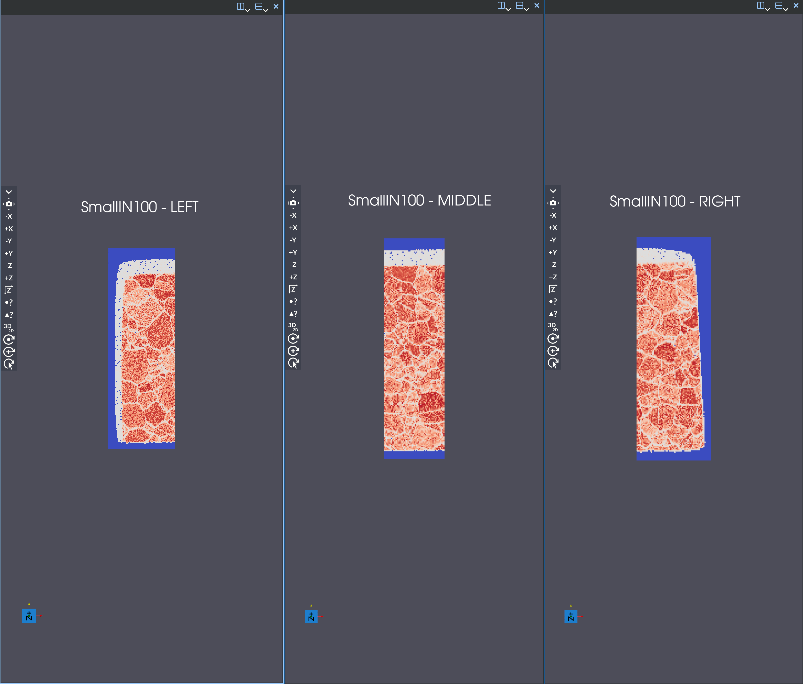
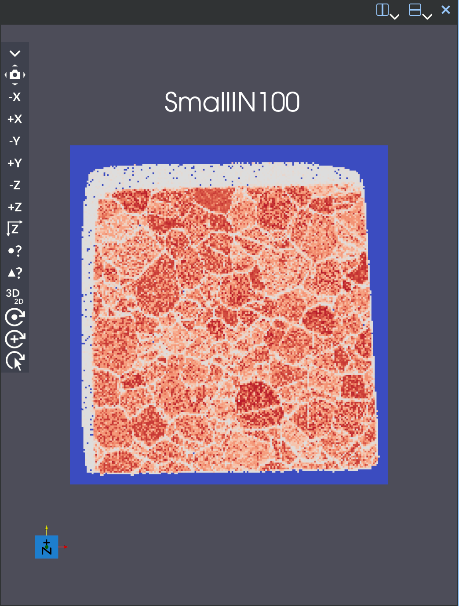
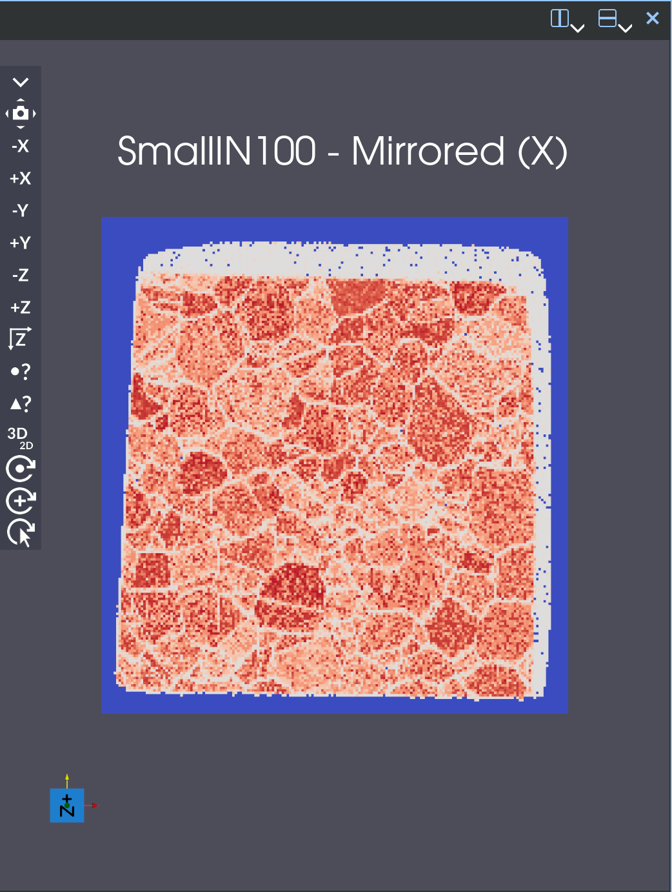
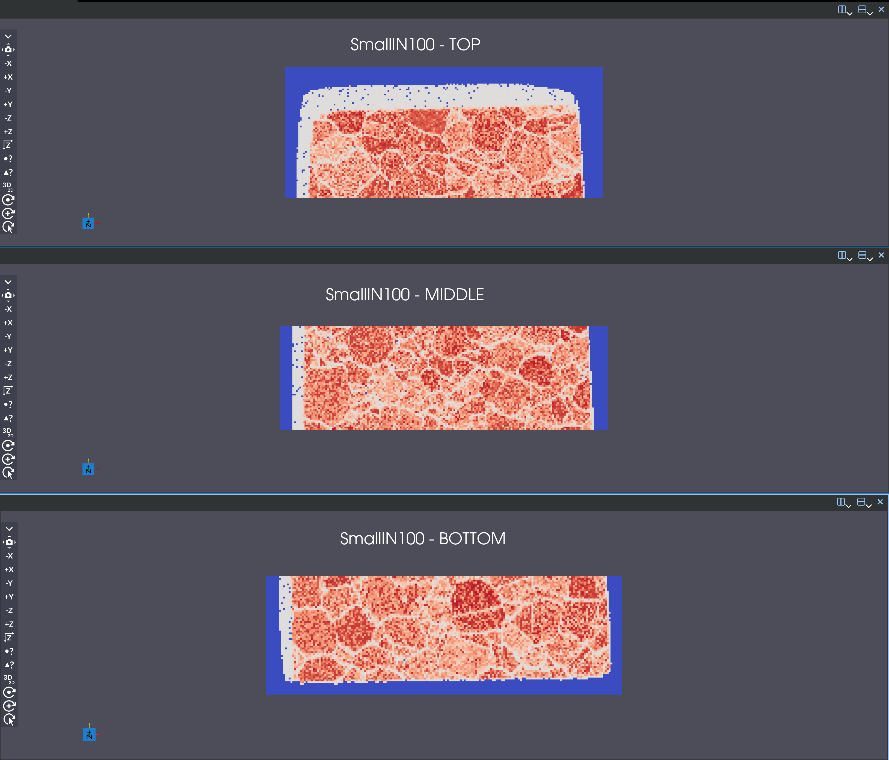
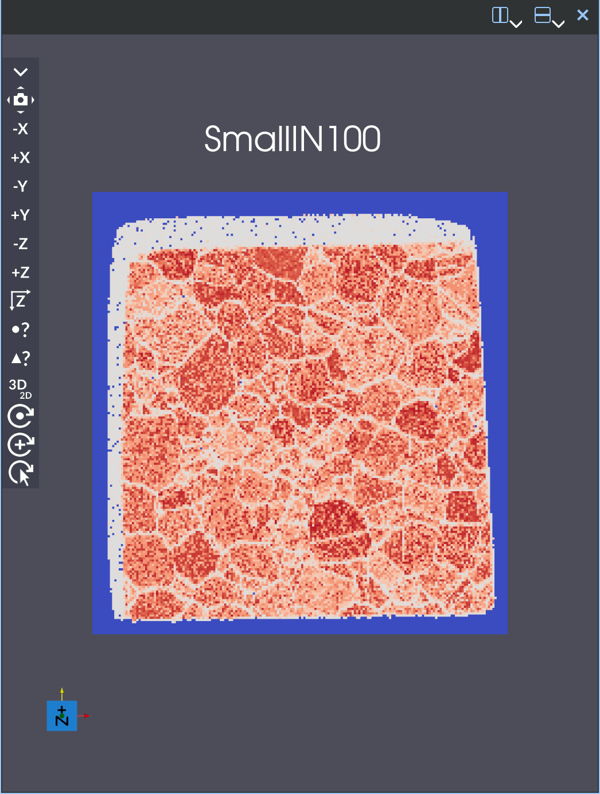
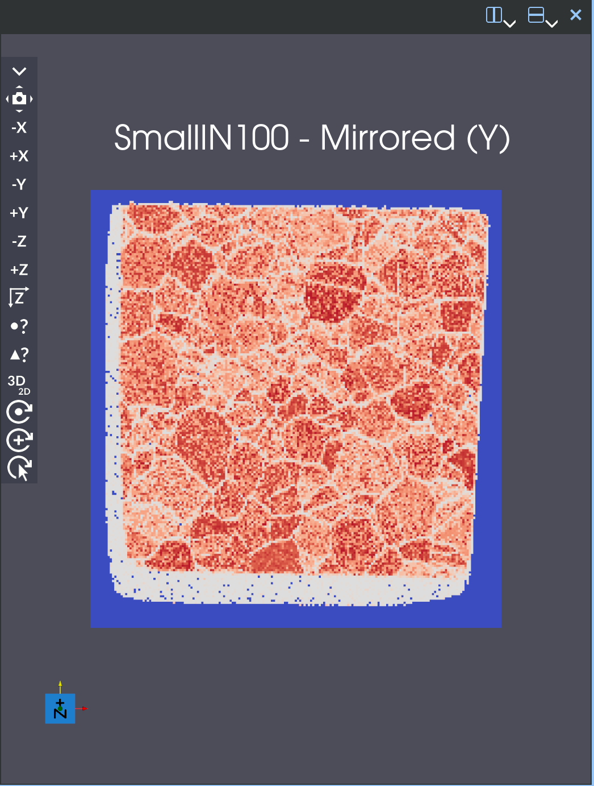
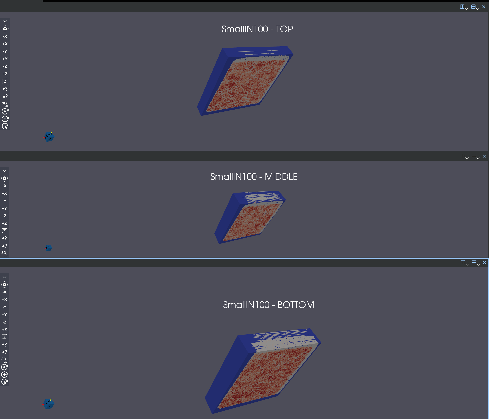
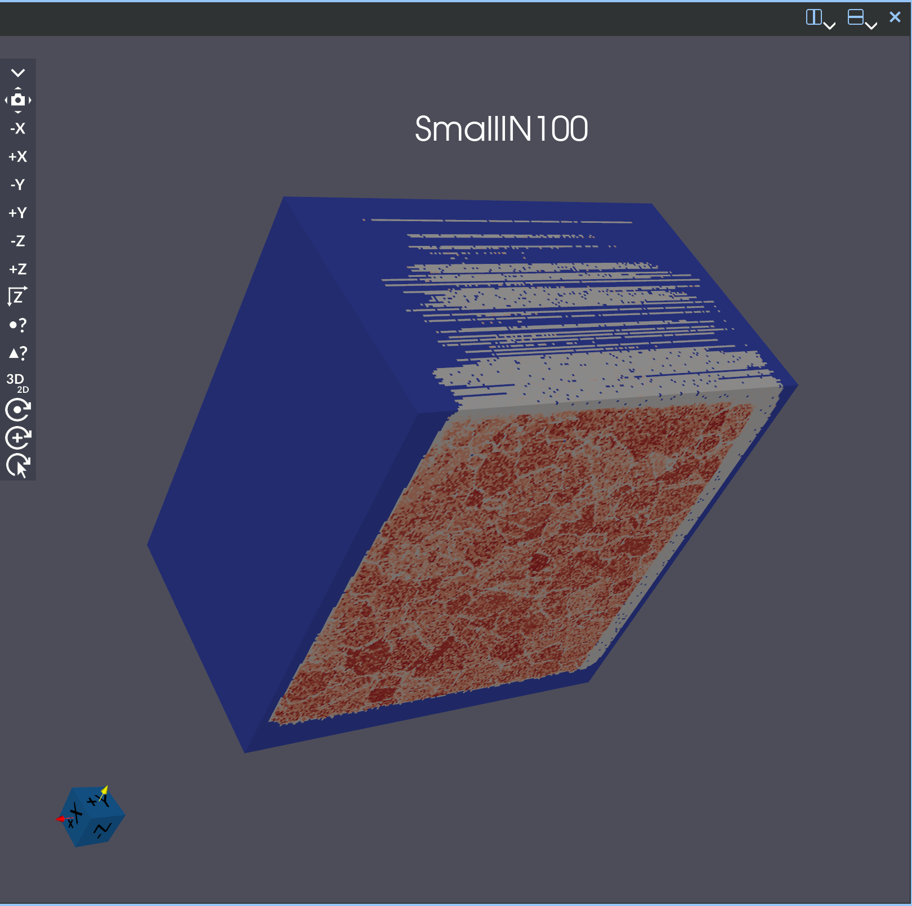
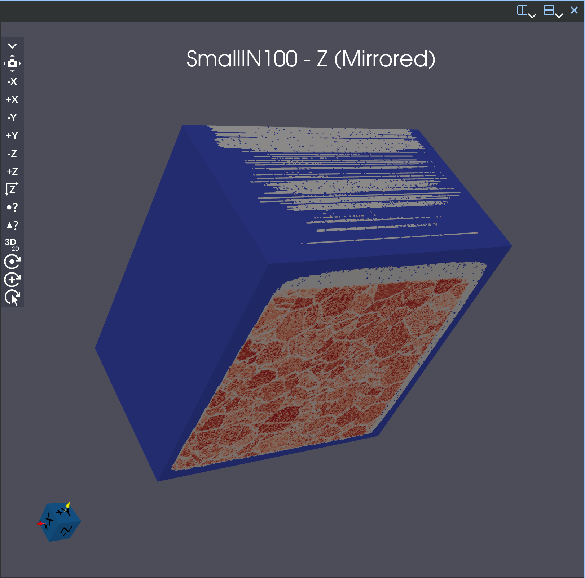

# Append Image Geometry

## Group (Subgroup)

Sampling (Memory/Management)

## Description

This filter allows the user to append one or multiple image geometries to a given image geometry, in any direction (X,Y,Z). The input and
destination **ImageGeometry** objects must have the same dimensions in the directions that are NOT chosen.  If the X direction is chosen, the geometries must match in Y & Z.  If the Y direction is chosen, the geometries must match in X & Z.  If the Z direction is chosen, the geometries must match in X & Y.  Optional checks for equal **Resolution** values can also be performed.

This filter also has an option to mirror the resulting geometry in the chosen direction.  If the X direction is chosen, it will mirror the positions of the YZ planes.  If the Y direction is chosen, it will mirror the positions of the XZ planes.  If the Z direction is chosen, it will mirror the positions of the XY planes.

### X Direction Examples

#### Example 1 (X)
If the user has an already existing **Image Geometry** that is 100 voxels in the *Y* direction by 300 pixels in the
*Z* direction and composed of 10 *X* slices, then if the user appends another three data sets in the X direction that are the same dimensions in Y & Z but contain 20 *X* slices each, the resulting **Image Geometry** will have a total of 70 *X* slices.

#### Example 2 (Visual Example) (X)
Here's the SmallIN100 dataset example sliced into three pieces in the X direction:

And here is what the geometry looks like after appending the three pieces together in the X direction.  On the left is the regular result, on the right is the mirrored result:
|  |  |
|:----------------------:|:----------------------:|

### Y Direction Examples

#### Example 1 (Y)
If the user has an already existing **Image Geometry** that is 400 voxels in the *X* direction by 200 pixels in the
*Z* direction and composed of 50 *Y* slices, then if the user appends another two data sets in the Y direction that are the same dimensions in X & Z but contain 40 *Y* slices each, the resulting **Image Geometry** will have a total of 130 *Y* slices.

#### Example 2 (Visual Example) (Y)
Here's the SmallIN100 dataset example sliced into three pieces in the Y direction:

And here is what the geometry looks like after appending the three pieces together in the Y direction.  On the left is the regular result, on the right is the mirrored result:
|  |  |
|:----------------------:|:----------------------:|

### Z Direction Examples

#### Example 1 (Z)
If the user has an already existing **Image Geometry** that is 100 voxels in the *X* direction by 200 pixels in the
*Y* direction and composed of 5 *Z* slices, then if the user appends one other data set in the Z direction that is the same dimensions in X & Y but contains 10 *Z* slices, the resulting **Image Geometry** will have a total of 15 *Z* slices.

#### Example 2 (Visual Example) (Z)
Here's the SmallIN100 dataset example sliced into three pieces in the Z direction:

And here is what the geometry looks like after appending the three pieces together in the Z direction.  On the left is the regular result, on the right is the mirrored result:
|  |  |
|:----------------------:|:----------------------:|

% Auto generated parameter table will be inserted here

## Example Pipelines

## License & Copyright

Please see the description file distributed with this **Plugin**

## DREAM3D-NX Help

If you need help, need to file a bug report or want to request a new feature, please head over to the [DREAM3DNX-Issues](https://github.com/BlueQuartzSoftware/DREAM3DNX-Issues/discussions) GitHub site where the community of DREAM3D-NX users can help answer your questions.
