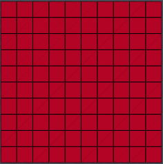
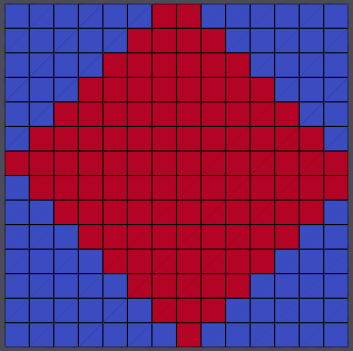
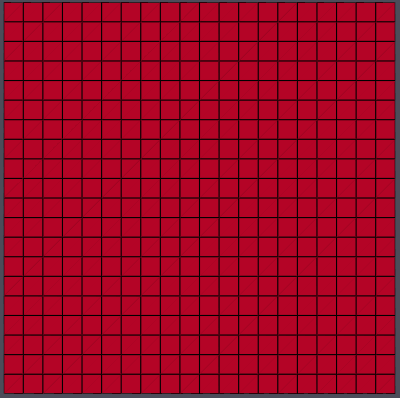

# Apply Transformation to Geometry

## Group (Subgroup)

Rotation, Scale & Transformation

## Description

### Unstructured Grid Geometries

This **Filter** applies a spatial transformation to either and unstructured **Geometry** or an **Image Geometry**. An "unstructured" **Geometry** is any geometry that requires explicit definition of **Vertex** positions. Specifically, **Vertex**, **Edge**, **Triangle**, **Quadrilateral**, and **Tetrahedral** **Geometries** may be transformed by this **Filter**. The transformation is applied in place, so the input **Geometry** will be modified.

- **NO** interpolation will take place as the only changes that take place are the actual coordinates of the vertices.

### Image Geometry

If the user selects an **Image Geometry** then there are 2 additional required filter parameters that need to be set:

- **Interpolation Method**: This will be used when transferring the data from the old geometry to the newly transformed geometry.
- **Cell Attribute Matrix**: This Attribute Matrix holds the data that is associated with each cell of the image geometry.

The linear/Bi-Linear/Tri-Linear Interpolation is adapted from the equations presented
in [https://www.cs.purdue.edu/homes/cs530/slides/04.DataStructure.pdf, page 36}](https://www.cs.purdue.edu/homes/cs530/slides/04.DataStructure.pdf)

### Caveats

- The **Scale** and **Rotation** transformation types will automatically translate the volume to (0, 0, 0), apply the scaling/rotation, and then translate the volume back to its original location.  If the **Manual Transformation Matrix** or **Pre-Computed Transformation Matrix** types are selected, then it is up to the user to make sure that those translations are included, if necessary.

## Example Image Geometry Transformations

| Description | Example Output Image |
|-------------|----------------------|
| Input Image |   |
| After Rotation of 45 Degrees around the <001> axis |  |
| Scaled by 2x in the X and Y axis  |  |

## Transformation Information

The user may select from a variety of options for the type of transformation to apply:

| Enum Value | Transformation Type                | Representation                                                                       |
|------------|------------------------------------|--------------------------------------------------------------------------------------|
| 0          | No Transformation                  | Identity transformation                                                              |
| 1          | Pre-Computed Transformation Matrix | A 4x4 transformation matrix, supplied by an **Attribute Array** in *row major* order |
| 2          | Manual Transformation Matrix       | Manually entered 4x4 transformation matrix                                           |
| 3          | Rotation                           | Rotation about the supplied axis-angle <x,y,z> (Angle in Degrees).                   |
| 4          | Translation                        | Translation by the supplied (x, y, z) values                                         |
| 5          | Scale                              | Scaling by the supplied (x, y, z) values                                             |

% Auto generated parameter table will be inserted here

## Example Pipelines

- Pipelines/SimplnxCore/Examples/apply_transformation_basic.d3dpipeline
- Pipelines/SimplnxCore/Examples/apply_transformation_image.d3dpipeline
- Pipelines/SimplnxCore/Examples/apply_transformation_node.d3dpipeline

## License & Copyright

Please see the description file distributed with this plugin.

## DREAM3D-NX Help

If you need help, need to file a bug report or want to request a new feature, please head over to the [DREAM3DNX-Issues](https://github.com/BlueQuartzSoftware/DREAM3DNX-Issues) GItHub site where the community of DREAM3D-NX users can help answer your questions.
