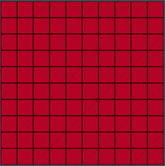
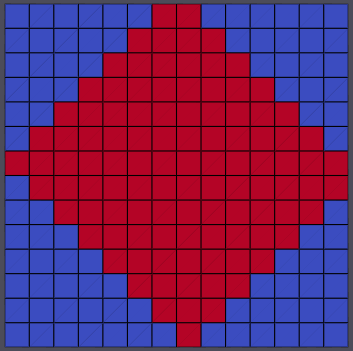
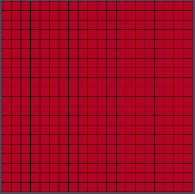
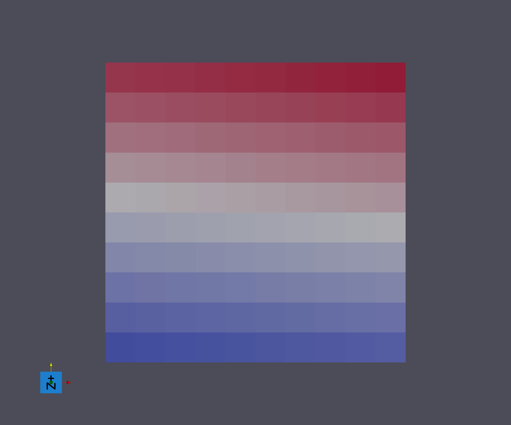
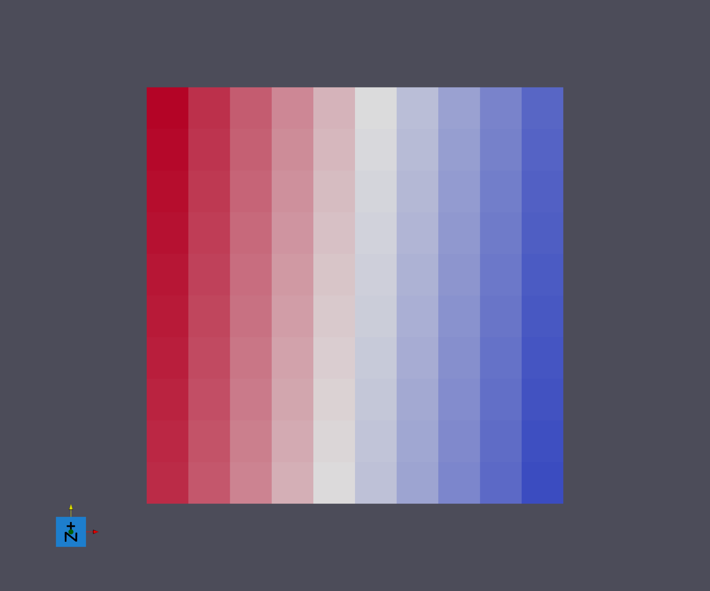
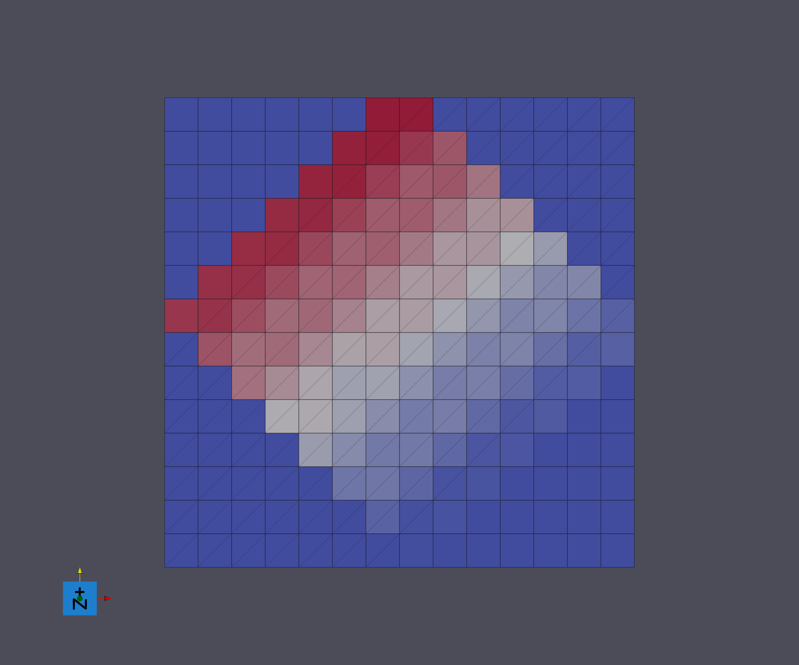
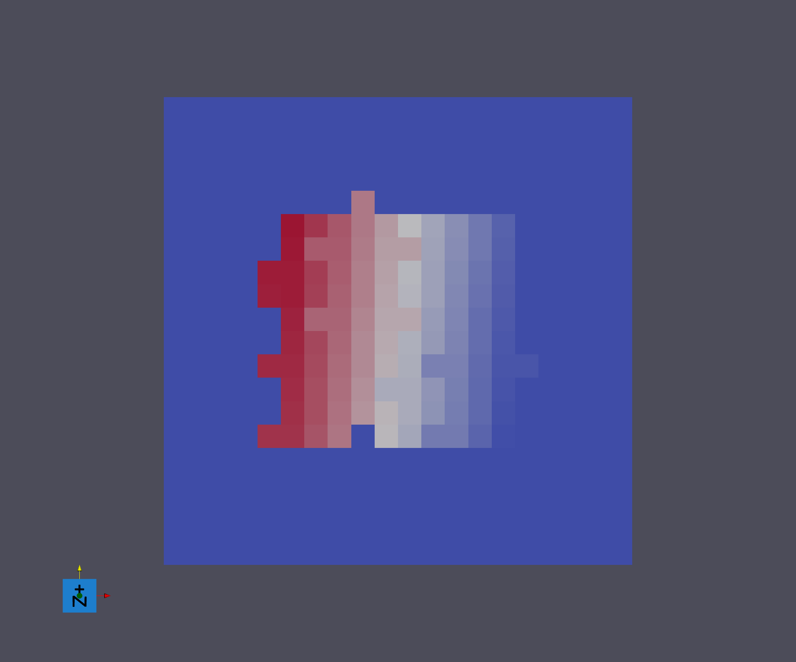
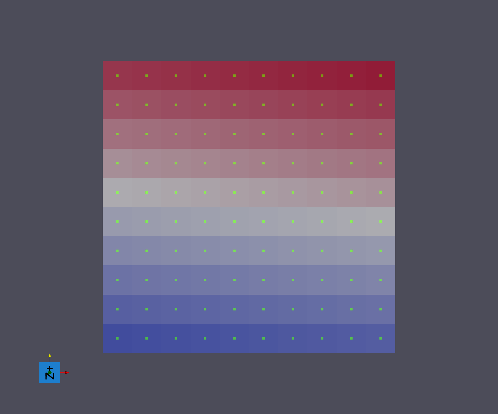
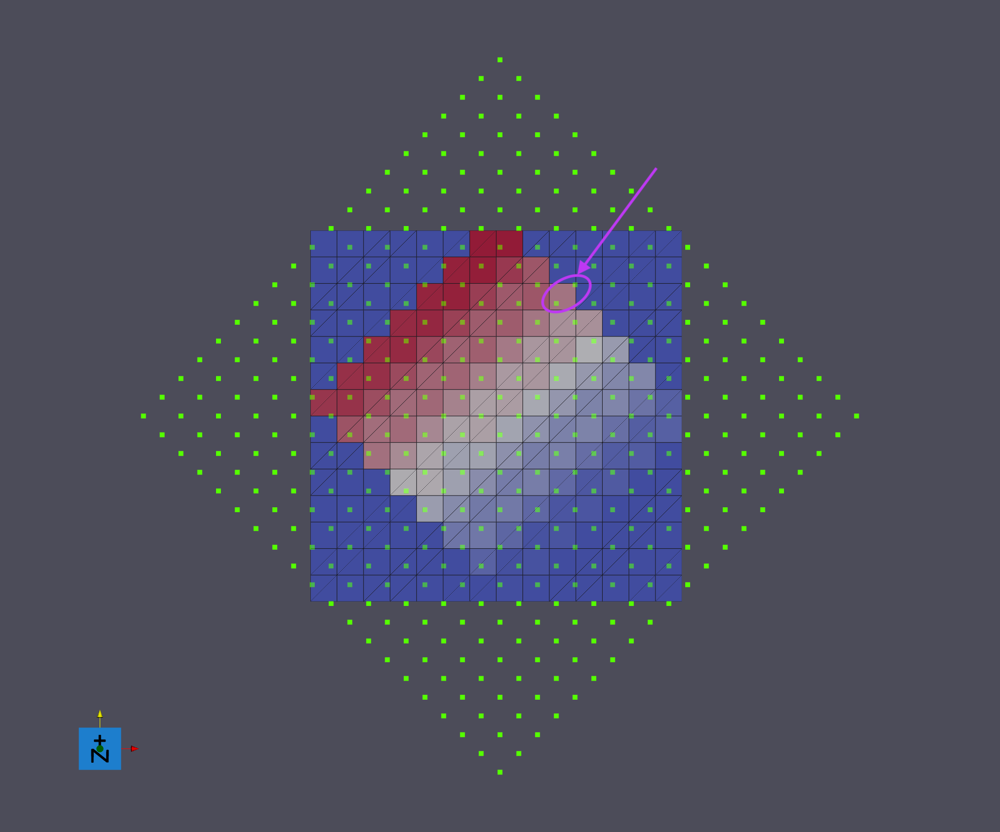
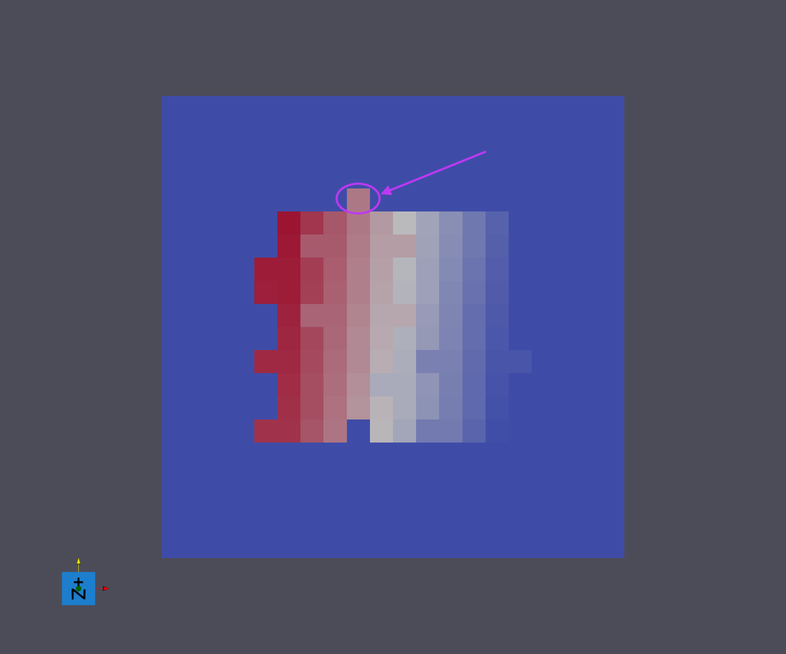

# Apply Transformation to Geometry

## Group (Subgroup)

Rotation, Scale & Transformation

## Description

This **Filter** applies a spatial transformation to either a node **Geometry** or an **Image Geometry**.

### Node Geometries

 A node **Geometry** is any geometry that requires explicit definition of **Vertex** positions. Specifically, **Vertex**, **Edge**, **Triangle**, **Quadrilateral**, and **Tetrahedral** **Geometries** may be transformed by this **Filter**. The transformation is applied in place, so the input **Geometry** will be modified.

- **NO** interpolation will take place as the only changes that take place are the actual coordinates of the vertices.

### Image Geometry

If the user selects an **Image Geometry** then there are 2 additional required filter parameters that need to be set:

- **Interpolation Method**: This will be used when transferring the data from the old geometry to the newly transformed geometry.
- **Cell Attribute Matrix**: This Attribute Matrix holds the data that is associated with each cell of the image geometry.

The linear/Bi-Linear/Tri-Linear Interpolation is adapted from the equations presented
in [https://www.cs.purdue.edu/homes/cs530/slides/04.DataStructure.pdf, page 36}](https://www.cs.purdue.edu/homes/cs530/slides/04.DataStructure.pdf)

## Example Image Geometry Transformations

| Description | Example Output Image |
|-------------|----------------------|
| Input Image |   |
| After Rotation of 45 Degrees around the <001> axis |  |
| Scaled by 2x in the X and Y axis  |  |

## Image Geometry Caveat

Using this filter several times in a row to apply several transforms in succession to the same image geometry is highly likely to result in visual artifacts related to the intermediate re-gridding of the image geometry between transformations.  For example, let's rotate an image geometry 90 degrees along the Z axis:

| Description | Image |
|-------------|----------------------|
| Input Image |   |
| After Rotation of 90 Degrees around the <001> axis |  |

Instead of using a single rotation of 90 degrees, if the user has a need to instead apply several rotations that still add up to 90 degrees, for example a pair of 45 degree rotations, potential unwanted artifacts can occur due to the intermediate regridding for each rotation.

| Description | Image |
|-------------|----------------------|
| Input Image |   |
| After 1st Rotation of 45 Degrees around the <001> axis |  |
| After 2nd Rotation of 45 Degrees around the <001> axis |  |

Why does this happen?  Let's overlay the centers of each cell on top of the original image geometry.

| Description | Image |
|-------------|----------------------|
| Input Image |   |
| After 1st Rotation of 45 Degrees around the <001> axis |  |

The green vertices refer to the center of each image geometry cell.  As you can see, after the first 45 degree rotation, the image geometry is re-gridded and now the transformed green vertices are no longer in the center of each cell.

On the 2nd and final 45 degree rotation, the image geometry is going to double in size because the algorithm doesn't know the final image geometry's exact size and doubles its size to account for the worst case scenario.

Let's see how the transformed green vertices overlay on the intermediate image geometry when the field of vertices has doubled in size but the image geometry hasn't actually been transformed a 2nd time yet.

| Description | Image |
|-------------|----------------------|
| After 1st Rotation of 45 Degrees around the <001> axis |  |

The cell circled in purple has two green vertices inside it.  This means that once the 2nd 45 degree transformation is completed, the final image geometry will have that orange color shifted outside where we would expect it to be.  And sure enough:

| Description | Image |
|-------------|----------------------|
| After 2nd Rotation of 45 Degrees around the <001> axis |  |

To avoid this problem, it is considered best practice to use the *[Combine Transformation Matrices](CombineTransformationMatricesFilter.md)* filter to combine all transforms together into one transform before applying the transform to an image geometry.

| Description | Image |
|-------------|----------------------|
| After combining both 45 degree rotations and applying around the <001> axis |  |

## NOTE: 

This caveat is ONLY for image geometries.  Multiple transformations can be applied in succession to any of the "Node" based geometries without any issues. Those are:

- Vertex
- Edge
- Triangle
- Quad
- Tetrahedral
- Hexahedral

## Transformation Information

The user may select from a variety of options for the type of transformation to apply:

| Enum Value | Transformation Type                | Representation                                                                       |
|------------|------------------------------------|--------------------------------------------------------------------------------------|
| 0          | No Transformation                  | Identity transformation                                                              |
| 1          | Pre-Computed Transformation Matrix | A 4x4 transformation matrix, supplied by an **Attribute Array** in *row major* order |
| 2          | Manual Transformation Matrix       | Manually entered 4x4 transformation matrix                                           |
| 3          | Rotation                           | Rotation about the supplied axis-angle <x,y,z> (Angle in Degrees).                   |
| 4          | Translation                        | Translation by the supplied (x, y, z) values                                         |
| 5          | Scale                              | Scaling by the supplied (x, y, z) values                                             |

The **Translate Geometry To Global Origin Before Transformation** option must be selected if the user wants to translate their volume to (0, 0, 0), apply the transform, and then translate the volume back to its original location.

## Saving the final transformation Matrix.

There is an option to save the final transformation matrix into its own array. The format of the output DataArray is a
flattened array 16 elements in size that represents a 4x4 matrix. The elements are encoded in a ROW MAJOR array, i.e., 

    1 2 3 4 5 6 7 8 9 10 11 12 13 14 15 16

represents the following 4x4 Matrix

    1   2   3   4
    5   6   7   8
    9   10  11  12
    13  14  15  16

% Auto generated parameter table will be inserted here

## Example Pipelines

- Pipelines/SimplnxCore/Examples/apply_transformation_basic.d3dpipeline
- Pipelines/SimplnxCore/Examples/apply_transformation_image.d3dpipeline
- Pipelines/SimplnxCore/Examples/apply_transformation_node.d3dpipeline

## License & Copyright

Please see the description file distributed with this plugin.

## DREAM3D-NX Help

If you need help, need to file a bug report or want to request a new feature, please head over to the [DREAM3DNX-Issues](https://github.com/BlueQuartzSoftware/DREAM3DNX-Issues/discussions) GitHub site where the community of DREAM3D-NX users can help answer your questions.
