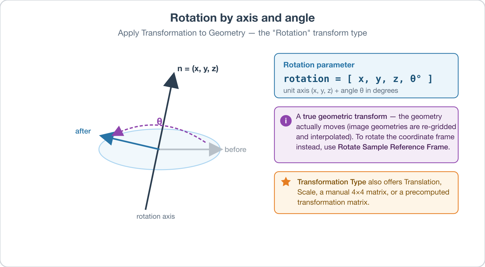

# Apply Transformation to Geometry

## Group (Subgroup)

Rotation, Scale & Transformation

## Description

This **Filter** applies a spatial transformation -- rotation, translation, scaling, or an arbitrary 4x4 matrix -- to a **Geometry**. Both **Image Geometries** and node-based geometries (Vertex, Edge, Triangle, Quadrilateral, Tetrahedral, Hexahedral) are supported.

### Node Geometries

For node-based geometries, the transformation modifies vertex positions only. No interpolation occurs. Multiple transformations can be applied in succession without artifacts.

### Image Geometry

For Image Geometries, transformation requires re-gridding because cell positions are implicit in the grid spacing and origin. After transformation, a new grid is generated and cell data is interpolated onto it. This is governed by two extra parameters:

- **Interpolation Method** -- how cell data values are sampled from the old grid (see below).
- **Cell Attribute Matrix** -- which attribute matrix holds the cell data to transform.

### Image Geometry Caveat: Successive Transformations

Applying multiple transformations one-at-a-time to an Image Geometry produces visible re-gridding artifacts because each intermediate step re-samples the data. The following example shows a 90-degree rotation done as a single step versus as two 45-degree steps:

| Description | Image |
|-------------|----------------------|
| Input Image |   |
| After single 90-degree rotation around <001> |  |
| After first 45-degree rotation |  |
| After second 45-degree rotation (artifacts visible) |  |

The problem is that after the first 45-degree rotation, the cell centers no longer align with the new grid cells -- the re-gridding has shifted them. On the second rotation, those misalignments compound.

| Description | Image |
|-------------|----------------------|
| Input Image |   |
| After 1st 45-degree rotation (cell centers in green) |  |

To avoid these artifacts, **combine all transformations into a single 4x4 matrix first** using [Combine Transformation Matrices](CombineTransformationMatricesFilter.md), then apply that combined matrix as a single transformation:

| Description | Image |
|-------------|----------------------|
| Combined 90-degree rotation applied once |  |

This caveat only applies to Image Geometries. Node-based geometries can have any number of transformations chained without issue.

### Example Transformations (Image Geometry)

| Description | Example Output Image |
|-------------|----------------------|
| Input Image |   |
| 45-degree rotation around <001> |  |
| 2x scale in X and Y |  |

### Transformation Type

The *Transformation Type* parameter selects how the transformation is specified:

| Value | Type | Description |
|---|---|---|
| 0 | No Transform | Identity (geometry unchanged). |
| 1 | Pre-Computed Transformation Matrix (4x4) | A 4x4 matrix supplied as a 16-element float32 Attribute Array in row-major order. |
| 2 | Manual Transformation Matrix | A 4x4 matrix typed in directly. |
| 3 | Rotation | Axis-angle: a unit vector (x, y, z) and an angle in **degrees**. |
| 4 | Translation | A (dx, dy, dz) translation vector in the geometry's physical units. |
| 5 | Scale | A (sx, sy, sz) scaling vector (dimensionless multipliers). |

The linear / bi-linear / tri-linear interpolation math is adapted from [Purdue CS530 slides, page 36](https://www.cs.purdue.edu/homes/cs530/slides/04.DataStructure.pdf).

If *Translate Geometry To Global Origin Before Transformation* is enabled, the geometry is shifted so its centroid sits at (0, 0, 0) before the transformation is applied, then translated back. Use this to rotate about the geometry's center rather than the world origin.

### Interpolation Method (Image Geometry Only)

- **Nearest Neighbor [0]** -- each output cell takes the value of the nearest input cell. Fast; preserves sharp boundaries; blocky.
- **Linear (trilinear in 3D) [1]** -- each output cell value is interpolated from surrounding input cells. Smoother; may blur sharp features.
- **No Interpolation [2]** -- no resampling. Use only when the transformation does not change the grid topology (e.g., integer translations that align exactly with the existing grid).

### Saving the Final Transformation Matrix

Optionally, the final 4x4 transformation matrix can be saved as an Attribute Array. The output is a 16-element float32 array in **row-major** order:

    1 2 3 4 5 6 7 8 9 10 11 12 13 14 15 16

represents the 4x4 matrix:

    1   2   3   4
    5   6   7   8
    9   10  11  12
    13  14  15  16

### Required Input Sources

- **Geometry** -- any supported geometry; for Image Geometry workflows, typically produced by [Create Image Geometry](CreateImageGeometryFilter.md), [ITK Import Image Stack](../ITKImageProcessing/ITKImportImageStackFilter.md), or an EBSD reader.
- **Pre-Computed Transformation Matrix** (only for Transformation Type 1) -- typically produced by [Combine Transformation Matrices](CombineTransformationMatricesFilter.md).
- **Cell Attribute Matrix** (Image Geometry only) -- the cell-level data to be re-gridded.

% Auto generated parameter table will be inserted here

## Example Pipelines

- Pipelines/SimplnxCore/Examples/apply_transformation_basic.d3dpipeline
- Pipelines/SimplnxCore/Examples/apply_transformation_image.d3dpipeline
- Pipelines/SimplnxCore/Examples/apply_transformation_node.d3dpipeline

## License & Copyright

Please see the description file distributed with this plugin.

## DREAM3D-NX Help

If you need help, need to file a bug report or want to request a new feature, please head over to the [DREAM3DNX-Issues](https://github.com/BlueQuartzSoftware/DREAM3DNX-Issues/discussions) GitHub site where the community of DREAM3D-NX users can help answer your questions.
