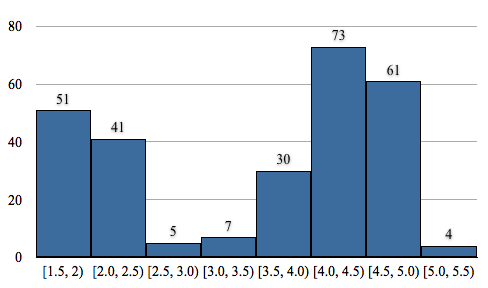

# Compute Attribute Array Frequency Histogram

## Description

This **Filter** accepts one or more numeric **DataArray** inputs and generates corresponding histogram **DataArray** outputs within a target **DataGroup**. For each selected array, it divides the data range—using either automatically derived or user-defined minimum/maximum values—into equal-width bins and counts the number of elements per bin.

Optionally, a mask **DataArray** can be provided to include only specific elements in the histogram computation.

The created histogram arrays are written into the target **DataGroup**. For each input array the following arrays are produced:

- **Counts DataArray**: A tuple for each bin representing the number of elements in that bin.
- **Bin Ranges DataArray**: A two-component tuple per bin defining the inclusive lower bound and exclusive upper bound. The bin bounds carry the same units as the input array (for example, if the input array is in micrometers, the bin bounds are in micrometers).
- **Most Populated Bin DataArray**: Reports the index of the bin that has the most values.
- **Modal Bin Ranges NeighborList** (optional): Specifies the inclusive lower and exclusive upper bound bin indices containing the input data's *mode(s)*. The *mode* is the value (or values) that occurs most frequently in the data. Because there can be multiple modes, this list may include more than two entries.

### Required Input Sources

None -- this filter operates on any generic numeric **DataArray** regardless of how it was produced.

## Example Data

Using the "Old Faithful" geyser data set from the [R site](http://www.r-tutor.com/elementary-statistics/quantitative-data/frequency-distribution-quantitative-data) (272 eruptions; the full data set is not reproduced here), the first few rows of the *Duration* and *Wait Time* columns are:

 Duration, Wait Time
 {3.6,79},
 {1.8,54},
 {3.333,74},
 {2.283,62},
 {4.533,85},
 {2.883,55},
 {4.7,88},
    ..

### Example Output

The range on the data is [1.6, 5.1]. Using 8 bins starting from 1.5 with a bin width of 0.5 the expected output for a "Left Closed, Right Open" histogram is the following table data.

 [1.5,2)            51
 [2,2.5)            41
 [2.5,3)             5
 [3,3.5)             7
 [3.5,4)            30
 [4,4.5)            73
 [4.5,5)            61
 [5,5.5)             4

### Example Plot

### Additional Information

Also see Histogram Quick Reference at [https://plot.ly/histogram/](https://plot.ly/histogram/).

% Auto generated parameter table will be inserted here

## Example Pipelines

+ Image Histogram
+ Confidence Index Histogram

## License & Copyright

Please see the description file distributed with this **Plugin**

## DREAM3D-NX Help

If you need help, need to file a bug report or want to request a new feature, please head over to the [DREAM3DNX-Issues](https://github.com/BlueQuartzSoftware/DREAM3DNX-Issues/discussions) GitHub site where the community of DREAM3D-NX users can help answer your questions.
