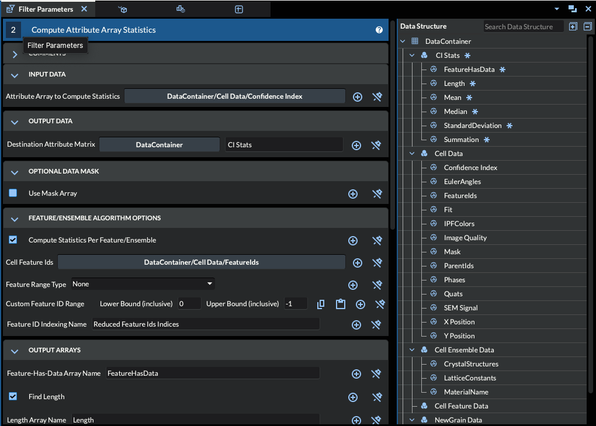
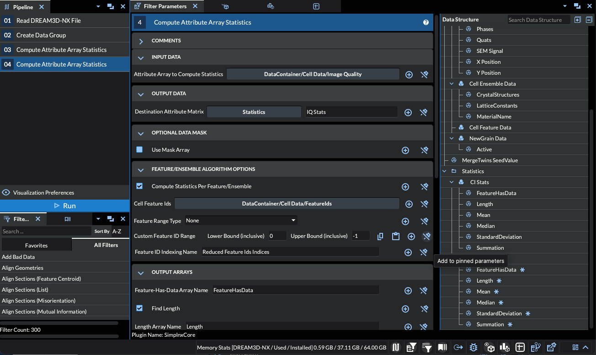

# Compute Attribute Array Statistics

## Group (Subgroup)

Statistics

## Description

***WARNING: The Histogram functionality has been moved to a new filter.***

This filter computes a variety of statistics for a given scalar array. The currently available statistics are array length, minimum, maximum, (arithmetic) mean, median, mode, standard deviation, and summation; any combination of these statistics may be computed. Any scalar array, of any primitive type, may be used as input. The type of each output array depends on the kind of statistic computed:

| Statistic               | Primitive Type                      |
|-------------------------|-------------------------------------|
| Length                  | signed 64-bit integer               |
| Minimum                 | same type as input                  |
| Maximum                 | same type as input                  |
| Mean                    | 32-bit float                        |
| Median                  | 32-bit float                        |
| Mode                    | same type as input                  |
| Standard Deviation      | 32-bit float                        |
| Summation               | 32-bit float                        |
| Standardized            | 32-bit float                        |
| Number of Unique Values | signed 32-bit integer               |

A **Feature** is a contiguous region of the data (such as a grain) identified by a unique integer **Feature** Id; an **Ensemble** is a higher-level grouping of **Features** (such as a phase). The filter can compute statistics over the whole array, or per **Feature**/**Ensemble** when a **Feature** Ids array is supplied.

The user may optionally use a mask to specify points to be ignored when computing the statistics; only points where the supplied mask is *true* are considered. Additionally, the user may compute the statistics per **Feature** or **Ensemble** by supplying a **Feature** Ids array. For example, if the user computes statistics per **Feature** and selects an array that has 10 unique **Feature** Ids, then the filter computes 10 sets of statistics (the mean of the supplied array for each **Feature**, the total number of points in each **Feature** (the length), and so on).

The input array may also be *standardized*, meaning that the array values are adjusted so that they have a mean of 0 and unit variance. This *Standardize Data* option requires that both *Find Mean* and *Find Standard Deviation* are also selected. The standardized data is saved as a new array stored in the same **Attribute Matrix** as the input array. When *Standardize Data* is selected, the mean and standard deviation values created by this filter reflect the mean and standard deviation of the *original* array; the new standardized array has a mean of 0 and unit variance. The standardized array is computed in double precision. If statistics are computed per **Feature** or **Ensemble**, then the array values are standardized according to the mean and standard deviation *for each **Feature**/**Ensemble***. For example, with 5 unique **Features** and *Standardize Data* selected, the values for **Feature** 1 are standardized using the mean and standard deviation of **Feature** 1, the values for **Feature** 2 are standardized using those of **Feature** 2, and so on.

Special operations occur for certain statistics if the supplied array is of type *bool* (for example, a mask array produced from threshold filters). The *length*, *minimum*, *maximum*, *median*, *mode*, and *summation* are computed as normal (although the resulting values may be platform dependent). The *mean* and *standard deviation* for a boolean array are *true* if there are more instances of *true* in the array than *false*. If *Standardize Data* is chosen for a boolean array, no modifications are made to the input. These operations for boolean inputs are chosen as a basic convention, and are not intended to be representative of true boolean logic.

## Destination Attribute Matrix

The user must create a destination **Attribute Matrix** in which the computed statistics are stored. DREAM3D-NX enforces a rule that an **Attribute Matrix** cannot contain another **Attribute Matrix**. With this in mind, the user should select a destination that is not itself an **Attribute Matrix**, such as the top level of a **Geometry** or the top level of the Data Structure itself. The user could also have created a group (using a previous filter) and use that group as the destination.

The user is creating the destination **Attribute Matrix** inside the `DataContainer` geometry.

The user is creating the destination **Attribute Matrix** inside the `Statistics` group which was created by filter #2 in the pipeline.

### Feature Range Type

When computing per-**Feature** statistics, the *Feature Range Type* parameter controls which **Feature** Ids are included and how the output is indexed (these are all dimensionless integer **Feature** Id selections):

- **None [0]**: No feature-based range is applied; statistics are computed for every **Feature** Id present.
- **Ignore Feature 0 [1]**: Excludes **Feature** Id 0 (the invalid/background feature) from the calculations.
- **Shrink To Fit [2]**: Automatically determines the minimum and maximum **Feature** Ids present and uses that as the range, removing empty entries.
- **Padded Custom Range [3]**: Uses the user-specified *Feature Ids Min Max Range* and generates filled values for **Feature** Ids below the minimum and above the maximum actually present in the data.
- **Minimum Size in Custom Range [4]**: Uses the user-specified range but clamps to the actual min/max **Feature** Ids if the specified bounds exceed them, avoiding padding.

For any range selection other than *None*, the filter also creates a *Feature Ids Indexing Array* that records the **Feature** Id each row of statistics corresponds to. If the selected range already contains every **Feature**, this indexing array is redundant and may be removed; in that niche case selecting *None* is simpler.

*Tip: If the maximum **Feature** Id in a custom range is unknown, supplying `-1` for the upper bound causes the filter to determine the maximum **Feature** Id at run time and use it as the upper bound.*

### Required Input Sources

- **Cell Feature Ids** -- required only when computing statistics per **Feature**/**Ensemble**; produced by a segmentation filter such as [Segment Features (Scalar)](ScalarSegmentFeaturesFilter.md).

% Auto generated parameter table will be inserted here

## Example Pipelines

## License & Copyright

Please see the description file distributed with this **Plugin**

## DREAM3D-NX Help

If you need help, need to file a bug report or want to request a new feature, please head over to the [DREAM3DNX-Issues](https://github.com/BlueQuartzSoftware/DREAM3DNX-Issues/discussions) GitHub site where the community of DREAM3D-NX users can help answer your questions.
