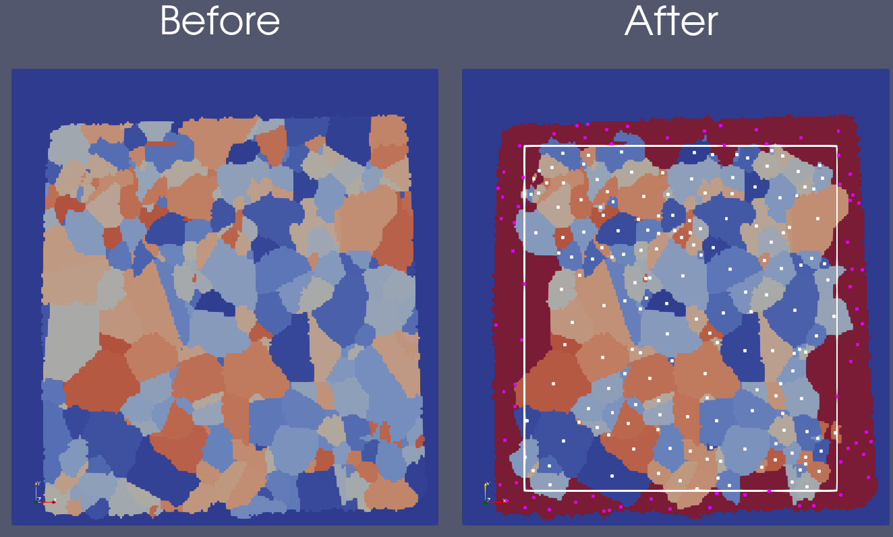

# Compute Biased Features (Bounding Box)

## Group (Subgroup)

Generic (Spatial)

## Description

This **Filter** flags each **Feature** as *biased* or *unbiased* by the outer surfaces of the sample, producing a feature-level boolean array suitable for excluding biased features from downstream statistical analyses (size distributions, shape distributions, ODFs, etc.).

### Why Bias Matters for Statistics

When a sample volume is cut out of a larger material, some grains are truncated by the cut. If only size or shape statistics are needed, surface-touching features like those flagged by [Compute Surface Features](ComputeSurfaceFeaturesFilter.md) can be excluded -- but that undercounts the problem. Larger grains are more likely to touch any given surface simply because they are larger, so excluding only surface-touching features still leaves a size-dependent sampling bias: *small* grains that don't touch the surface are over-represented relative to *large* grains that do. The biased-feature flag produced here corrects for this by identifying which features' centroids are close enough to a boundary that they are statistically suspect, regardless of whether the feature itself touches the boundary.

### How This Filter Works

The algorithm for determining whether a **Feature** is *biased* is as follows:

1. The *centroids* of all **Features** are calculated
2. All **Features** are tested to determine if they touch an outer surface of the sample
3. The largest box is found that does not include any of the *centroids* of **Features** that intersect an outer surface of the sample
4. Each **Feature**'s *centroid* is checked to see whether it lies within the box.  

*If a **Feature**'s *centroid* lies within the box, then the **Feature** is said to be *unbiased*, and if it lies outside the box, then the **Feature** is said to be *biased*.*

By definition of the box, no **Feature** that intersects an outer surface of the sample can be considered *unbiased*, but it should be noted that **Features** that do not intersect the outer surfaces may still be considered *biased*. This algorithm works to determine the biased **Features** because all **Features** have one (and only one) centroid, no matter their size. Generally, this method will deem more small **Features** biased than the set of **Features** that just intersect the outer surfaces - and this corrects for the increased likelihood that larger **Features** will touch an outer surface.

*Note:* This **Filter** is a modification of an algorithm from Dave Rowenhorst (Naval Research Laboratory).

The images below show the feature ids before and after running this filter. The image on the right shows the biased features colored in red, the unbiased features colored by their feature id, the bounding box (described in step 3 of the algorithm above), and the feature centroids (white for unbiased and purple for biased).

### Required Input Sources

- **Feature Centroids** -- produced by [Compute Feature Centroids](ComputeFeatureCentroidsFilter.md).
- **Surface Features** -- produced by [Compute Surface Features](ComputeSurfaceFeaturesFilter.md) or as an optional output of [Compute Feature Neighbors](ComputeFeatureNeighborsFilter.md).
- **Feature Phases** (only when applying to a single phase) -- produced by [Compute Feature Phases](ComputeFeaturePhasesFilter.md).

% Auto generated parameter table will be inserted here

## Example Pipelines

+ ComputeBiasedFeatures.d3dpipeline

## License & Copyright

Please see the description file distributed with this **Plugin**

## DREAM3D-NX Help

If you need help, need to file a bug report or want to request a new feature, please head over to the [DREAM3DNX-Issues](https://github.com/BlueQuartzSoftware/DREAM3DNX-Issues/discussions) GitHub site where the community of DREAM3D-NX users can help answer your questions.
