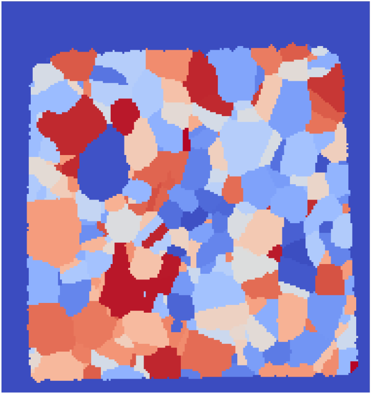
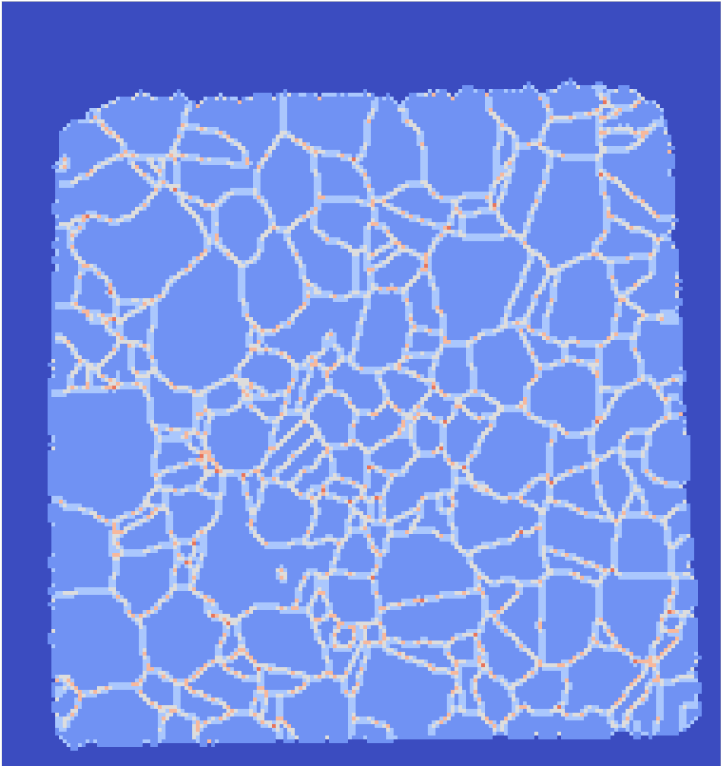

# Compute Boundary Cells (Image)

## Group (Subgroup)

Generic (Spatial)

## Description

This **Filter** determines, for each **Cell**, the number of neighboring **Cells** that are owned by a different **Feature**.  The algorithm for determining this is as follows:

1. Identify the **Feature** to which a **Cell** belongs
2. Identify the **Features** to which each of the current **Cell**'s six (6) face-face neighboring **Cells** (front, back, left, right, up, down) belong
3. Determine the number of those neighboring **Cells** belonging to a different **Feature** than the current **Cell**.
4. Repeat 1-3 for all **Cells**

| Small IN100 Feature Ids Input | Small IN100 Boundary Cells Output |
|--|--|
|  |  |

## Algorithm

For each voxel in the image geometry, the filter counts how many of its 6 face-connected neighbors (front, back, left, right, up, down) belong to a different feature. The result is an Int8 array where each cell stores a value from 0 (all neighbors are the same feature) to 6 (all neighbors differ).

Two optional behaviors modify the counting:

+ **Include Volume Boundary**: When enabled, cells on the outer faces of the image geometry receive additional boundary counts for each face that touches the volume edge. Feature 0 cells on the boundary are excluded from this count.
+ **Ignore Feature Zero**: When enabled, neighbors with Feature ID = 0 are not counted as boundary faces. This is useful when Feature 0 represents background/empty space that should not be treated as a distinct feature.

### In-Core Algorithm (Direct)

The in-core variant iterates all voxels sequentially in Z-Y-X order. For each voxel, it uses pre-computed flat-index offsets to look up the 6 face neighbors directly via operator[] on the FeatureIds DataStore. This is a straightforward approach that works well when all data is resident in memory.

### Out-of-Core Algorithm (Scanline)

When the FeatureIds array is stored out-of-core in chunked format (e.g., loaded from a .dream3d file in OOC mode), the in-core algorithm's random neighbor lookups would trigger chunk load/evict cycles for every voxel, making it extremely slow. The Scanline variant avoids this by reading one complete Z-slice at a time using sequential bulk I/O.

Three in-memory buffers hold adjacent Z-slices simultaneously:

+ **prevSlice**: The Z-slice at z-1, needed for -Z neighbor lookups
+ **curSlice**: The Z-slice at z (the slice being processed)
+ **nextSlice**: The Z-slice at z+1, needed for +Z neighbor lookups

Within a Z-slice, X and Y neighbor lookups are simple index arithmetic on the curSlice buffer. After processing a slice, the output is written in a single bulk operation, the window rotates forward, and the next Z-slice is loaded. This guarantees strictly sequential disk I/O.

### Performance

The in-core and out-of-core variants produce identical results. The algorithm dispatch is automatic: in-memory data uses the Direct path, and chunked/OOC data uses the Scanline path. The Scanline variant adds minimal memory overhead (3 Z-slices of int32 plus 1 Z-slice of int8), which is negligible compared to the full volume.

% Auto generated parameter table will be inserted here

## Example Pipelines

+ ComputeBoundaryCells.d3dpipeline

## License & Copyright

Please see the description file distributed with this **Plugin**

## DREAM3D-NX Help

If you need help, need to file a bug report or want to request a new feature, please head over to the [DREAM3DNX-Issues](https://github.com/BlueQuartzSoftware/DREAM3DNX-Issues/discussions) GitHub site where the community of DREAM3D-NX users can help answer your questions.
