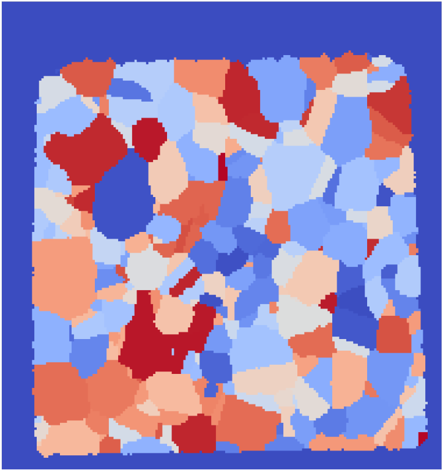

# Compute Boundary Cells (Image)

## Group (Subgroup)

Generic (Spatial)

## Description

This **Filter** determines, for each **Cell**, the number of neighboring **Cells** that are owned by a different **Feature**.  The algorithm for determining this is as follows:

1. Identify the **Feature** to which a **Cell** belongs
2. Identify the **Features** to which each of the current **Cell**'s six (6) face-face neighboring **Cells** (front, back, left, right, up, down) belong
3. Determine the number of those neighboring **Cells** belonging to a different **Feature** than the current **Cell**.
4. Repeat 1-3 for all **Cells**

| Small IN100 Feature Ids Input | Small IN100 Boundary Cells Output |
|--|--|
|  |  |

% Auto generated parameter table will be inserted here

## Example Pipelines

+ ComputeBoundaryCells.d3dpipeline

## License & Copyright

Please see the description file distributed with this **Plugin**

## DREAM3D-NX Help

If you need help, need to file a bug report or want to request a new feature, please head over to the [DREAM3DNX-Issues](https://github.com/BlueQuartzSoftware/DREAM3DNX-Issues/discussions) GitHub site where the community of DREAM3D-NX users can help answer your questions.
