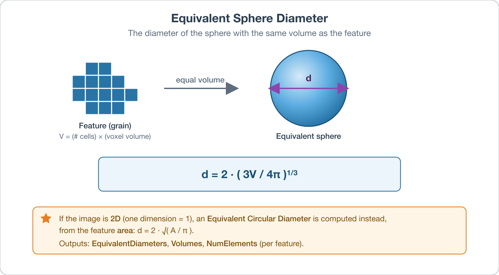

# Compute Feature Sizes

## Group (Subgroup)

Statistics (Morphological)

## Description

**Note:** Regarding using an *Image Geometry* as input, if you have a `1` in any of the dimensions it will be turned into a 2D calculation instead. See *Image Geometry Additional Considerations* section for more details.

This **Filter** calculates the sizes, volumes/areas, and equivalent diameters of all **Features** in an **Image Geometry** or **Rectilinear Grid Geometry**.

To do so, the **Filter** simply iterates through all **Elements** querying for the **Feature** that owns them and keeping a tally for each **Feature**. The tally is then stored as *NumElements* and the *Volume* and *EquivalentDiameter* are also calculated (and stored) by knowing the volume of each **Element**.

Note here that **Image Geometry** will always be faster than its equivalent **Rectilinear Grid Geometry** because we leverage the uniformity of voxel sizes to perform volume/area calculations at the feature level rather than the cell level.

During the computation of the **Feature** sizes, the size of each individual **Element** is computed and stored in the corresponding **Geometry**. By default, these sizes are deleted after executing the **Filter** to save memory. If you wish to store the **Element** sizes, select the *Generate Missing Element Sizes* option. The sizes will be stored within the **Geometry** definition itself, not as a separate **Attribute Array**.

## Image Geometry Additional Considerations

A typical Image Stack *(an `Image Geometry` that contains 3 dimensions greater than 1)* conceptually consists of a series of 2D images stacked on top of one another to create a 3D object, thus it functions in 3D space as expected. This means it produces **Volumes** and **Equivalent Spherical Diameters**.

Due to the way *Image Geometry* is stored, if you have a `1` in any of the dimensions
it will be turned into a 2D calculation instead. This means **Areas instead of Volumes** and **Equivalent Circular Diameters instead of Equivalent Spherical Diameters**. Furthermore, you must have two dimensions greater than `1` to pass preflight. The reason for this being orientation becomes ambiguous once a second dimension is "empty".

To illustrate why this is think about an image geometry with the dimensions of `1x1x5 (XYZ)`. There is no way to tell whether a `Z * X` or `Z * Y` scaling would be appropriate for the area calculation, given the current information accessible in the algorithm.

### Required Input Sources

- **Feature Ids** -- a per-**Cell** integer label array produced by a segmentation filter such as [Segment Features (Scalar)](ScalarSegmentFeaturesFilter.md).

% Auto generated parameter table will be inserted here

## Example Pipelines

+ (03) Small IN100 Morphological Statistics
+ (02) Small IN100 Full Reconstruction
+ InsertTransformationPhase
+ (06) SmallIN100 Synthetic
+ (09) Image Segmentation

## License & Copyright

Please see the description file distributed with this **Plugin**

## DREAM3D-NX Help

If you need help, need to file a bug report or want to request a new feature, please head over to the [DREAM3DNX-Issues](https://github.com/BlueQuartzSoftware/DREAM3DNX-Issues/discussions) GitHub site where the community of DREAM3D-NX users can help answer your questions.
