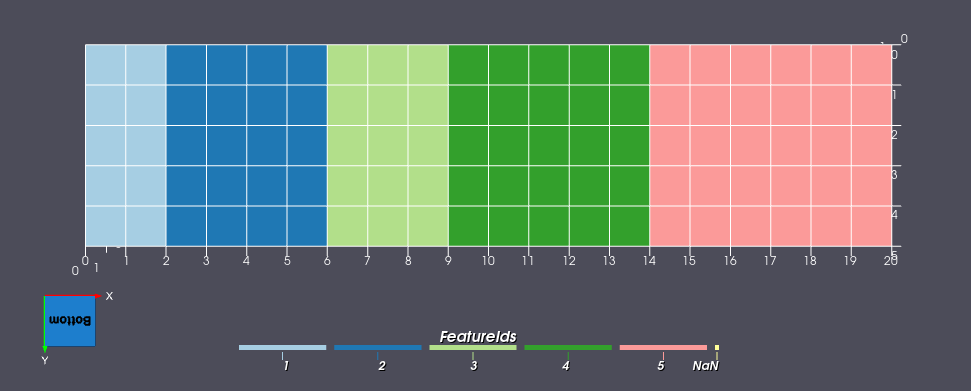
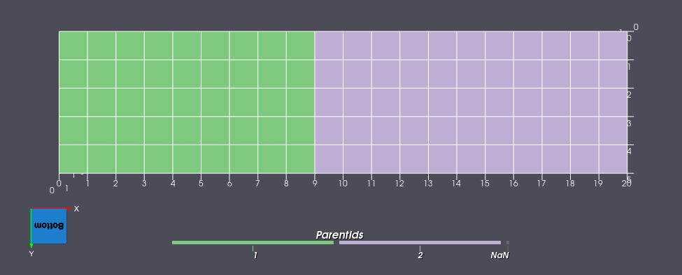
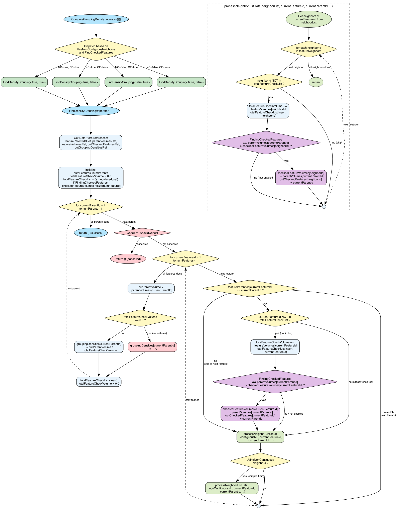

# Compute Grouping Densities

## Group (Subgroup)

Statistics (Reconstruction)

## Description

This **Filter** computes a **Grouping Density** value for each **Parent Feature** in a hierarchical reconstruction. Hierarchical reconstructions involve more than one level of segmentation, creating a **Feature** to **Parent Feature** relationship (e.g., grains grouped into reconstructed parent grains).

The **Grouping Density** quantifies how spatially concentrated the child **Features** of a **Parent Feature** are relative to the surrounding microstructure. A higher density value indicates the **Parent Feature's** volume is large relative to the region its child **Features** and their neighbors occupy, suggesting a tightly packed grouping. A lower density value indicates the child **Features** are spread out among many neighbors, suggesting a more dispersed grouping.

### How It Works

For each **Parent Feature**, the filter:

1. Identifies all child **Features** that belong to the **Parent Feature** (via the **Parent IDs** array).
2. Collects all contiguous neighbors of those child **Features** (and optionally non-contiguous neighbors).
3. Accumulates the volumes of all collected ("checked") **Features** into a total checked volume. Each **Feature** is only counted once, even if it is a neighbor of multiple child **Features**.
4. Computes the **Grouping Density** as:

```
Grouping Density = Parent Volume / Total Checked Volume
```

If a **Parent Feature** has no child **Features** (total checked volume is zero), the **Grouping Density** is set to **-1.0** to indicate an invalid or empty parent.

### Optional Parameters

#### Use Non-Contiguous Neighbors

When enabled, the filter also queries the **Non-Contiguous Neighbor List** for each child **Feature** in addition to the standard **Contiguous Neighbor List**. This expands the set of checked **Features** to include neighbors that are nearby but do not share a direct face/edge/vertex with the child **Feature**. Enable this option if non-contiguous neighbors were used during the original grouping step. Typically the filter "Compute Feature NeighborHoods" is used to generate the Non-contiguous Neighbors lists. That filter's parameter for the "Multiples of Average Diameter can have a large effect on the final Grouping Density value that is computed.

#### Find Checked Features

When enabled, the filter produces an additional output array (**Checked Features**) at the **Feature** level. For each **Feature** that was checked during the density computation, this array records which **Parent Feature** checked it. Since a **Feature** may be checked by multiple **Parent Features** (as a neighbor of children belonging to different parents), the assignment goes to the **Parent Feature** with the **largest Parent Volume**. This provides a way to see which parent had the strongest influence over each region of the microstructure.


### Worked Example

Consider a 20x5 2D **Image Geometry** with unit spacing (1.0 x 1.0 x 1.0), containing 5 **Features** arranged as vertical bands and 2 **Parent Features**:





- Features 1, 2, 3 belong to Parent 1 (Parent Volume = 45, i.e. 10 + 20 + 15 cells)
- Features 4, 5 belong to Parent 2 (Parent Volume = 55, i.e. 25 + 30 cells)

| Feature | Cells | Volume | Parent | Contiguous Neighbors |
|---------|-------|--------|--------|----------------------|
| 1       | 10    | 10.0   | 1      | {2}                  |
| 2       | 20    | 20.0   | 1      | {1, 3}               |
| 3       | 15    | 15.0   | 1      | {2, 4}               |
| 4       | 25    | 25.0   | 2      | {3, 5}               |
| 5       | 30    | 30.0   | 2      | {4}                  |

**Parent 1:** Child features {1, 2, 3} plus their contiguous neighbors include feature 4 (neighbor of feature 3). Total checked volume = 10 + 20 + 15 + 25 = 70. Density = 45 / 70 = **0.6429**.

**Parent 2:** Child features {4, 5} plus their contiguous neighbors include feature 3 (neighbor of feature 4). Total checked volume = 25 + 30 + 15 = 70. Density = 55 / 70 = **0.7857**.

Note that both densities are less than 1.0 because each parent's children have neighbors belonging to the *other* parent, expanding the total checked volume beyond the parent's own volume.

### Interpreting Results

| Density Value | Interpretation |
|---------------|----------------|
| > 1.0         | Parent volume exceeds the total checked region; the grouping is compact and dense |
| = 1.0         | Parent volume equals the total checked region |
| 0.0 < d < 1.0 | Parent volume is smaller than the total checked region; the grouping is dispersed |
| -1.0          | No child features found for this parent (invalid/empty parent) |

% Auto generated parameter table will be inserted here


### Algorithm Flowchart



## References

## Example Pipelines

## License & Copyright

Please see the description file distributed with this **Plugin**

## DREAM3D-NX Help

If you need help, need to file a bug report or want to request a new feature, please head over to the [DREAM3DNX-Issues](https://github.com/BlueQuartzSoftware/DREAM3DNX-Issues/discussions) GitHub site where the community of DREAM3D-NX users can help answer your questions.
