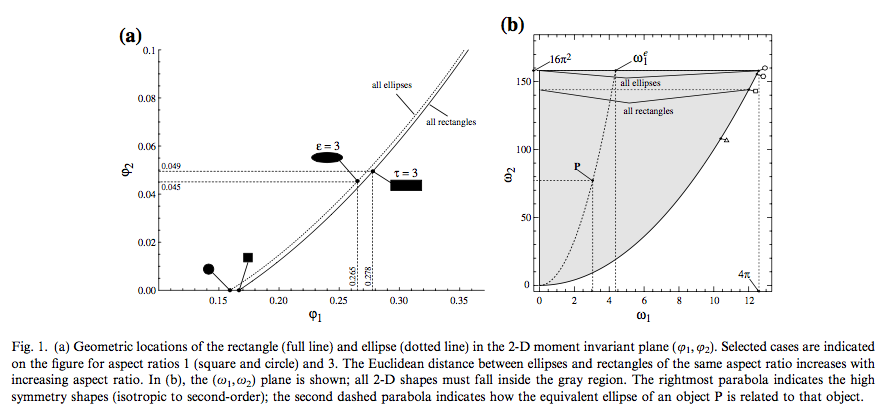
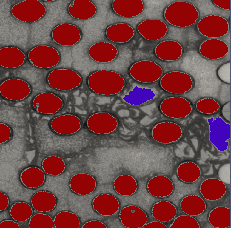

# Compute Moment Invariants (2D)

## Group (Subgroup)

Statistics (Statistics)

## Description

This **Filter** computes the 2D **moment invariants** Omega-1 and Omega-2 for each **Feature** in a 2D image. A **Feature** is a contiguous region of like-segmented cells (for example a particle). **Moment invariants** are scalar shape descriptors derived from the *Central Moments* of a **Feature**: the **Filter** treats each **Feature** as a flat 2D shape, measures how its area is distributed about its own centroid, and condenses that distribution into two numbers that do not change when the shape is translated, rotated, or (after normalization) scaled. Omega-1 and Omega-2 are therefore dimensionless values that describe the *shape* of a **Feature**, independent of its position, orientation, or size.

In practice these values measure how elongated or irregular a **Feature** is. A perfect circle gives the smallest possible Omega values; the more a **Feature** deviates toward an elongated ellipse or an irregular shape, the larger the Omega values become. By thresholding Omega-1 and Omega-2, you can classify **Features** by shape, for example separating round particles from elongated or irregular ones.

Based on the paper by MacSleyne et al. [1], the algorithm calculates the 2D central moments for each **Feature** starting at *feature id = 1*. Because *feature id 0* is of special significance and is typically a matrix or background, it is ignored. If any **Feature** has a Z extent (Z Delta) greater than 1 cell, that **Feature** is skipped. The algorithm works strictly in the XY plane and is meant to be applied to a 2D image.

The **Filter** can optionally normalize the values to a unit circle (the *Normalize Moment Invariants* parameter) and can optionally save the full 3x3 *Central Moments* matrix as a Data Array in the *Feature Attribute Matrix*.

The figures below, from [1], can help classify objects by their Omega values. An example usage is finding elliptical shapes (red) and differentiating them from non-elliptical shapes (purple):

### Required Input Sources

- **Cell Feature Ids** -- the Feature that owns each Cell, produced by a segmentation filter such as [Segment Features (Scalar)](ScalarSegmentFeaturesFilter.md).
- **Feature Rect** -- the min/max XY pixel coordinates (bounding corners) of each Feature, produced by [Compute Feature Corners](ComputeFeatureRectFilter.md).

% Auto generated parameter table will be inserted here

# Citations

[1] J.P. MacSleyne, J.P. Simmons, M. De Graef, *On the use of 2-D moment invariants for the automated classification of particle shapes*, Acta Materialia, Volume 56, Issue 3, February 2008, Pages 427-437, ISSN 1359-6454, [http://dx.doi.org/10.1016/j.actamat.2007.09.039.](http://dx.doi.org/10.1016/j.actamat.2007.09.039.)
[http://www.sciencedirect.com/science/article/pii/S1359645407006702](http://www.sciencedirect.com/science/article/pii/S1359645407006702)

# Acknowledgements

The authors would like to thank Dr. Marc De Graef from Carnegie Mellon University for enlightening discussions and a concrete implementation from which to start this filter.

## License & Copyright

Please see the description file distributed with this **Plugin**

## DREAM3D-NX Help

If you need help, need to file a bug report or want to request a new feature, please head over to the [DREAM3DNX-Issues](https://github.com/BlueQuartzSoftware/DREAM3DNX-Issues/discussions) GitHub site where the community of DREAM3D-NX users can help answer your questions.
