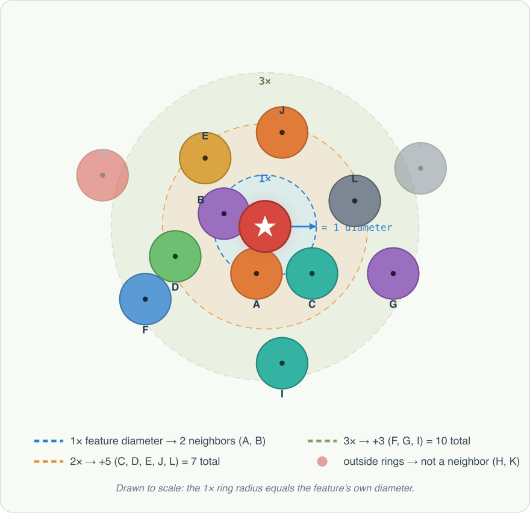

# Compute Feature Neighborhoods

## Group (Subgroup)

Statistics (Morphological)

## Description

For each feature, determine how many other features have their *centroid* within a search radius of that feature's centroid, counted using a true Euclidean (spherical) distance test.

The **Search Radius Type** parameter selects how the search radius is defined:

- **Multiples of Equivalent Diameter** *(default)*: each feature searches within a radius equal to **its own** *Equivalent Sphere Diameter* multiplied by the *Multiples of Equivalent Diameter* value (`radius_i = equivalentDiameter[i] × multiples`). Because the radius scales with each feature's own size, larger features have larger neighborhoods and the neighbor relationship can be **asymmetric** (a large feature may reach a small one that does not reach back). This mode requires the *Equivalent Diameters* feature array. *(The average diameter of all features is used only to size the internal search grid. This per-feature radius preserves the behavior of the legacy DREAM3D `FindNeighborhoods` filter.)*
- **Search Radius (microns)**: every feature uses the same absolute search radius (in microns) supplied by the user. The neighborhood is therefore symmetric, and the *Equivalent Diameters* array is **not** required.

In the "Multiples of Equivalent Diameter" mode the search radius for feature *i* is:

```text
radius_i = MultiplesOfEquivalentDiameter × EquivalentDiameter_i
```

(there is no division by two; the average diameter is used only to size the internal search grid). In the "Search Radius (microns)" mode the radius is the absolute value entered by the user.

The algorithm for determining the number of neighboring **Features** is:

1. Determine each feature's search radius from the selected **Search Radius Type**
2. Define a sphere centered at the **Feature**'s *centroid* using that radius
3. Check every other **Feature**'s *centroid* to see if it lies within the sphere (a centroid exactly on the sphere surface **is** counted); keep a count and a list of those that satisfy the test
4. Repeat for all **Features**

Feature 0 (the background/unassigned feature) is excluded from the computation entirely: it never searches for neighbors, it is never counted as a neighbor of any other feature, and its `Neighborhoods` entry is always 0 with an empty `NeighborhoodList`.

The figure below shows a single target feature and how progressively larger multiples of its own diameter capture more neighboring centroids.



### Multiplier

The *Multiplier* parameter is **dimensionless** -- a multiple of the average ESD. Common values:

- **1.0** -- search sphere is the same size as the average grain. Catches a feature's immediate neighbors and slightly beyond.
- **2.0-3.0** -- second-nearest-neighbor analysis.
- **5.0+** -- broader clustering / long-range arrangement studies.

### Required Input Sources

- **Cell Feature Ids** -- produced by a segmentation filter such as [Segment Features (Misorientation)](../OrientationAnalysis/EBSDSegmentFeaturesFilter.md).
- **Feature Centroids** -- produced by [Compute Feature Centroids](ComputeFeatureCentroidsFilter.md).
- **Feature Equivalent Diameters** -- produced by [Compute Feature Sizes](ComputeFeatureSizesFilter.md).
- **Feature Phases** -- produced by [Compute Feature Phases](ComputeFeaturePhasesFilter.md).

% Auto generated parameter table will be inserted here

## Example Pipelines

+ (03) Small IN100 Morphological Statistics
+ InsertTransformationPhase
+ (06) SmallIN100 Synthetic

## License & Copyright

Please see the description file distributed with this **Plugin**

## DREAM3D-NX Help

If you need help, need to file a bug report or want to request a new feature, please head over to the [DREAM3DNX-Issues](https://github.com/BlueQuartzSoftware/DREAM3DNX-Issues/discussions) GitHub site where the community of DREAM3D-NX users can help answer your questions.
